# Bài 12: page-Layout

#### Bài 12: Trang Layout

/en/word/links/nội dung/

### Giới thiệu

Word cung cấp nhiều loại trang Layout và định dạng Options ảnh hưởng đến cách nội dung xuất hiện trên trang. Bạn có thể tùy chỉnh ** hướng trang **, ** cỡ giấy ** và ** lề trang ** tùy thuộc vào cách bạn muốn tài liệu của mình xuất hiện.

Xem video bên dưới để tìm hiểu thêm về trang Layout trong Word.

#### Hướng trang

Word cung cấp hai hướng trang Options: ** ngang ** và ** dọc **. So sánh ví dụ của chúng tôi bên dưới để biết hướng có thể ảnh hưởng đến hình thức và khoảng cách của văn bản và hình ảnh như thế nào.

* Nằm ngang có nghĩa là trang được định hướng ** theo chiều ngang **.

  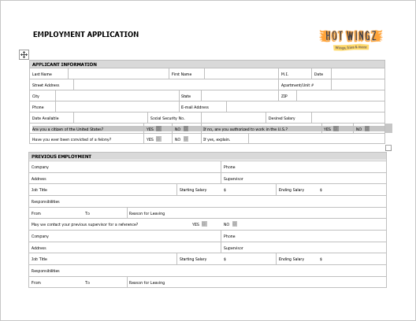
* Chân dung có nghĩa là trang được định hướng ** theo chiều dọc **.

  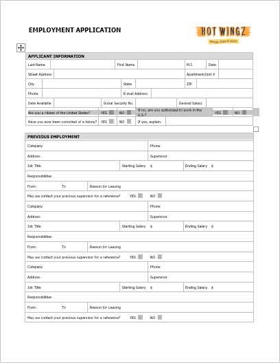

#### Để thay đổi hướng trang:

1. Chọn tab ** Layout **.
2. Bấm vào lệnh ** Định hướng ** trong nhóm Thiết lập Trang.

   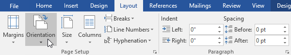
3. Một menu thả xuống sẽ xuất hiện. Nhấp vào ** Dọc ** hoặc ** Phong cảnh ** để thay đổi hướng trang.

   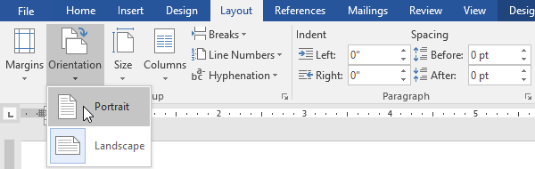
4. Hướng trang của tài liệu sẽ được thay đổi.

### Kích thước trang

Theo mặc định, ** kích thước trang ** của tài liệu New là 8,5 inch x 11 inch. Tùy thuộc vào dự án của bạn, bạn có thể cần điều chỉnh kích thước trang tài liệu của mình. Điều quan trọng cần lưu ý là trước khi sửa đổi kích thước trang mặc định, bạn nên kiểm tra xem máy in của bạn có thể đáp ứng kích thước trang nào.

#### Để thay đổi kích thước trang:

Word có nhiều ** kích thước trang được xác định trước ** để bạn lựa chọn.

1. Chọn tab ** Layout **, sau đó nhấp vào lệnh ** Size **.

   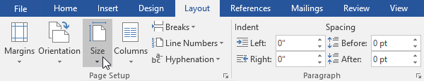
2. Một menu thả xuống sẽ xuất hiện. Kích thước trang hiện tại được đánh dấu. Nhấp vào ** được xác định trước ** ** trang ** ** kích thước ** mong muốn.

   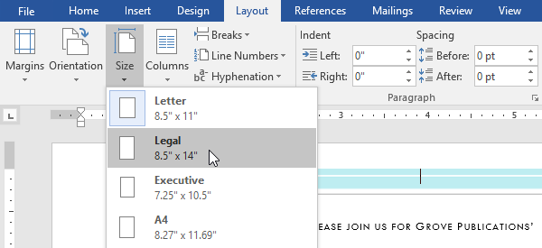
3. Kích thước trang của tài liệu sẽ được thay đổi.

#### Để sử dụng kích thước trang tùy chỉnh:

Word cũng cho phép bạn tùy chỉnh kích thước trang trong hộp thoại ** Thiết lập trang **.

1. Từ tab ** Layout **, hãy nhấp vào ** Kích thước **. Chọn ** Kích cỡ giấy khác ** từ trình đơn thả xuống.

   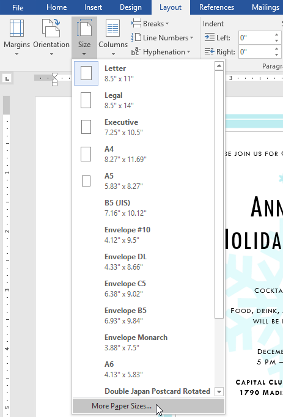
2. Hộp thoại ** Thiết lập trang ** sẽ xuất hiện.
3. Điều chỉnh các giá trị cho ** Chiều rộng ** và ** Chiều cao **, sau đó nhấp vào ** OK **.

   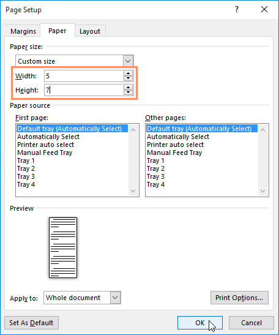
4. Kích thước trang của tài liệu sẽ được thay đổi.

### Lề trang

** lề ** là ** khoảng trắng ** giữa văn bản và cạnh tài liệu của bạn. Theo mặc định, lề của tài liệu New được đặt thành ** Bình thường **, nghĩa là nó có khoảng cách một inch giữa văn bản và mỗi cạnh. Tùy theo nhu cầu của bạn, Word cho phép bạn thay đổi kích thước lề của tài liệu.

#### Để định dạng lề trang:

Word có nhiều ** kích thước lề được xác định trước ** để bạn lựa chọn.

1. Chọn tab ** Layout **, sau đó nhấp vào lệnh ** Lề **.

   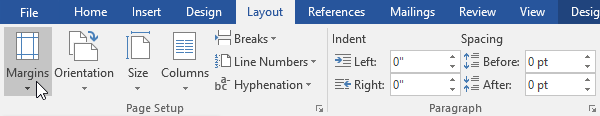
2. Một menu thả xuống sẽ xuất hiện. Nhấp vào ** kích thước lề được xác định trước ** mà bạn muốn.

   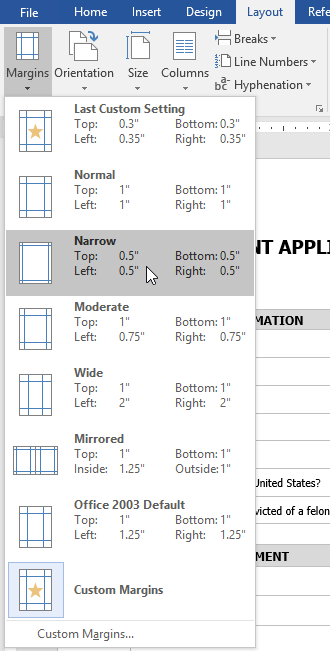
3. Lề của tài liệu sẽ được thay đổi.

#### Để sử dụng lề tùy chỉnh:

Word cũng cho phép bạn tùy chỉnh kích thước lề trong hộp thoại ** Thiết lập trang **.

1. Từ tab ** Layout **, hãy nhấp vào ** Lợi nhuận **. Chọn ** Lợi nhuận tùy chỉnh ** từ trình đơn thả xuống.

   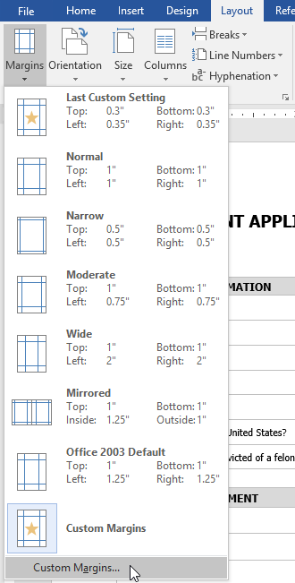
2. Hộp thoại ** Thiết lập trang ** sẽ xuất hiện.
3. Điều chỉnh giá trị cho từng lề, sau đó nhấp vào ** OK **.

   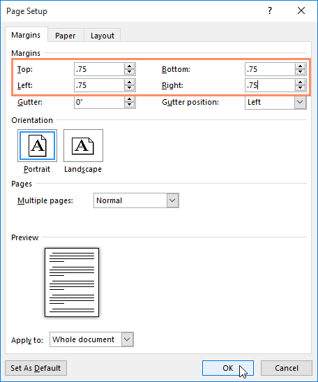
4. Lề của tài liệu sẽ được thay đổi.

Bạn cũng có thể Open hộp thoại Thiết lập Trang bằng cách điều hướng đến tab Layout và nhấp vào ** mũi tên ** nhỏ ở góc dưới cùng bên phải của nhóm ** Thiết lập Trang **.

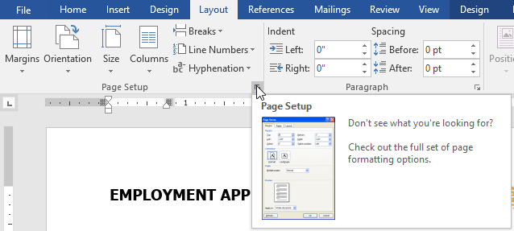

Bạn có thể sử dụng tính năng ** Đặt làm mặc định ** tiện lợi của Word để ** Save ** tất cả các thay đổi ** định dạng ** mà bạn đã thực hiện và tự động áp dụng chúng cho tài liệu New. Để tìm hiểu cách thực hiện việc này, hãy đọc bài học của chúng tôi về [Thay đổi cài đặt mặc định của bạn trong Word](../../../word-tips/changed-your-default-settings-in-word/1/index.html "Cách thay đổi cài đặt mặc định của bạn trong Word").

### Thử thách!

1. Open [tài liệu thực hành](practice_files/word_pagelayout_practice.docx) của chúng tôi.
2. Thay đổi ** hướng trang ** thành ** Dọc **.
3. Thay đổi ** kích thước trang ** thành ** Pháp lý **. Nếu không có khổ Legal, bạn có thể chọn khổ khác như ** A5 **.
4. Thay đổi ** lề ** thành cài đặt ** Thu hẹp **.
5. Khi bạn hoàn tất, tài liệu của bạn sẽ là một trang nếu sử dụng kích thước Pháp lý. Nó sẽ trông giống như thế này:

   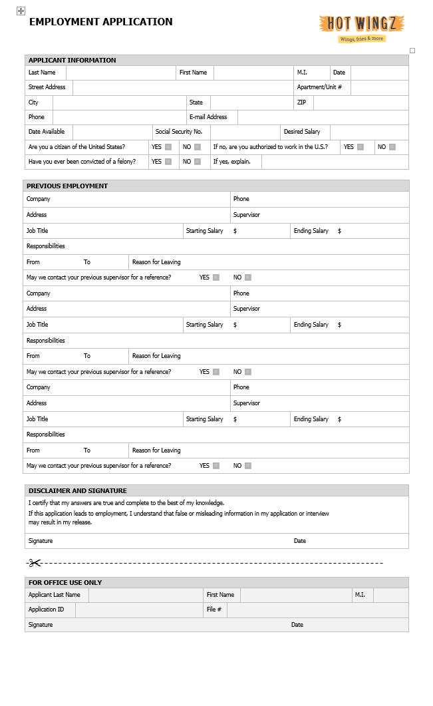

/en/word/printing-documents/content/