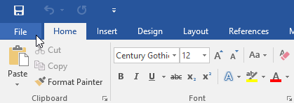
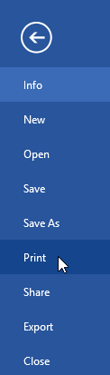
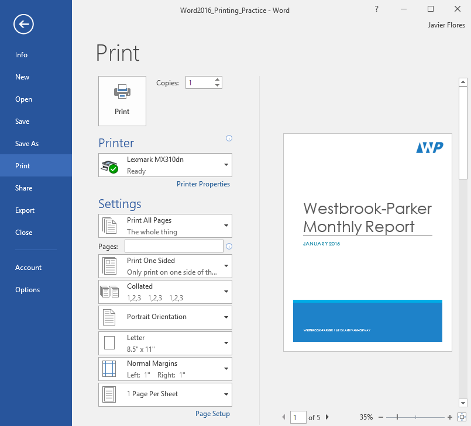
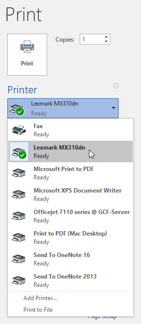
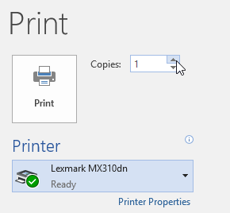
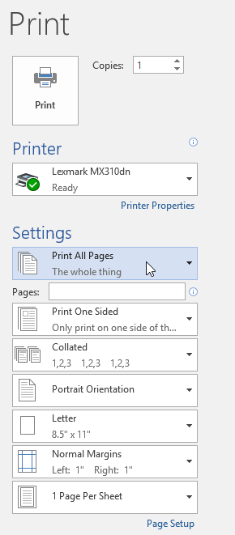
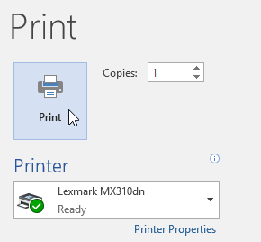
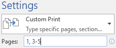
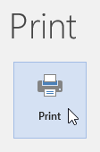
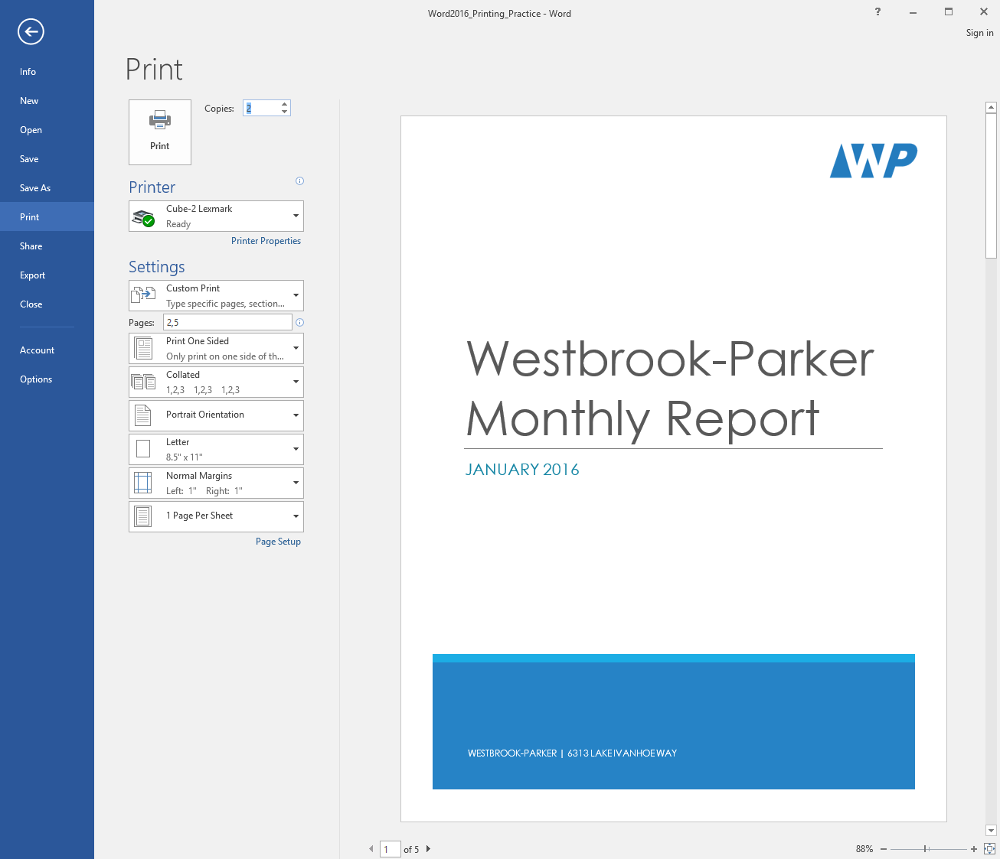

# Bài 13: in ấn tài liệu

#### Bài 13: In tài liệu

/en/word/page-Layout/content/

### Giới thiệu

Sau khi tạo tài liệu, bạn có thể muốn ** Print ** tài liệu đó thành View và Share công việc của bạn ** ngoại tuyến **. Thật dễ dàng để xem trước và Print một tài liệu trong Word bằng cách sử dụng khung ** Print **.

Xem video bên dưới để tìm hiểu thêm về cách in tài liệu trong Word.

#### Để truy cập khung Print:

1. Chọn tab ** File **. ** Backstage view ** sẽ xuất hiện.

   
2. Chọn ** Print **. Khung ** Print ** sẽ xuất hiện.

   

Nhấp vào các nút trong phần tương tác bên dưới để tìm hiểu thêm về cách sử dụng khung Print.

chỉnh sửa điểm phát sóngchỉnh sửa điểm phát sóng

## Print

Nhấp vào nút này để Print tài liệu.

## Máy in

Nếu bạn có nhiều máy in, hãy chọn máy in bạn muốn sử dụng.

## Print Phạm vi

Tại đây, bạn có thể chọn Print toàn bộ tài liệu, chỉ trang hiện tại hoặc Print tùy chỉnh cho đến Print các trang cụ thể.

## In một mặt và hai mặt

Chọn Print trên một hoặc cả hai mặt giấy nếu máy in của bạn hỗ trợ cài đặt này.

## đối chiếu

Nếu bạn in nhiều bản sao, bạn có thể chọn cách sắp xếp các trang. ** Đối chiếu ** sẽ sắp xếp chúng theo 1, 2, 3, 1, 2, 3. ** Không đối chiếu ** sẽ sắp xếp chúng theo 1, 1, 2, 2, 3, 3.

## Định hướng trang

Tại đây, bạn có thể chọn hướng dọc (dọc) hoặc ngang (ngang).

## Khổ giấy

Bạn có thể chọn khổ giấy muốn sử dụng nếu máy in của bạn hỗ trợ cài đặt này.

## Lề

Tại đây, bạn có thể điều chỉnh lề trang.

## Chia tỷ lệ

Tùy chọn này cho phép bạn Print nhiều trang trên một tờ hoặc chia tỷ lệ tài liệu để vừa với một khổ giấy cụ thể.

## Bản sao

Tại đây, bạn có thể chọn số lượng bản sao bạn muốn Print.

## Lựa chọn trang

Bạn có thể nhấp vào mũi tên để View một trang khác trong khung Xem trước.

## Zoom Control/ Phóng to trang

Nhấp và kéo thanh trượt để sử dụng ** Zoom Control **. Số ở bên trái thanh trượt phản ánh phần trăm thu phóng. Bạn có thể nhấp vào nút ** Thu phóng đến trang ** ở bên phải để đặt Zoom Control vừa với một trang trong cửa sổ.

## Ngăn xem trước

Tại đây, bạn có thể xem bản xem trước tài liệu của bạn sẽ trông như thế nào khi được in.

Bạn cũng có thể truy cập khung Print bằng cách nhấn ** Ctrl+P ** trên bàn phím.

#### Tới Print một tài liệu:

1. Điều hướng đến khung ** Print **, sau đó chọn ** máy in ** mong muốn.

   
2. Nhập số lượng ** bản sao ** bạn muốn Print.

   
3. Chọn bất kỳ ** cài đặt ** bổ sung nào nếu cần.

   
4. Nhấp vào ** Print **.

   

### tùy chỉnh in ấn

Đôi khi bạn có thể thấy không cần thiết phải Print toàn bộ tài liệu của mình, trong trường hợp đó ** in tùy chỉnh ** có thể phù hợp hơn với nhu cầu của bạn. Cho dù bạn đang in ** vài trang riêng lẻ ** hay ** phạm vi trang **, Word đều cho phép bạn ** chỉ định ** chính xác những trang bạn muốn Print.

#### Để tùy chỉnh Print một tài liệu:

Nếu bạn muốn Print trang hoặc phạm vi trang riêng lẻ, bạn sẽ cần phân tách từng mục bằng ** dấu phẩy ** (ví dụ: 1, 3, 5-7 hoặc 10-14).

1. Điều hướng đến khung ** Print **.
2. Trong trường ** Trang:**, nhập các trang bạn muốn Print.

   
3. Nhấp vào ** Print **.

   

Nếu tài liệu của bạn không được in theo cách bạn muốn, bạn có thể cần phải điều chỉnh một số cài đặt của trang Layout. Để tìm hiểu thêm, Review bài học [Trang Layout](../../page-Layout/1/index.html) của chúng tôi.

### Thử thách!

1. Open [tài liệu thực hành](practice_files/word_printing_practice.docx) của chúng tôi.
2. Trong khung ** Print **, hãy thay đổi cài đặt thành Print ** chỉ ** trang 2 và 5.
3. Thay đổi số lượng ** bản sao ** thành 2.
4. Sử dụng các mũi tên ở cuối phần xem trước ** Print ** đến View mỗi trang.
5. Khi bạn hoàn tất, ngăn Print của bạn sẽ trông giống như thế này:

   chỉnh sửa điểm phát sóng
6. Tùy chọn: Nếu có máy in, bạn có thể nhấp vào lệnh ** Print **. Nó phải Print hai bản sao của trang 2 và 5.

/en/word/breaks/content/