# Bài 14: giờ giải lao

#### Bài học 14: Giải lao

/en/word/printing-documents/content/

### Giới thiệu

Khi bạn đang làm việc trên một tài liệu nhiều trang, có thể đôi khi bạn muốn có nhiều quyền kiểm soát hơn đối với cách văn bản trôi chảy chính xác. ** B **** reaks ** có thể hữu ích trong những trường hợp này. Có nhiều loại dấu ngắt để bạn lựa chọn tùy thuộc vào nội dung bạn cần, bao gồm ** ngắt trang **,** ngắt phần ** và ** ngắt cột **.

Hãy xem video bên dưới để tìm hiểu thêm về cách sử dụng dấu ngắt trong Word.

#### Để Insert ngắt trang:

Trong ví dụ của chúng tôi, các tiêu đề phần trên trang ba (** Doanh thu hàng tháng ** và ** Theo khách hàng **) được tách biệt khỏi bảng trên trang bên dưới. Và mặc dù chúng ta chỉ có thể nhấn ** Enter ** cho đến khi văn bản đó đến đầu trang bốn, nhưng nó có thể dễ dàng bị dịch chuyển xung quanh nếu chúng ta thêm hoặc xóa nội dung nào đó trong phần khác của tài liệu. Thay vào đó, chúng tôi sẽ Insert ** ngắt trang **.

1. Đặt ** điểm chèn ** vào vị trí bạn muốn tạo ngắt trang. Trong ví dụ của chúng tôi, chúng tôi sẽ đặt nó ở đầu tiêu đề của chúng tôi.

   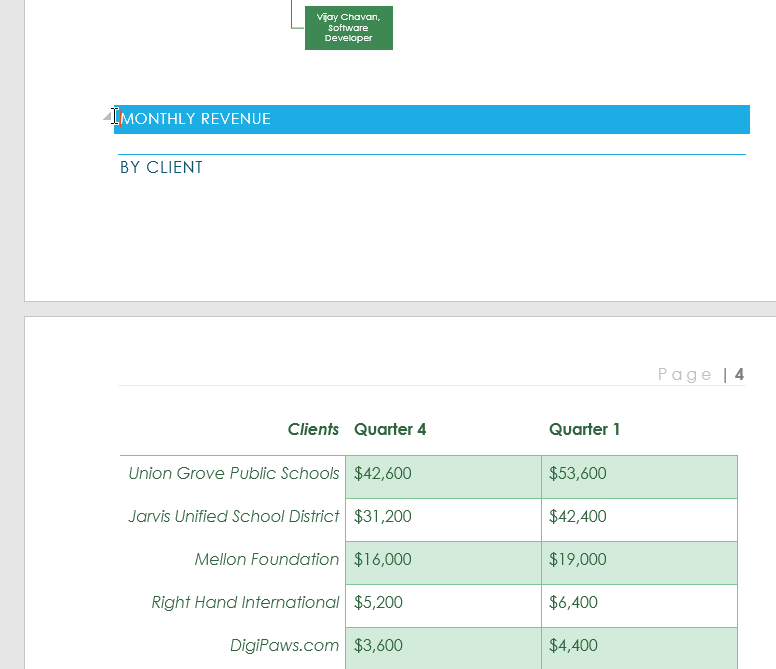
2. Trên tab ** Insert **, hãy nhấp vào lệnh ** Ngắt trang **. Bạn cũng có thể nhấn ** Ctrl+Enter ** trên bàn phím.

   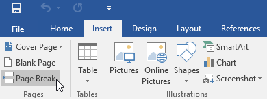
3. Việc ngắt trang sẽ được chèn vào tài liệu và văn bản sẽ chuyển sang trang tiếp theo.

   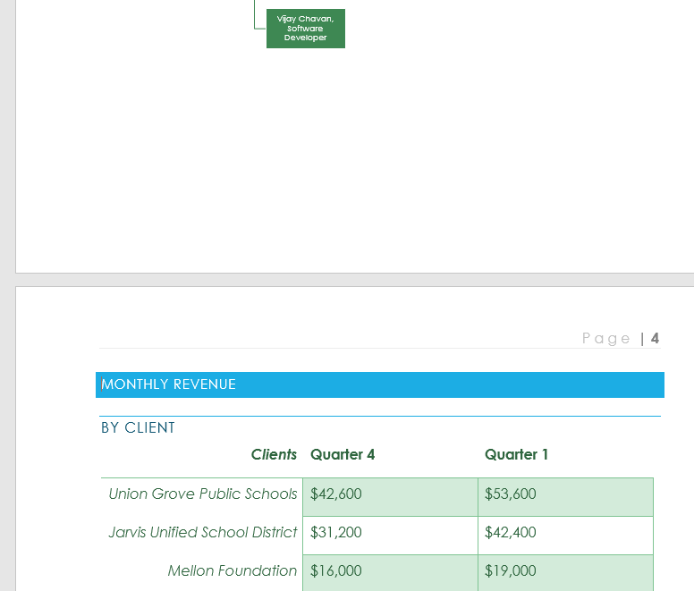

Theo mặc định, dấu ngắt là ** ẩn **. Nếu bạn muốn xem dấu ngắt trong tài liệu của mình, hãy nhấp vào lệnh ** Hiển thị/Ẩn ** trên tab ** Home **.

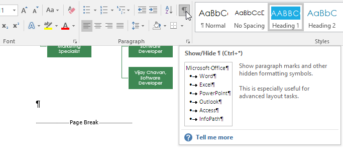

### Ngắt phần

** Ngắt phần ** tạo ** rào cản ** giữa các phần khác nhau của tài liệu, cho phép bạn định dạng từng phần một cách độc lập. Ví dụ: bạn có thể muốn một phần có hai cột mà không cần thêm cột vào toàn bộ tài liệu. Word cung cấp một số kiểu ngắt phần.

* ** Trang tiếp theo **: Tùy chọn này chèn dấu ngắt phần và di chuyển văn bản sau dấu ngắt sang trang tiếp theo của tài liệu.
* ** Liên tục **: Tùy chọn này chèn dấu ngắt phần và cho phép bạn tiếp tục làm việc trên cùng một trang.
* ** Trang chẵn ** và ** Trang lẻ **: Options này thêm dấu ngắt phần và di chuyển văn bản sau dấu ngắt sang trang chẵn hoặc trang lẻ tiếp theo. Các Options này có thể hữu ích khi bạn cần bắt đầu phần New trên trang chẵn hoặc trang lẻ (chẳng hạn như chương New của một cuốn sách).

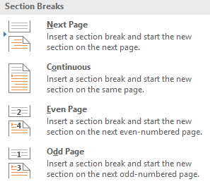

#### Để Insert ngắt phần:

Trong ví dụ của chúng tôi, chúng tôi sẽ thêm dấu ngắt phần để tách một đoạn văn khỏi danh sách hai cột.

1. Đặt ** điểm chèn ** vào nơi bạn muốn tạo dấu ngắt. Trong ví dụ của chúng tôi, chúng tôi sẽ đặt nó ở đầu đoạn văn mà chúng tôi muốn tách khỏi định dạng hai cột.

   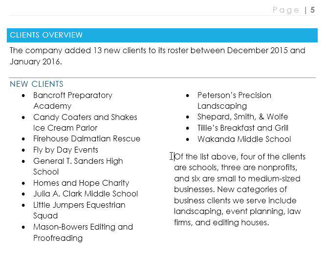
2. Trên tab ** Trang Layout **, hãy nhấp vào lệnh ** Ngắt **, sau đó chọn ngắt phần mong muốn từ menu thả xuống. Trong ví dụ của chúng tôi, chúng tôi sẽ chọn ** Liên tục ** để đoạn văn của chúng tôi vẫn ở trên cùng một trang với các cột.

   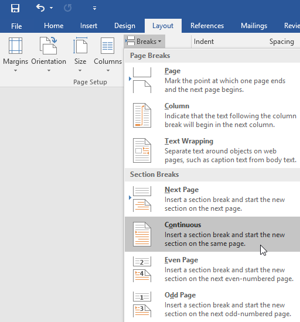
3. Dấu ngắt phần sẽ xuất hiện trong tài liệu.

   
4. Văn bản ** trước ** và ** sau ** ngắt phần giờ đây có thể được định dạng riêng. Trong ví dụ của chúng tôi, chúng tôi sẽ áp dụng định dạng một cột cho đoạn văn.

   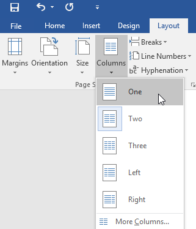
5. Định dạng sẽ được áp dụng cho phần hiện tại của tài liệu. Trong ví dụ của chúng tôi, văn bản phía trên dấu ngắt phần sử dụng định dạng hai cột, trong khi đoạn văn bên dưới dấu ngắt sử dụng định dạng một cột.

   

### Các loại nghỉ giải lao khác

Khi bạn muốn định dạng hình thức của các cột hoặc sửa đổi dòng văn bản bao quanh một hình ảnh, Word sẽ cung cấp thêm dấu ngắt Options có thể Help:

* ** Cột **: Khi tạo nhiều cột, bạn có thể áp dụng ngắt cột để cân bằng hình thức của các cột. Bất kỳ văn bản nào sau dấu ngắt cột sẽ bắt đầu ở cột tiếp theo. Để tìm hiểu thêm về cách tạo cột trong tài liệu của bạn, Review bài học của chúng tôi về [Cột](../../columns/1/index.html).
* ** Gói văn bản **: Khi văn bản đã được ngắt dòng xung quanh một hình ảnh hoặc đối tượng, bạn có thể sử dụng dấu ngắt ngắt dòng văn bản để kết thúc ngắt dòng và bắt đầu nhập dòng bên dưới hình ảnh. Review bài học của chúng tôi về [Gói hình ảnh và văn bản](../../pictures-and-text-wrapping/1/index.html) để tìm hiểu thêm.

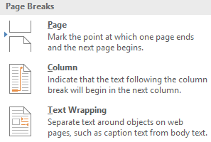

#### Để xóa giờ nghỉ:

Theo mặc định, thời gian nghỉ được ** ẩn **. Nếu bạn muốn xóa dấu ngắt, trước tiên bạn cần hiển thị dấu ngắt trong tài liệu của mình.

1. Trên tab ** Home **, hãy nhấp vào lệnh ** Hiển thị/Ẩn **.

   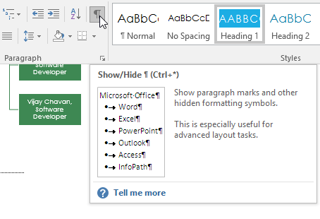
2. Xác định vị trí ** ngắt ** bạn muốn xóa, sau đó đặt dấu chèn vào đầu dấu ngắt.

   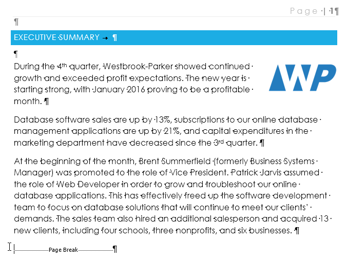
3. Nhấn phím ** Xóa **. Dấu ngắt sẽ bị xóa khỏi tài liệu.

   

### Thử thách!

1. Open [tài liệu thực hành](practice_files/word_breaks_practice.docx) của chúng tôi.
2. Cuộn đến phần ** Dự báo doanh thu ** ở gần cuối tài liệu.
3. ** Xóa ** ngắt trang sau biểu đồ ** Dự báo Quý 2 theo Khách hàng **.
4. Đặt con trỏ của bạn ở đầu tiêu đề ** Dự đoán ứng dụng web **.
5. Insert a ** Ngắt phần trang tiếp theo **.
6. Trong nhóm ** Thiết lập trang ** trên tab ** Layout **, hãy nhấp vào menu thả xuống ** Cột ** và chọn ** Một **. Điều này sẽ định dạng trang trở lại một cột và sẽ cho phép tiêu đề Dự báo ứng dụng web và bảng bên dưới nó trải dài trên trang. Bạn sẽ tìm hiểu thêm về các cột trong bài học tiếp theo của chúng tôi.
7. Khi bạn hoàn tất, hai trang cuối cùng sẽ trông giống như thế này:

   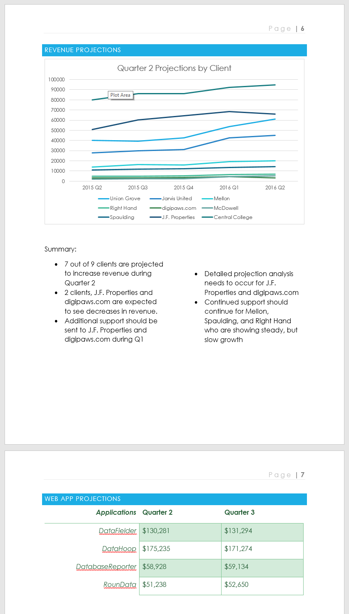

/en/word/cột/nội dung/