# Bài 15: cột

#### Bài 15: Cột

/en/word/breaks/content/

### Giới thiệu

Đôi khi thông tin bạn đưa vào tài liệu được hiển thị tốt nhất ở ** cột **. Cột có thể Help cải thiện khả năng đọc, đặc biệt với một số loại tài liệu nhất định—như bài báo, bản tin và tờ rơi. Word cũng cho phép bạn điều chỉnh các cột bằng cách thêm ** ngắt cột **.

Hãy xem video dưới đây để tìm hiểu thêm về các cột trong Word.

#### Để thêm cột vào tài liệu:

1. Chọn văn bản bạn muốn định dạng.

   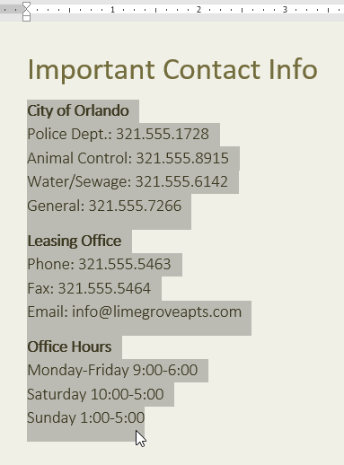
2. Chọn tab ** Layout **, sau đó nhấp vào lệnh ** Cột **. Một menu thả xuống sẽ xuất hiện.
3. Chọn số cột bạn muốn tạo.

   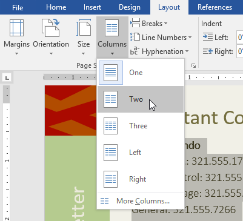
4. Văn bản sẽ định dạng thành các cột.

   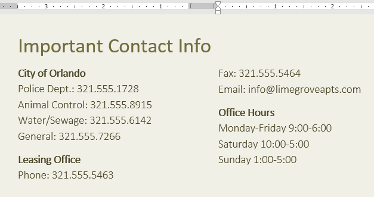

Lựa chọn cột của bạn không bị giới hạn ở menu thả xuống xuất hiện. Chọn ** Thêm cột ** ở cuối menu để truy cập hộp thoại ** Cột **. Nhấp vào mũi tên bên cạnh ** Số cột:** để điều chỉnh số cột.

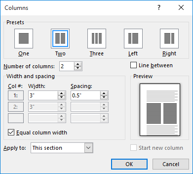

Nếu bạn muốn điều chỉnh khoảng cách và căn chỉnh các cột, hãy nhấp và kéo ** điểm đánh dấu thụt lề ** trên ** Ruler ** cho đến khi các cột xuất hiện theo cách bạn muốn.

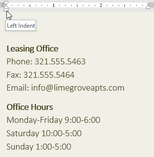

#### Để xóa cột:

Để xóa định dạng cột, hãy đặt dấu chèn ở bất kỳ đâu trong cột, sau đó nhấp vào lệnh ** Cột ** trên tab ** Layout **. Chọn ** Một ** từ menu thả xuống xuất hiện.

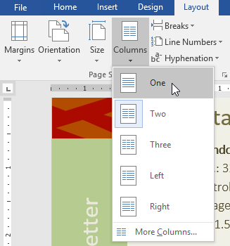

### Thêm ngắt cột

Khi bạn đã tạo xong các cột, văn bản sẽ tự động chuyển từ cột này sang cột tiếp theo. Tuy nhiên, đôi khi bạn có thể muốn kiểm soát chính xác vị trí bắt đầu của mỗi cột. Bạn có thể thực hiện việc này bằng cách tạo ** ngắt cột **.

#### Để thêm ngắt cột:

Trong ví dụ bên dưới, chúng tôi sẽ thêm dấu ngắt cột để di chuyển văn bản đến đầu cột tiếp theo.

1. Đặt ** điểm chèn ** vào đầu văn bản bạn muốn di chuyển.

   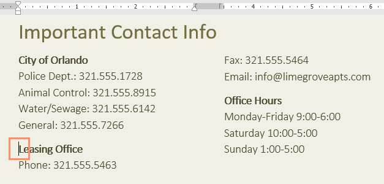
2. Chọn tab ** Layout **, sau đó nhấp vào lệnh ** Ngắt **. Một menu thả xuống sẽ xuất hiện.
3. Chọn ** Cột ** từ menu.

   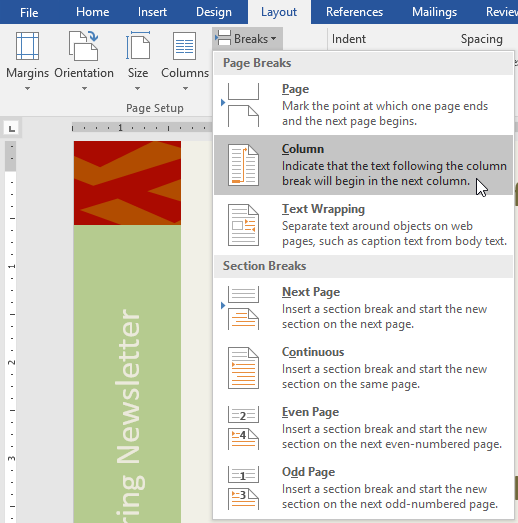
4. Văn bản sẽ di chuyển về đầu cột. Trong ví dụ của chúng tôi, nó đã di chuyển đến đầu cột tiếp theo.

   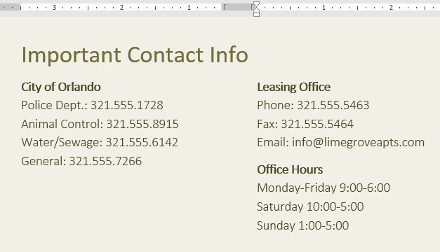

Để tìm hiểu thêm về cách thêm dấu ngắt vào tài liệu của bạn, Review bài học của chúng tôi về [Ngắt](../../breaks/1/index.html).

#### Để loại bỏ ngắt cột:

1. Theo mặc định, thời gian nghỉ được ẩn. Nếu bạn muốn hiển thị dấu ngắt trong tài liệu của mình, hãy nhấp vào lệnh ** Hiển thị/Ẩn ** trên tab ** Home **.

   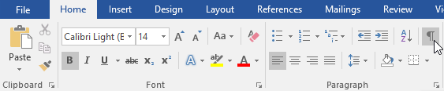
2. Đặt điểm chèn vào bên trái dấu ngắt mà bạn muốn xóa.

   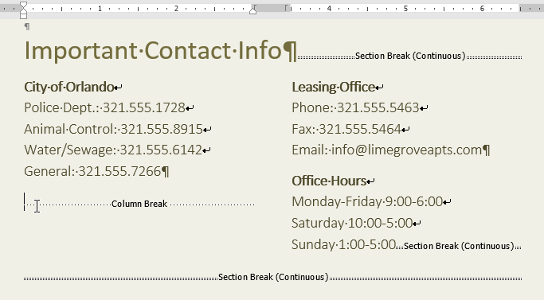
3. Nhấn phím xóa để loại bỏ dấu ngắt.

   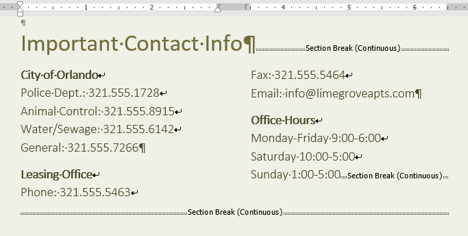

### Thử thách!

1. Open [tài liệu thực hành](practice_files/word_columns_practice.docx) của chúng tôi.
2. Cuộn đến ** trang 3 **.
3. Chọn tất cả văn bản trong danh sách có dấu đầu dòng bên dưới ** Lời nhắc của cộng đồng ** và định dạng nó thành ** hai cột **.
4. Đặt con trỏ của bạn ở đầu dấu đầu dòng thứ tư trước từ ** Khách truy cập **.
5. Insert ** ngắt cột **.
6. Khi bạn hoàn tất, trang của bạn sẽ trông giống như thế này:

   

/en/word/headers-and-footers/content/