# Bài 16: Header và Footer

#### Bài 16: Đầu trang và chân trang

/en/word/cột/nội dung/

### Giới thiệu

** tiêu đề ** là một phần của tài liệu xuất hiện ở ** lề trên **, trong khi ** chân trang ** là một phần của tài liệu xuất hiện ở ** lề dưới **. Đầu trang và chân trang thường chứa thông tin bổ sung như ** số trang **, ** ngày **, ** an ** ** tên tác giả ** và ** chú thích cuối trang **, có thể Help sắp xếp tài liệu dài hơn và giúp chúng dễ đọc hơn. Văn bản được nhập vào đầu trang hoặc chân trang sẽ xuất hiện trên ** mỗi trang ** của tài liệu.

Xem video bên dưới để tìm hiểu thêm về đầu trang và chân trang trong Word.

#### Để tạo đầu trang hoặc chân trang:

Trong ví dụ của chúng tôi, chúng tôi muốn hiển thị tên tác giả ở đầu mỗi trang, vì vậy chúng tôi sẽ đặt tên đó trong tiêu đề.

1. Nhấp đúp vào bất kỳ vị trí nào trên ** lề trên hoặc dưới ** tài liệu của bạn. Trong ví dụ của chúng tôi, chúng tôi sẽ bấm đúp vào lề trên.

   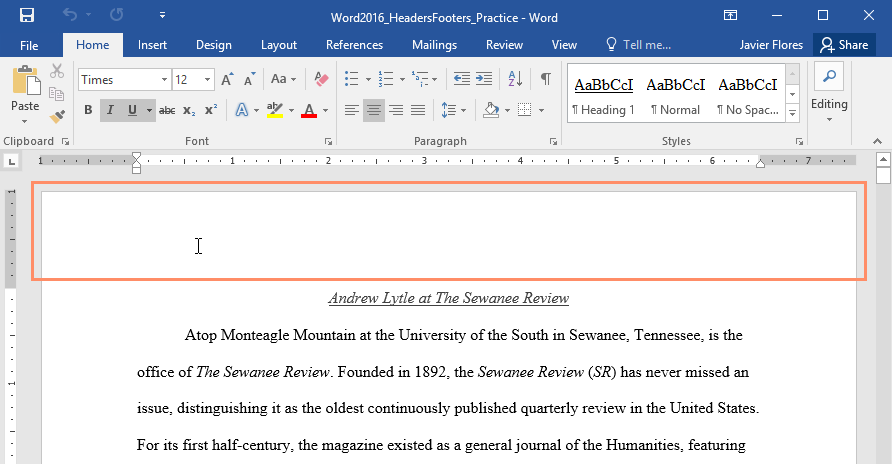
2. Đầu trang hoặc chân trang sẽ Open và tab ** Design ** sẽ xuất hiện ở bên phải của ** Ribbon **. Điểm chèn sẽ xuất hiện ở đầu trang hoặc chân trang.

   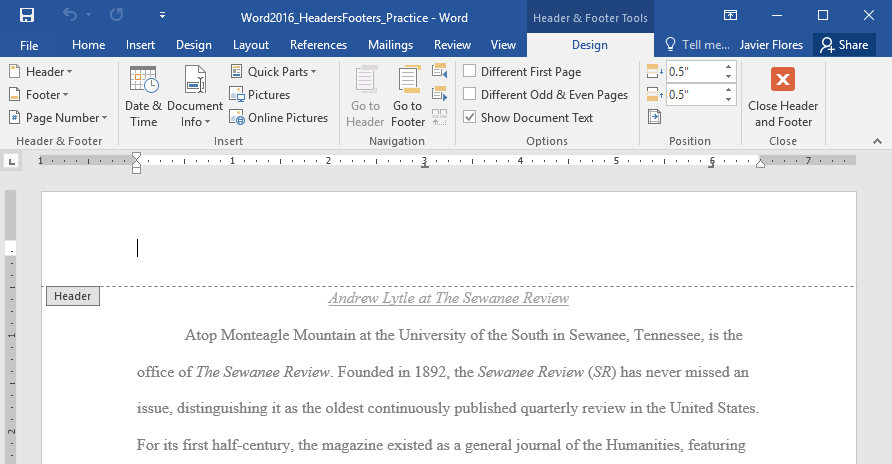
3. Nhập ** thông tin mong muốn ** vào đầu trang hoặc chân trang. Trong ví dụ của chúng tôi, chúng tôi sẽ nhập tên tác giả và ngày tháng.

   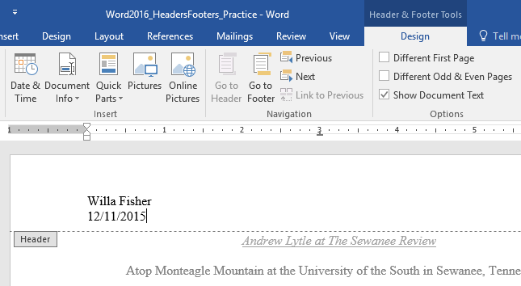
4. Khi bạn hoàn tất, hãy nhấp vào ** Close Đầu trang và chân trang **. Bạn cũng có thể nhấn phím ** Esc **.

   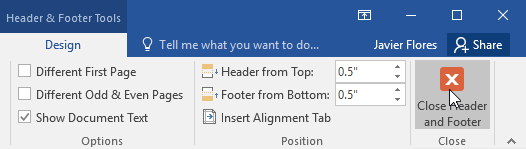
5. Văn bản đầu trang hoặc chân trang sẽ xuất hiện.

   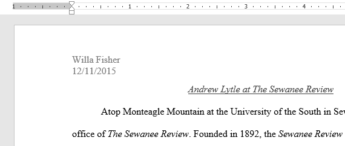

#### Đến Insert đầu trang hoặc chân trang đặt trước:

Word có nhiều ** đầu trang và chân trang cài sẵn ** mà bạn có thể sử dụng để cải thiện Design và Layout của tài liệu của mình. Trong ví dụ của chúng tôi, chúng tôi sẽ thêm tiêu đề đặt trước vào tài liệu của mình.

1. Chọn tab ** Insert **, sau đó nhấp vào lệnh ** Header ** hoặc ** Footer **. Trong ví dụ của chúng tôi, chúng tôi sẽ nhấp vào lệnh ** Header **.

   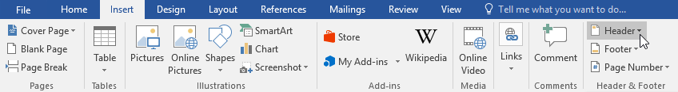
2. Trong menu xuất hiện, chọn ** đầu trang hoặc chân trang đặt trước ** mong muốn.

   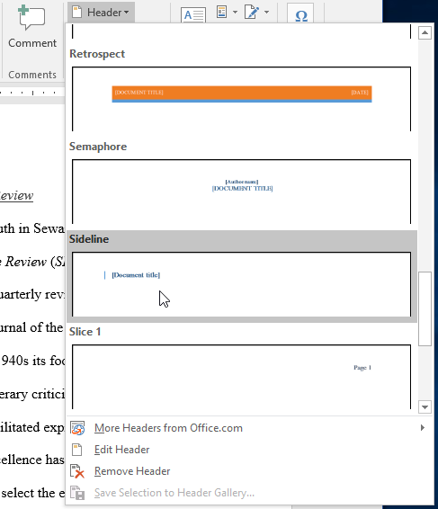
3. Đầu trang hoặc chân trang sẽ xuất hiện. Nhiều đầu trang và chân trang đặt trước chứa phần giữ chỗ văn bản được gọi là trường ** Kiểm soát nội dung **. Những trường này rất phù hợp để thêm thông tin như tiêu đề tài liệu, tên tác giả, ngày tháng và số trang.

   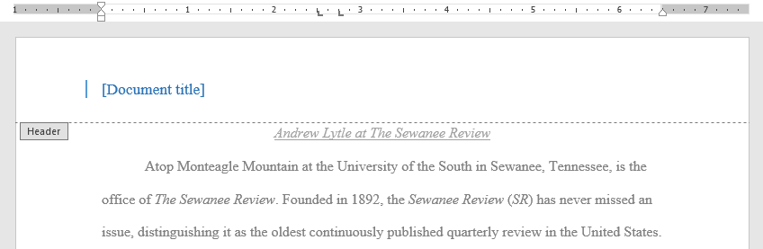
4. Để chỉnh sửa trường Kiểm soát nội dung, hãy nhấp vào trường đó và nhập ** thông tin mong muốn **.

   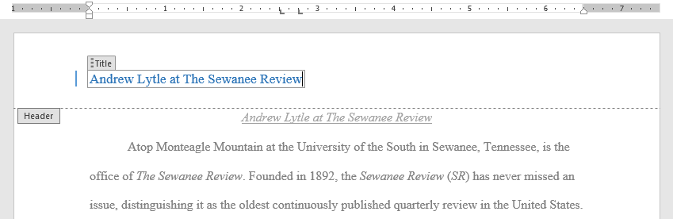
5. Khi bạn hoàn tất, hãy nhấp vào ** Close Đầu trang và chân trang **. Bạn cũng có thể nhấn phím ** Esc **.

   

Nếu bạn muốn xóa trường Kiểm soát nội dung, hãy nhấp chuột phải vào trường đó và chọn ** Xóa Kiểm soát nội dung ** từ trình đơn xuất hiện.

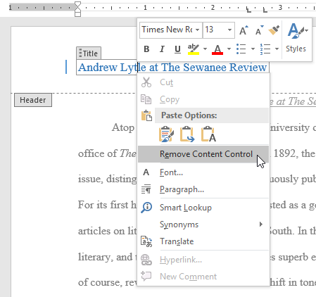

### Chỉnh sửa đầu trang và chân trang

Sau Close đầu trang hoặc chân trang, nó sẽ vẫn hiển thị nhưng sẽ bị ** khóa **. Chỉ cần nhấp đúp vào đầu trang hoặc chân trang để ** mở khóa **, thao tác này sẽ cho phép bạn chỉnh sửa.

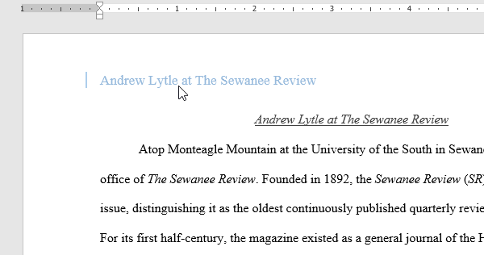

#### tab Design Options

Khi đầu trang và chân trang của tài liệu của bạn được mở khóa, tab ** Design ** sẽ xuất hiện ở bên phải của Ribbon, cung cấp cho bạn nhiều chỉnh sửa khác nhau Options:

* ** Ẩn đầu trang và chân trang của trang đầu tiên **: Đối với một số tài liệu, bạn có thể không muốn trang đầu tiên hiển thị đầu trang và chân trang, giống như nếu bạn có trang bìa và muốn bắt đầu đánh số trang từ trang thứ hai. Nếu bạn muốn ẩn đầu trang và chân trang của trang đầu tiên, hãy chọn hộp bên cạnh ** Trang đầu tiên khác nhau **.

  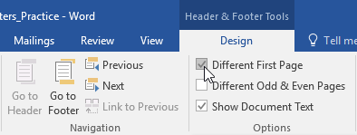
* ** Xóa đầu trang hoặc chân trang **: Nếu bạn muốn xóa tất cả thông tin có trong đầu trang, hãy nhấp vào lệnh ** Header ** và chọn ** Xóa tiêu đề ** từ menu xuất hiện. Tương tự, bạn có thể xóa chân trang bằng lệnh ** Footer **.

  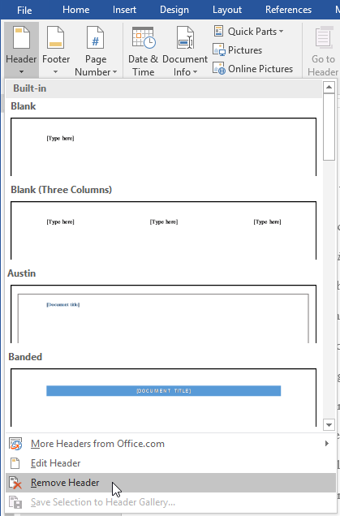
* ** Số trang **: Bạn có thể tự động đánh số từng trang bằng lệnh Số trang. Review bài học [Số trang](../../page-numbers/1/index.html) của chúng tôi để tìm hiểu thêm.

  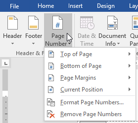
* ** Bổ sung Options **: Với các lệnh có sẵn trong nhóm Insert, bạn có thể thêm ** ngày và giờ **, ** tài liệu Info **, ** hình ảnh **, v.v. vào đầu trang hoặc chân trang của mình.

  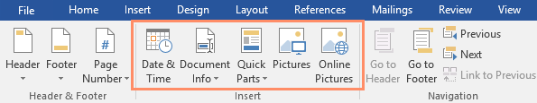

#### Để Insert ngày hoặc giờ vào đầu trang hoặc chân trang:

Đôi khi việc thêm ** ngày hoặc giờ ** vào đầu trang hoặc chân trang sẽ rất hữu ích. Ví dụ: bạn có thể muốn tài liệu của mình hiển thị ** ngày tạo **.

Mặt khác, bạn có thể muốn hiển thị ** ngày in **, bạn có thể thực hiện việc này bằng cách đặt thành ** cập nhật tự động **. Điều này hữu ích nếu bạn thường xuyên cập nhật và Print một tài liệu vì bạn sẽ luôn có thể biết phiên bản nào là mới nhất.

1. Bấm đúp vào bất kỳ đâu trên đầu trang hoặc chân trang để ** mở khóa ** nó. Đặt ** điểm chèn ** vào nơi bạn muốn ngày hoặc giờ xuất hiện. Trong ví dụ của chúng tôi, chúng tôi sẽ đặt điểm chèn vào dòng bên dưới tên tác giả.

   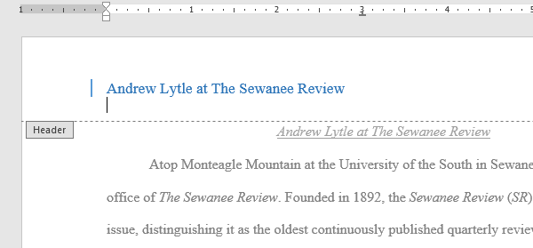
2. Tab ** Design ** sẽ xuất hiện. Nhấp vào lệnh ** Ngày & Giờ **.

   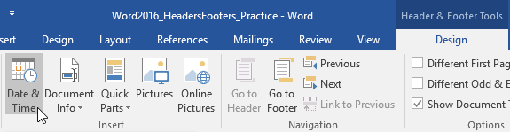
3. Hộp thoại ** Ngày và Giờ ** sẽ xuất hiện. Chọn ** ngày ** hoặc ** định dạng thời gian ** mong muốn.
4. Chọn hộp bên cạnh ** Cập nhật tự động ** nếu bạn muốn ngày thay đổi mỗi khi bạn Open tài liệu. Nếu bạn không muốn thay đổi ngày, hãy bỏ chọn tùy chọn này.
5. Nhấp vào ** OK **.

   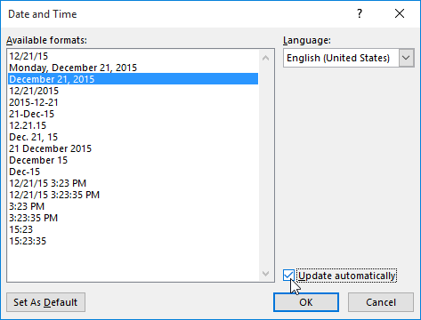
6. Ngày sẽ xuất hiện trong tiêu đề.

   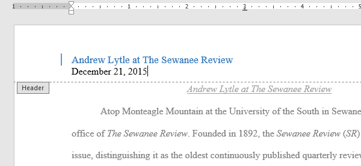

### Thử thách!

1. Open [tài liệu thực hành](practice_files/word_headersfooters_practice.docx) của chúng tôi. Nếu bạn đã tải xuống tài liệu thực hành của chúng tôi để theo dõi bài học, hãy nhớ tải xuống bản sao mới bằng cách nhấp vào liên kết trong bước này.
2. Open ** tiêu đề **.
3. Chọn ** Căn phải ** trên tab ** Home ** và nhập tên của bạn.
4. Bên dưới tên của bạn, hãy sử dụng lệnh ** Ngày & Giờ ** trên tab ** Design ** và Insert ngày bằng bất kỳ định dạng nào bạn muốn.
5. Trong phần ** chân trang **, Insert chân trang được đặt trước ** Grid **. Nếu phiên bản Word của bạn không có cài đặt sẵn Lưới, bạn có thể chọn bất kỳ cài đặt sẵn nào.
6. ** Close ** đầu trang và chân trang.
7. Khi bạn hoàn tất, trang của bạn sẽ trông giống như thế này:

   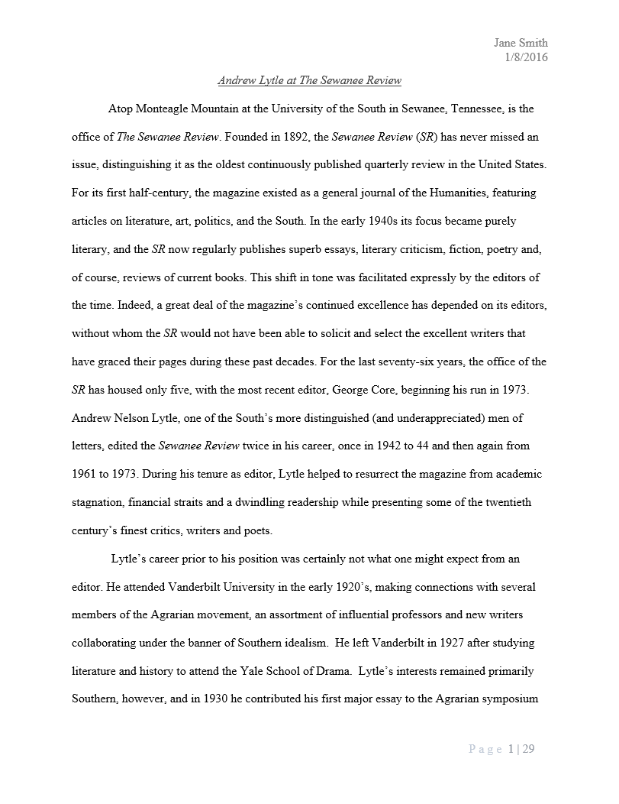

/en/word/số trang/nội dung/