# Bài 17: số trang

#### Bài 17: Số trang

/en/word/headers-and-footers/content/

### Giới thiệu

** Số trang ** có thể được sử dụng để tự động đánh số từng trang trong tài liệu của bạn. Chúng có nhiều định dạng số khác nhau và có thể được tùy chỉnh để phù hợp với nhu cầu của bạn. Số trang thường được đặt ở ** tiêu đề **, ** chân trang ** hoặc ** lề bên **. Khi bạn cần đánh số trang khác nhau, Word cho phép bạn ** bắt đầu lại việc đánh số trang **.

Hãy xem video dưới đây để tìm hiểu thêm về số trang trong Word.

#### Để thêm số trang:

Word có thể tự động gắn nhãn cho mỗi trang bằng số trang và đặt nó vào đầu trang, chân trang hoặc lề bên. Nếu bạn có đầu trang hoặc chân trang hiện có, nó sẽ bị xóa và thay thế bằng số trang.

1. Trên tab ** Insert **, hãy nhấp vào lệnh ** Số trang **.

   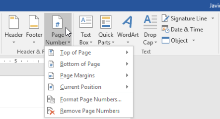
2. Open menu ** Đầu trang **, ** Cuối trang ** hoặc ** Lề trang **, tùy thuộc vào vị trí bạn muốn đặt số trang, sau đó chọn kiểu tiêu đề mong muốn.

   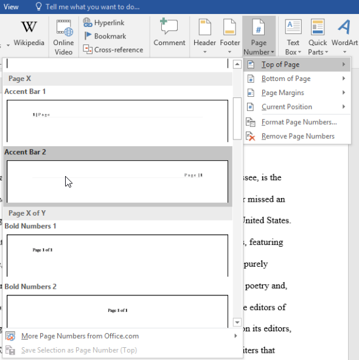
3. Đánh số trang sẽ xuất hiện.

   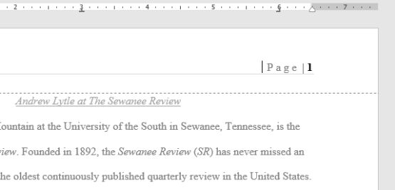
4. Nhấn phím ** Esc ** để khóa đầu trang và chân trang.

   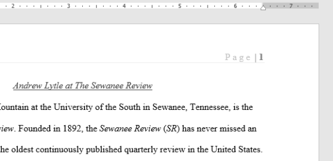
5. Nếu bạn cần thực hiện bất kỳ thay đổi nào đối với số trang của mình, chỉ cần nhấp đúp vào đầu trang hoặc chân trang để mở khóa.

Nếu bạn đã tạo số trang ở ** lề bên ** thì số trang đó vẫn được coi là một phần của ** tiêu đề ** hoặc ** chân trang **. Bạn sẽ không thể chọn số trang trừ khi đầu trang hoặc chân trang được chọn.

#### Để thêm số trang vào đầu trang hoặc chân trang hiện có:

Nếu bạn đã có đầu trang hoặc chân trang và muốn thêm số trang vào đó, Word có tùy chọn tự động Insert số trang vào đầu trang hoặc chân trang hiện có. Trong ví dụ của chúng tôi, chúng tôi sẽ thêm đánh số trang vào tiêu đề tài liệu của mình.

1. Nhấp đúp vào bất kỳ đâu trên ** tiêu đề ** hoặc ** chân trang ** để ** mở khóa ** nó.

   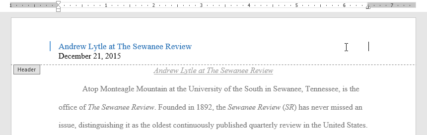
2. Trên tab ** Design **, hãy nhấp vào lệnh ** Số trang **. Trong menu xuất hiện, hãy di chuột qua ** Vị trí hiện tại ** và chọn ** đánh số trang ** ** kiểu ** mong muốn.

   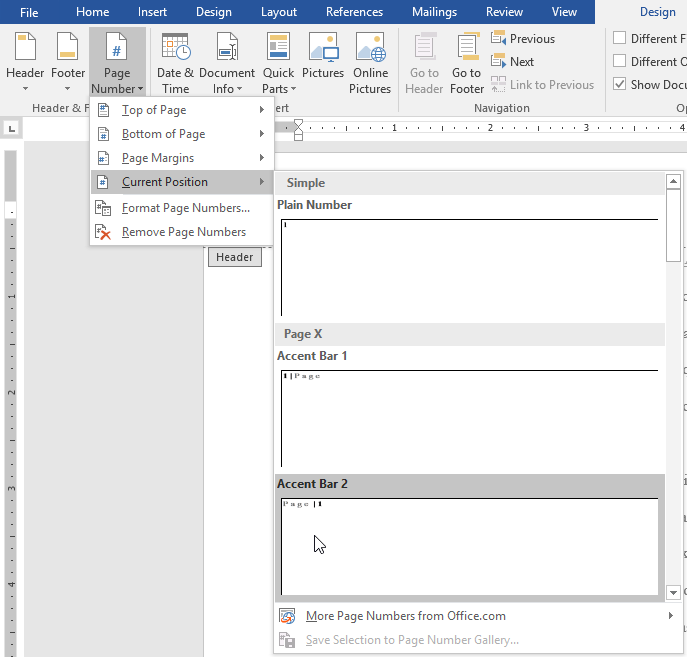
3. Đánh số trang sẽ xuất hiện.

   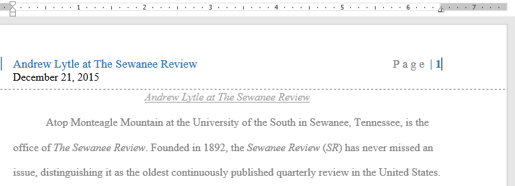
4. Khi bạn hoàn tất, hãy nhấn phím ** Esc **.

   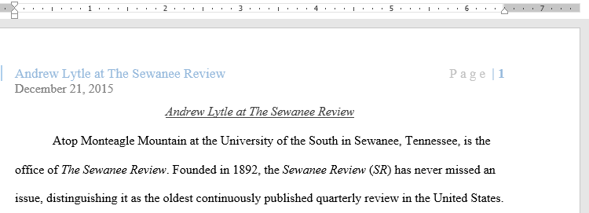

#### Để ẩn số trang ở trang đầu tiên:

Trong một số tài liệu, bạn có thể không muốn trang đầu tiên hiển thị số trang. Bạn có thể ** ẩn số trang đầu tiên ** mà không ảnh hưởng đến các trang còn lại.

1. Bấm đúp vào đầu trang hoặc chân trang để mở khóa.
2. Từ tab Design, hãy đánh dấu bên cạnh ** Trang đầu tiên khác **. Đầu trang và chân trang sẽ biến mất khỏi trang đầu tiên. Nếu muốn, bạn có thể nhập nội dung nào đó New vào đầu trang hoặc chân trang và nó sẽ chỉ ảnh hưởng đến trang đầu tiên.

   

Nếu bạn không thể chọn ** Trang đầu tiên khác **, có thể là do một đối tượng trong đầu trang hoặc chân trang đã được chọn. Bấm vào vùng trống trong đầu trang hoặc chân trang để đảm bảo không có gì được chọn.

#### Để bắt đầu lại việc đánh số trang:

Word cho phép bạn bắt đầu lại việc đánh số trang trên bất kỳ trang nào trong tài liệu của bạn. Bạn có thể thực hiện việc này bằng cách chèn dấu ngắt phần và chọn số bạn muốn bắt đầu đánh số lại. Trong ví dụ của chúng tôi, chúng tôi sẽ bắt đầu lại việc đánh số trang cho phần ** Tác phẩm được trích dẫn ** trong tài liệu của chúng tôi.

1. Đặt ** điểm chèn ** ở ** đầu trang ** mà bạn muốn bắt đầu lại việc đánh số trang. Nếu có văn bản trên trang, hãy đặt dấu chèn ở ** đầu văn bản **.

   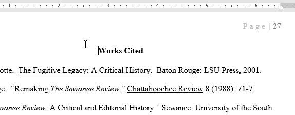
2. Chọn tab ** Layout **, sau đó nhấp vào lệnh ** Ngắt **. Chọn ** Trang tiếp theo ** từ trình đơn thả xuống xuất hiện.

   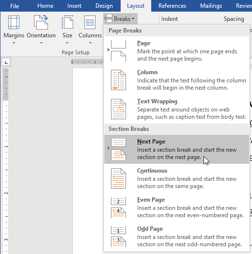
3. Dấu ngắt phần sẽ được thêm vào tài liệu.
4. Bấm đúp vào ** đầu trang hoặc chân trang ** chứa số trang bạn muốn khởi động lại.

   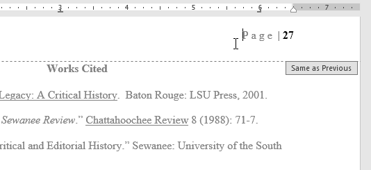
5. Bấm vào lệnh ** Số trang **. Trong menu xuất hiện, chọn ** Định dạng số trang **.

   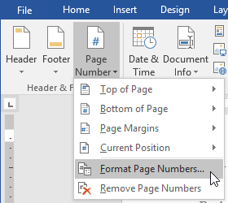
6. Một hộp thoại sẽ xuất hiện. Nhấp vào nút ** Bắt đầu tại:**. Theo mặc định, nó sẽ bắt đầu ở ** 1 **. Nếu muốn, bạn có thể thay đổi số. Khi bạn hoàn tất, hãy nhấp vào ** OK **.

   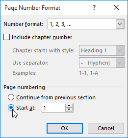
7. Việc đánh số trang sẽ bắt đầu lại.

   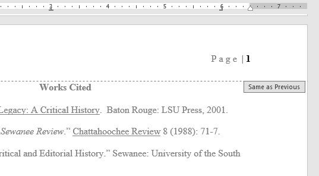

Để tìm hiểu thêm về cách thêm dấu ngắt phần vào tài liệu của bạn, Review bài học của chúng tôi về [Ngắt](../../breaks/1/index.html).

### Thử thách!

1. Open [tài liệu thực hành](practice_files/word_pagenumbers_practice.docx) của chúng tôi.
2. Trên trang 1, Insert số trang ** Accent Bar 4 ** ở ** Cuối trang **.
3. Trong ** Design Options **, chọn ** Trang đầu tiên khác **. Số trang bây giờ sẽ được ẩn trên trang đầu tiên.
4. Cuộn đến ** trang 27 ** của tài liệu.
5. Đặt con trỏ của bạn ở đầu tiêu đề ** Tác phẩm được trích dẫn ** và Insert a ** Ngắt phần liên tục **.
6. Ở chân trang 27, ** bắt đầu lại việc đánh số trang ** ở 1.
7. Khi bạn hoàn tất, phần cuối trang 27 sẽ trông như thế này:

   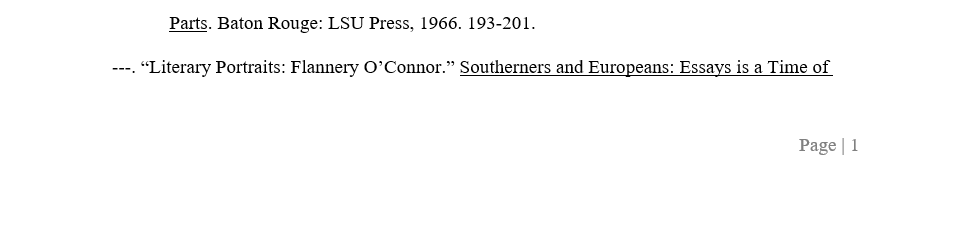

/en/word/pictures-and-text-wrapping/content/