# Bài 1: Làm quen với từ

#### Bài 1: Làm quen với Word

### Giới thiệu

Microsoft Word là ứng dụng ** xử lý văn bản ** cho phép bạn tạo nhiều loại ** tài liệu **, bao gồm thư từ, sơ yếu lý lịch, v.v. Trong bài học này, bạn sẽ tìm hiểu cách điều hướng giao diện Word và làm quen với một số tính năng quan trọng nhất của nó, chẳng hạn như ** Ribbon **, ** Quick Access Toolbar ** và ** Backstage view **.

Hãy xem video dưới đây để làm quen hơn với Word.

#### Về hướng dẫn này

Các quy trình trong hướng dẫn này sẽ áp dụng cho ** tất cả các phiên bản Microsoft Word gần đây **, bao gồm ** Word 2019 **, ** Word ** ** 2016 ** và ** Office 365 **. Có thể có một số khác biệt nhỏ, nhưng nhìn chung các phiên bản này đều giống nhau. Tuy nhiên, nếu đang sử dụng ** phiên bản cũ hơn **, bạn có thể tham khảo một trong các [hướng dẫn Word](../../../topics/word/index.html) khác của chúng tôi.

#### Giao diện Word

Khi bạn Open Word lần đầu tiên, ** Start Screen ** sẽ xuất hiện. Từ đây, bạn sẽ có thể tạo tài liệu ** New **, chọn ** Template ** và truy cập ** tài liệu được chỉnh sửa gần đây ** của bạn. Từ ** Start Screen **, tìm và chọn ** Blank document ** để truy cập vào giao diện Word.

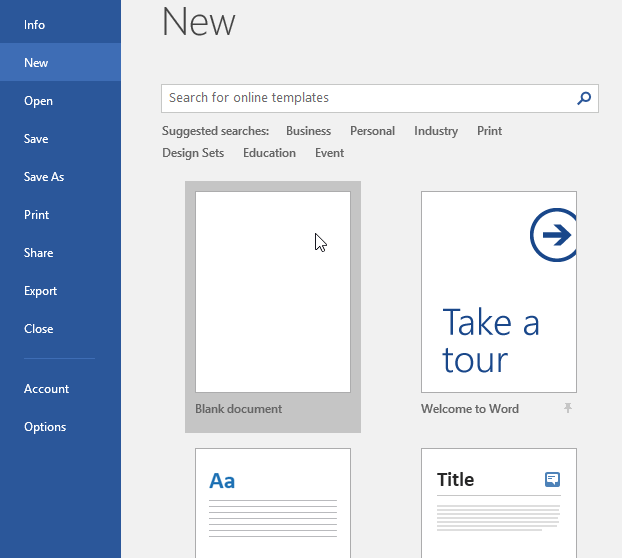

Nhấp vào các nút trong phần tương tác bên dưới để tìm hiểu thêm về giao diện Word.

doneedit điểm phát sóng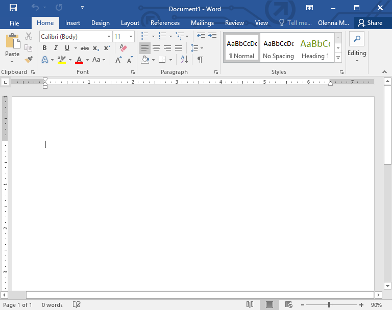

## Microsoft Account

Từ đây, bạn có thể truy cập thông tin ** Microsoft Account **, View hồ sơ của bạn và chuyển đổi tài khoản.

## Tell Me

Thanh ** Tell Me ** cho phép bạn tìm kiếm các lệnh, điều này đặc biệt hữu ích nếu bạn không nhớ tìm một lệnh cụ thể ở đâu.

## Nhóm lệnh

Mỗi nhóm chứa một loạt ** lệnh ** khác nhau. Chỉ cần nhấp vào bất kỳ lệnh nào để áp dụng nó. Một số nhóm còn có ** mũi tên ** ở góc dưới bên phải mà bạn có thể nhấp vào để xem thêm lệnh.

## Quick Access Toolbar

** Quick Access Toolbar ** cho phép bạn truy cập các lệnh phổ biến bất kể tab nào được chọn. Theo mặc định, nó bao gồm các lệnh ** Save **, ** Undo ** và ** Redo **.

## Ruler

** Ruler ** nằm ở trên cùng và bên trái tài liệu của bạn. Nó giúp việc ** căn chỉnh ** và ** điều chỉnh khoảng cách ** trở nên dễ dàng hơn.

## Scroll Bar

Nhấp và kéo ** dọc Scroll Bar ** để di chuyển lên và xuống qua các trang trong tài liệu của bạn.

## Zoom Control

Nhấp và kéo thanh trượt để sử dụng Zoom Control. Số ở bên phải thanh trượt phản ánh ** phần trăm thu phóng **.

## Document Views

Có ba cách để View một tài liệu:
  
** Read Mode ** hiển thị tài liệu của bạn ở chế độ toàn màn hình.
 ** Print Layout ** được chọn theo mặc định. Nó hiển thị tài liệu giống như trên trang in. ** Web Layout ** hiển thị cách tài liệu của bạn trông như một trang web.

## Ribbon

** Ribbon ** chứa tất cả ** lệnh ** bạn sẽ cần để thực hiện các tác vụ phổ biến trong Word. Nó có nhiều ** tab **, mỗi tab có một số ** nhóm ** lệnh.

## ngăn tài liệu

Đây là nơi bạn sẽ ** nhập và chỉnh sửa văn bản ** trong tài liệu.

## Số trang và số từ

Từ đây, bạn có thể nhanh chóng xem số lượng ** từ ** và ** trang ** trong tài liệu của mình.

## Zoom Control

Nhấp và kéo thanh trượt để sử dụng Zoom Control. Số ở bên phải thanh trượt phản ánh ** phần trăm thu phóng **.

### Làm việc với môi trường Word

Tất cả các phiên bản Word gần đây đều bao gồm ** Ribbon ** và ** Quick Access Toolbar **, nơi bạn sẽ tìm thấy các lệnh để thực hiện các tác vụ phổ biến trong Word, cũng như ** Backstage view **.

### Ribbon

Word sử dụng ** hệ thống theo thẻ Ribbon ** thay vì các menu truyền thống. ** Ribbon ** chứa ** nhiều tab ** mà bạn có thể tìm thấy ở gần đầu cửa sổ Word.

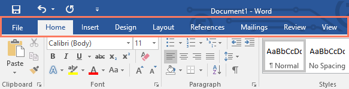

Mỗi tab chứa một số ** nhóm lệnh liên quan **. Ví dụ: nhóm Phông chữ trên tab Home chứa các lệnh để định dạng văn bản trong tài liệu của bạn.

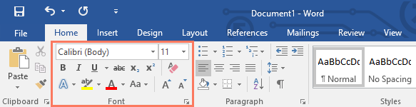

Một số nhóm còn có ** mũi tên nhỏ ** ở góc dưới cùng bên phải mà bạn có thể nhấp vào để xem thêm Options.

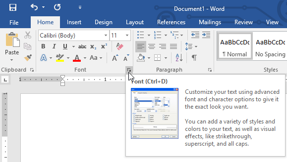

#### Hiển thị và ẩn Ribbon

Nếu bạn thấy Ribbon chiếm quá nhiều không gian màn hình, bạn có thể ẩn nó. Để thực hiện việc này, hãy nhấp vào mũi tên ** Ribbon Display Options ** ở góc trên bên phải của Ribbon, sau đó chọn tùy chọn mong muốn từ menu thả xuống:

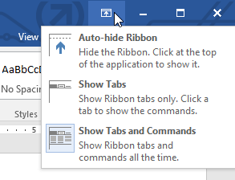

* ** Auto-hide Ribbon **: Tự động ẩn hiển thị tài liệu của bạn ở chế độ toàn màn hình và ẩn hoàn toàn Ribbon khỏi View. Để hiển thị Ribbon, hãy nhấp vào lệnh ** Mở rộng Ribbon ** ở đầu màn hình.
* ** Show Tabs **: Tùy chọn này ẩn tất cả các nhóm lệnh khi không sử dụng nhưng các tab sẽ vẫn hiển thị. Để hiển thị Ribbon, chỉ cần nhấp vào tab.
* ** Show Tabs and Commands **: Tùy chọn này tối đa hóa Ribbon. Tất cả các tab và lệnh sẽ hiển thị. Tùy chọn này được chọn theo mặc định khi bạn Open Word lần đầu tiên.

#### Sử dụng tính năng Tell Me

Nếu bạn gặp khó khăn khi tìm lệnh mình muốn, tính năng ** Tell Me ** có thể Help. Nó hoạt động giống như một thanh tìm kiếm thông thường. Nhập nội dung bạn đang tìm kiếm và danh sách Options sẽ xuất hiện. Sau đó, bạn có thể sử dụng lệnh trực tiếp từ menu mà không cần phải tìm nó trên Ribbon.

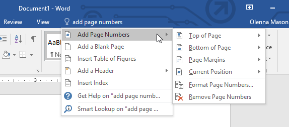

### Quick Access Toolbar

Nằm ngay phía trên Ribbon, ** Quick Access Toolbar ** cho phép bạn truy cập các lệnh phổ biến bất kể tab nào được chọn. Theo mặc định, nó hiển thị các lệnh ** Save **, ** Undo ** và ** Redo ** nhưng bạn có thể thêm các lệnh khác tùy theo nhu cầu của mình.

#### Để thêm lệnh vào Quick Access Toolbar:

1. Nhấp vào ** mũi tên thả xuống ** ở bên phải của ** Quick Access Toolbar **.

   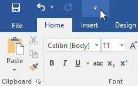
2. Chọn ** lệnh ** bạn muốn thêm từ menu.

   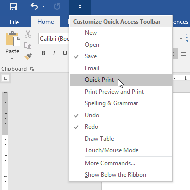
3. Lệnh sẽ được ** thêm ** vào Quick Access Toolbar.

   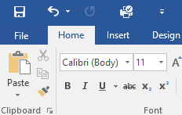

### Ruler

** R ***** uler ** nằm ở trên cùng và bên trái tài liệu của bạn. Nó giúp ** điều chỉnh ** tài liệu của bạn một cách chính xác dễ dàng hơn. Nếu muốn, bạn có thể ẩn Ruler để tạo thêm không gian màn hình.

#### Để hiển thị hoặc ẩn Ruler:

1. Nhấp vào tab ** View **.

   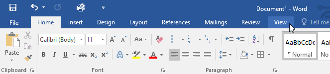
2. Nhấp vào hộp kiểm bên cạnh ** Ruler ** để ** hiển thị ** hoặc ** ẩn ** Ruler.

   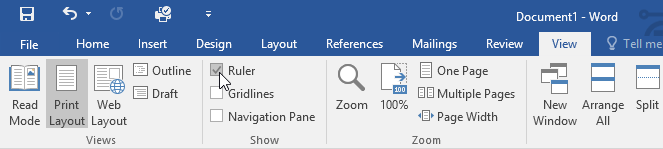

### Backstage view

** Backstage view ** cung cấp cho bạn nhiều Options để lưu, mở File, in và chia sẻ tài liệu của bạn. Để truy cập Backstage view, hãy nhấp vào tab ** File ** trên ** Ribbon **.

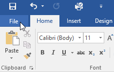

Nhấp vào các nút trong phần tương tác bên dưới để tìm hiểu thêm về cách sử dụng Backstage view.

chỉnh sửa điểm phát sóng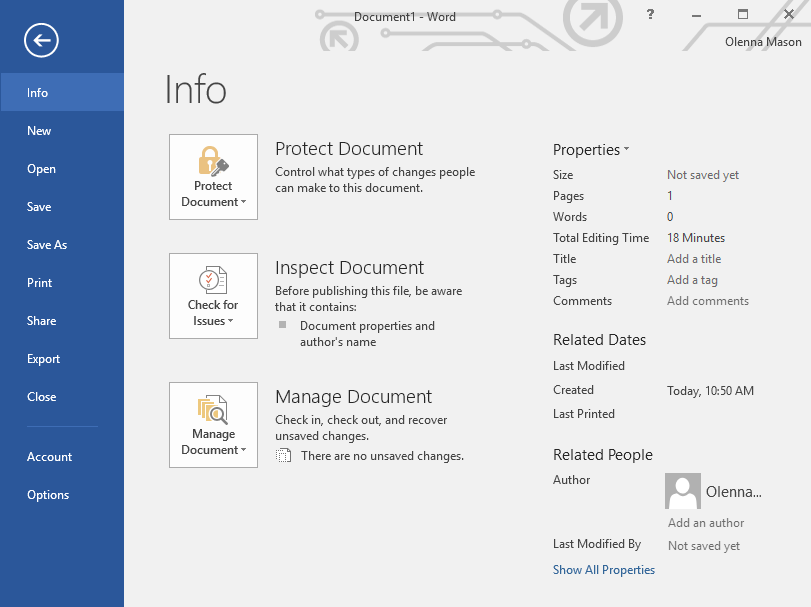

## Open

Từ đây, bạn có thể ** Open tài liệu ** được lưu vào máy tính hoặc vào OneDrive của bạn.

## Save và Save As

Bạn sẽ sử dụng ** Save ** và ** Save As ** cho tài liệu Save cho máy tính của bạn hoặc cho OneDrive.

## Print

Từ khung Print, bạn có thể thay đổi cài đặt ** Print ** và Print tài liệu của mình. Bạn cũng có thể xem ** bản xem trước ** tài liệu của mình.

## Export

Từ đây, bạn có thể Export tài liệu của mình ở định dạng File khác, chẳng hạn như ** PDF/XPS **.

## Close

Nhấp vào đây để ** Close ** tài liệu hiện tại.

## Share

Từ đây, bạn có thể mời mọi người ** View và cộng tác ** trên tài liệu của mình.

## Quay lại Word

Bạn có thể sử dụng mũi tên để ** Close ** ** Backstage ** ** View ** và quay lại Word.

## Account

Từ ngăn Account, bạn có thể truy cập thông tin ** Microsoft Account ** của mình, sửa đổi chủ đề và nền cũng như đăng xuất khỏi Account.

## Options

Tại đây, bạn có thể thay đổi nhiều Word khác nhau ** Options **. Ví dụ: bạn có thể kiểm soát cài đặt kiểm tra chính tả và ngữ pháp, cài đặt Tự động Phục hồi và tùy chọn ngôn ngữ.

## Info

** khung thông tin ** sẽ xuất hiện bất cứ khi nào bạn truy cập Backstage view. Nó chứa thông tin về tài liệu hiện tại. Bạn cũng có thể ** kiểm tra ** tài liệu để xóa Info cá nhân và ** bảo vệ ** tài liệu đó để ngăn người khác thực hiện thêm các thay đổi.

## New

Từ đây, bạn có thể tạo ** New Blank document ** hoặc bạn có thể chọn từ một bộ sưu tập lớn ** mẫu **.

### Document Views và thu phóng

Word có nhiều kiểu xem Options thay đổi cách hiển thị tài liệu của bạn. Bạn có thể chọn View tài liệu của mình trong ** Read Mode **, ** Print Layout ** hoặc ** Web Layout **. Những chế độ xem này có thể hữu ích cho nhiều tác vụ khác nhau, đặc biệt nếu bạn định ** Print ** tài liệu. Bạn cũng có thể ** phóng to và thu nhỏ ** để làm cho tài liệu của bạn dễ đọc hơn.

#### Đang chuyển đổi Document Views

Việc chuyển đổi giữa Document Views khác nhau thật dễ dàng. Chỉ cần xác định vị trí và chọn lệnh ** tài liệu View ** mong muốn ở góc dưới cùng bên phải của cửa sổ Word.

* ** Read Mode **: View này sẽ mở tài liệu ra toàn màn hình. View này rất phù hợp để đọc số lượng lớn văn bản hoặc đơn giản là xem lại tác phẩm của bạn.

  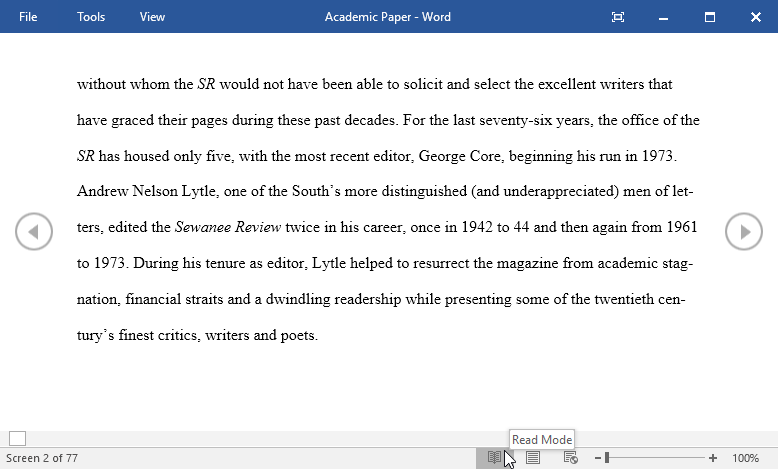
* ** Print Layout **: Đây là tài liệu mặc định View trong Word. Nó cho thấy tài liệu sẽ trông như thế nào trên trang in.

  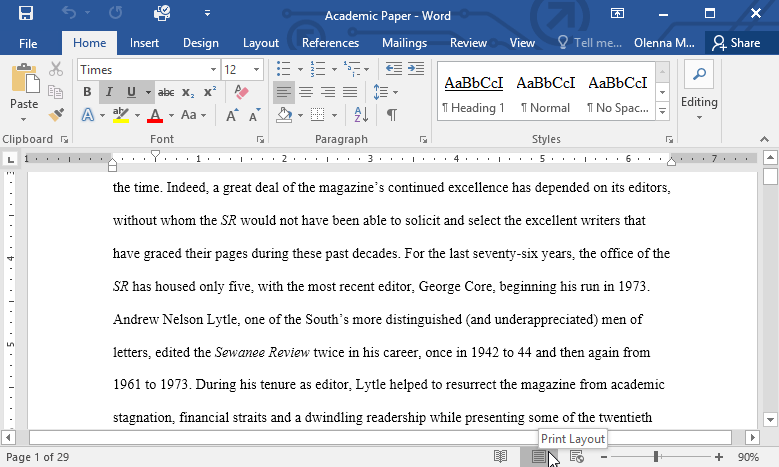
* ** Web Layout **: View này hiển thị tài liệu dưới dạng trang web, điều này có thể hữu ích nếu bạn đang sử dụng Word để xuất bản nội dung trực tuyến.

  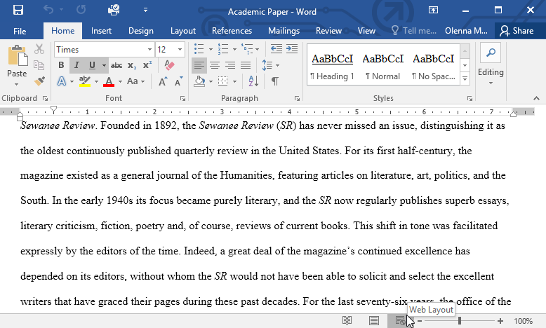

#### Phóng to và thu nhỏ

Để phóng to hoặc thu nhỏ, hãy nhấp và kéo thanh trượt ** Zoom Control ** ở góc dưới cùng bên phải của cửa sổ Word. Bạn cũng có thể chọn các lệnh **++** hoặc **-** **** để phóng to hoặc thu nhỏ theo gia số nhỏ hơn. Con số bên cạnh thanh trượt hiển thị ** phần trăm thu phóng ** hiện tại, còn được gọi là ** mức thu phóng **.

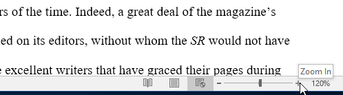

### Thử thách!

1. Open ** Word ** và tạo ** Blank document **.
2. Thay đổi ** Ribbon Display Options ** thành ** Show Tabs **.
3. Sử dụng ** Customize Quick Access Toolbar **, thêm ** New **, ** Nhanh Print ** và ** Spelling & Grammar.**
4. Trong ** Tell me bar **, nhập ** Hình dạng ** và nhấn ** Enter **.
5. Chọn một hình dạng từ menu và nhấp đúp vào vị trí nào đó trên tài liệu của bạn.
6. Hiển thị ** Ruler ** nếu nó chưa hiển thị.
7. ** Thu phóng ** tài liệu lên 120%.
8. Thay đổi ** Tài liệu View ** thành ** Web Layout **.
9. Khi bạn hoàn tất, tài liệu của bạn sẽ trông giống như thế này:

   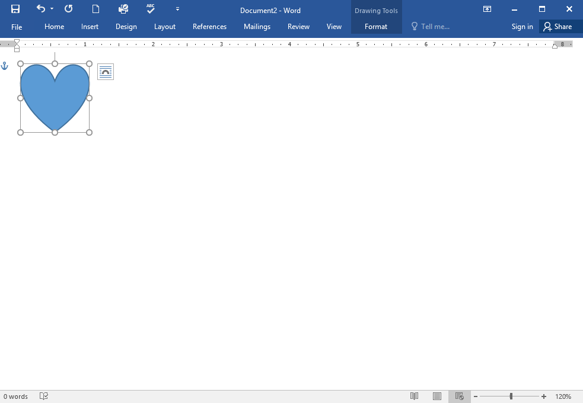
10. Thay đổi ** Ribbon Display Options ** trở lại ** Show Tabs and Commands ** và thay đổi ** Document View ** trở lại ** Print Layout **.

/en/word/hiểu-OneDrive/content/