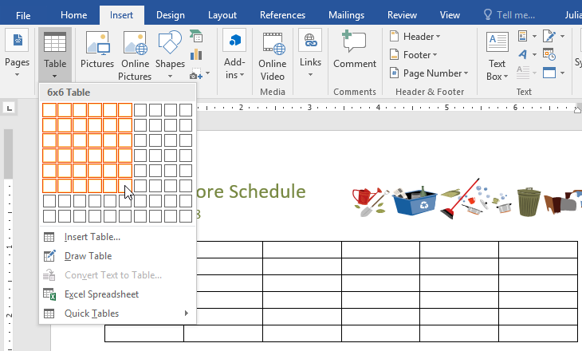
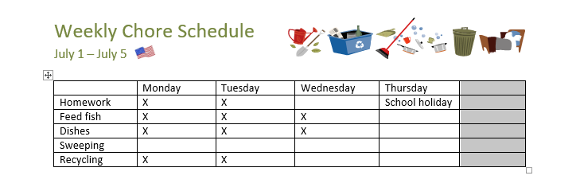
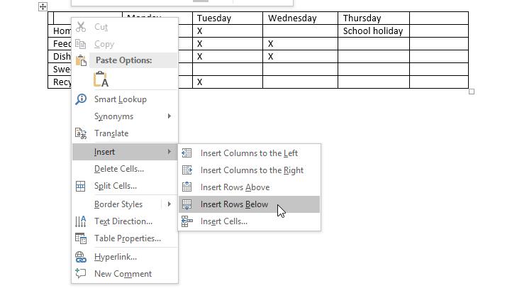
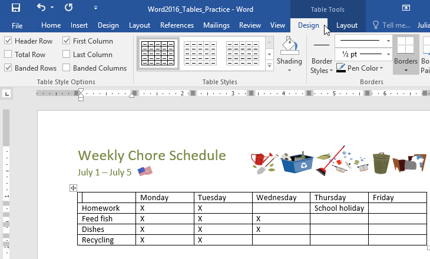
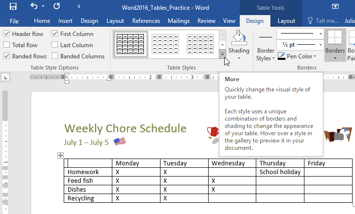
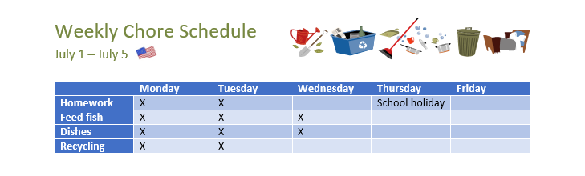
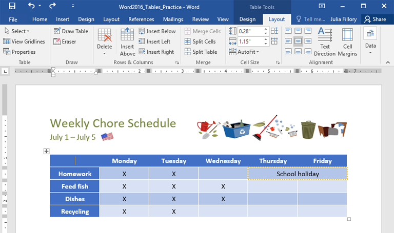
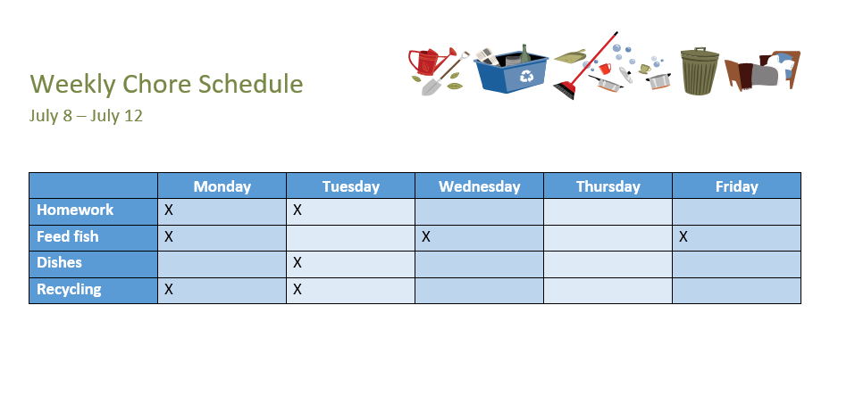

# Bài học 23: bảng

#### Bài học 23: Bàn

/en/word/aligning-ordering-and-grouping-objects/content/

### Giới thiệu

** bảng ** là một lưới các ô được sắp xếp theo ** hàng ** và ** cột **. Bảng có thể được sử dụng để sắp xếp bất kỳ loại nội dung nào, cho dù bạn đang làm việc với dữ liệu văn bản hay số. Trong Word, bạn có thể nhanh chóng Insert một ** bảng trống ** hoặc chuyển đổi ** văn bản hiện có ** thành bảng. Bạn cũng có thể tùy chỉnh bảng của mình bằng cách sử dụng ** kiểu ** và ** bố cục ** khác nhau.

Xem video bên dưới để tìm hiểu thêm về cách tạo bảng.

#### Đến Insert một bảng trống:

1. Đặt điểm chèn vào nơi bạn muốn bảng xuất hiện.
2. Điều hướng đến tab ** Insert **, sau đó nhấp vào lệnh ** Table **.

   
3. Thao tác này sẽ Open một menu thả xuống có chứa lưới. Di chuột qua lưới để chọn số lượng ** cột và hàng ** bạn muốn.

   
4. Nhấp vào lưới để ** xác nhận ** lựa chọn của bạn và một bảng sẽ xuất hiện.
5. Để ** nhập văn bản **, hãy đặt dấu chèn vào ô bất kỳ, sau đó bắt đầu nhập.

   

Để điều hướng giữa các ô, hãy sử dụng phím ** Tab ** hoặc phím ** mũi tên ** trên bàn phím của bạn. Nếu điểm chèn nằm ở ô cuối cùng, việc nhấn phím ** Tab ** sẽ tự động tạo hàng New.

#### Để chuyển đổi văn bản hiện có thành bảng:

Trong ví dụ bên dưới, mỗi dòng văn bản chứa một phần của ** danh sách kiểm tra **, bao gồm công việc nhà và các ngày trong tuần. Các mục được phân tách bằng ** tab **. Word có thể chuyển những thông tin này thành bảng, sử dụng các tab để phân tách dữ liệu thành các cột.

1. Chọn văn bản bạn muốn ** chuyển đổi ** thành bảng. Nếu bạn đang sử dụng thông lệ File của chúng tôi, bạn có thể tìm thấy văn bản này trên trang 2 của tài liệu.

   
2. Đi tới tab ** Insert **, sau đó nhấp vào lệnh ** Table **.
3. Chọn ** Chuyển văn bản thành bảng ** từ trình đơn thả xuống.

   
4. Một hộp thoại sẽ xuất hiện. Chọn một trong Options bên dưới ** Tách văn bản tại **. Đây là cách Word biết nên điền gì vào mỗi cột.

   
5. Nhấp vào ** OK **. Văn bản sẽ xuất hiện trong một bảng.

   

### Sửa đổi bảng

Bạn có thể dễ dàng thay đổi giao diện của bảng sau khi thêm bảng vào tài liệu của mình. Có một số Options để tùy chỉnh, bao gồm ** thêm hàng hoặc cột ** và thay đổi ** kiểu bảng **.

#### Để thêm một hàng hoặc cột:

1. Di chuột ra ngoài bảng nơi bạn muốn thêm hàng hoặc cột. Nhấp vào ** dấu cộng ** xuất hiện.

   
2. Một hàng hoặc cột New sẽ được thêm vào bảng.

   

Bạn cũng có thể ** nhấp chuột phải ** vào bảng, sau đó di chuột qua ** Insert ** để xem các hàng và cột khác nhau Options.

#### Để xóa một hàng hoặc cột:

1. Đặt điểm chèn vào ** hàng ** hoặc ** cột ** bạn muốn xóa.
2. Nhấp chuột phải, sau đó chọn ** Xóa ô ** từ menu.

   
3. Một hộp thoại sẽ xuất hiện. Chọn ** Xóa toàn bộ hàng ** hoặc ** Xóa toàn bộ cột **, sau đó nhấp vào ** OK **.

   
4. Hàng hoặc cột sẽ bị xóa.

#### Để áp dụng kiểu bảng:

Kiểu bảng cho phép bạn thay đổi ** giao diện ** của bảng ngay lập tức. Chúng kiểm soát một số thành phần Design, bao gồm màu sắc, đường viền và phông chữ.

1. Nhấp vào bất kỳ đâu trong bảng của bạn để chọn, sau đó nhấp vào tab ** Design ** ở ngoài cùng bên phải của Ribbon.

   
2. Xác định vị trí nhóm ** kiểu bảng **, sau đó nhấp vào mũi tên thả xuống ** Thêm ** để xem danh sách đầy đủ các kiểu.

   
3. Chọn ** bảng ** ** kiểu ** bạn muốn.

   
4. Kiểu bảng sẽ xuất hiện.

   

#### Để sửa đổi kiểu bảng Options:

Sau khi chọn kiểu bảng, bạn có thể bật Options ** bật ** hoặc ** tắt ** khác nhau để thay đổi giao diện của bảng. Có sáu Options: ** Hàng tiêu đề **, ** Hàng tổng **, ** Hàng có dải băng **, ** Cột đầu tiên **, ** Cột cuối cùng ** và ** Cột có dải băng **.

1. Nhấp vào bất kỳ đâu trong bảng của bạn, sau đó điều hướng đến tab ** Design **.
2. Xác định vị trí nhóm ** Table Style Options **, sau đó ** chọn ** hoặc ** bỏ chọn ** Options mong muốn.

   
3. Kiểu bảng sẽ được sửa đổi.

   

Tùy thuộc vào ** kiểu bảng ** bạn đã chọn, một số ** kiểu bảng Options ** nhất định có thể có hiệu ứng khác. Bạn có thể cần phải thử nghiệm để có được giao diện như mong muốn.

#### Để áp dụng đường viền cho bảng:

1. Chọn ** ô ** bạn muốn áp dụng đường viền.

   
2. Sử dụng các lệnh trên tab ** Design ** để chọn ** Kiểu đường **, ** Độ dày đường ** và ** Màu bút ** mong muốn.

   
3. Nhấp vào mũi tên ** thả xuống ** bên dưới lệnh ** Borders **.
4. Chọn ** loại đường viền ** từ trình đơn.

   
5. Đường viền sẽ được áp dụng cho các ô đã chọn.

   

### Sửa đổi bảng bằng tab Layout

Trong Word, tab ** Layout ** xuất hiện bất cứ khi nào bạn chọn bảng của mình. Bạn có thể sử dụng Options trên tab này để thực hiện nhiều sửa đổi khác nhau.

Nhấp vào các nút trong phần tương tác bên dưới để tìm hiểu thêm về các điều khiển bảng Layout của Word.

chỉnh sửa điểm phát sóng

## Hàng và Cột

Sử dụng các lệnh này để nhanh chóng ** Insert ** hoặc ** xóa ** hàng và cột. Điều này có thể đặc biệt hữu ích nếu bạn cần thêm thứ gì đó vào giữa bảng.

## Hợp nhất và chia ô

Một số bảng yêu cầu Layout không tuân theo lưới tiêu chuẩn. Trong những trường hợp này, bạn có thể muốn ** hợp nhất ** nhiều ô (tức là kết hợp chúng thành một) hoặc ** tách ** một ô thành hai.

## Thay đổi kích thước ô

Bạn có thể nhập ** chiều cao hàng ** hoặc ** chiều rộng cột ** mong muốn theo cách thủ công cho các ô của mình. Bạn cũng có thể sử dụng lệnh ** AutoFit ** để tự động điều chỉnh độ rộng cột dựa trên văn bản bên trong.

## Phân phối hàng/cột

Để giữ cho bảng của bạn trông gọn gàng và ngăn nắp, bạn có thể ** phân bổ các hàng hoặc cột bằng nhau **. Điều này sẽ làm cho chúng có cùng kích thước. Bạn có thể áp dụng tính năng này cho ** toàn bộ bảng ** hoặc chỉ ** một phần nhỏ ** của bảng.

## Căn chỉnh văn bản ô

Bằng cách thay đổi ** căn chỉnh ** các ô, bạn có thể kiểm soát chính xác vị trí của văn bản. Trong ví dụ bên dưới, văn bản đã được căn chỉnh về ** trung tâm **.

## Thay đổi hướng văn bản

Bạn có thể dễ dàng thay đổi hướng của văn bản từ ** ngang ** sang ** dọc **. Làm cho văn bản của bạn theo chiều dọc có thể thêm phong cách cho bảng của bạn; nó cũng cho phép bạn thêm ** thêm cột ** vào bảng của mình.

### Thử thách!

1. Open [tài liệu thực hành](practice_files/word_tables_practice.docx) của chúng tôi.
2. Cuộn đến ** trang 3 ** và chọn tất cả văn bản bên dưới các ngày ** 8 tháng 7 - 12 tháng 7 **.
3. Sử dụng ** Chuyển văn bản thành bảng ** thành Insert văn bản thành bảng ** 6 cột **. Đảm bảo ** Tách văn bản tại Tab **.
4. ** Xóa ** cột Thứ Bảy.
5. ** Insert một cột ** ở ** trái ** của cột Thứ Sáu và nhập ** Thứ Năm ** vào ô trên cùng.
6. Thay đổi ** kiểu bảng ** thành bất kỳ kiểu nào bắt đầu bằng ** Bảng lưới 5 **. ** Gợi ý **: Tên kiểu xuất hiện khi bạn di chuột qua chúng.
7. Trong trình đơn ** kiểu bảng Options **, hãy bỏ chọn Hàng có dải băng và chọn Cột có dải băng.
8. Chọn ** toàn bộ bảng **. Trong trình đơn thả xuống ** Biên giới **, chọn ** Tất cả biên giới **.
9. Với bảng vẫn được chọn, hãy tăng ** chiều cao hàng của bảng ** lên 0,3" (0,8 cm).
10. Chọn hàng đầu tiên và thay đổi ** căn chỉnh ô ** thành ** Căn giữa **.
11. Khi bạn hoàn tất, bảng của bạn sẽ trông giống như thế này:

    

/en/word/charts/content/