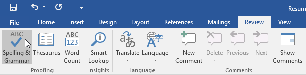
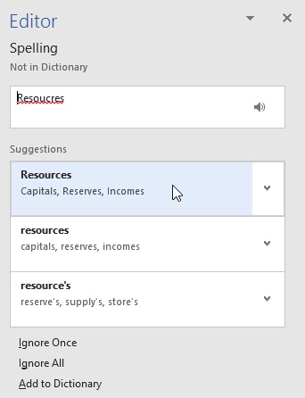
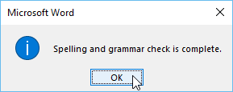
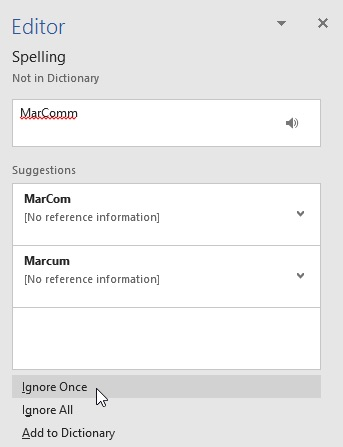
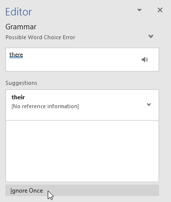
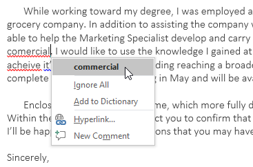
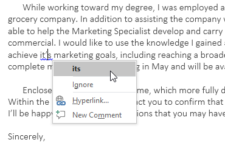
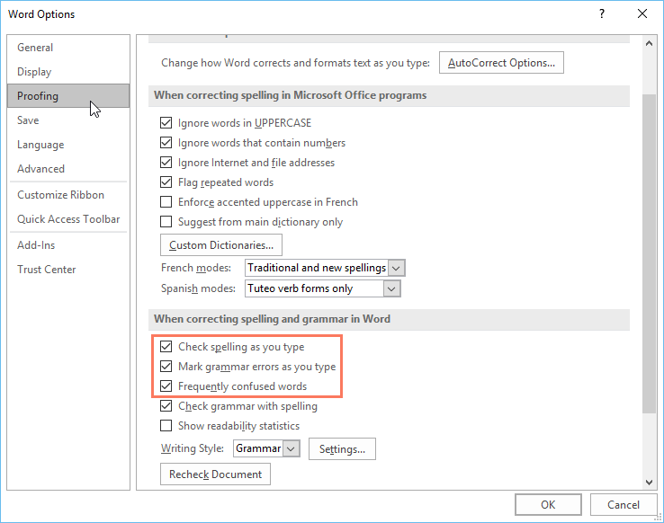
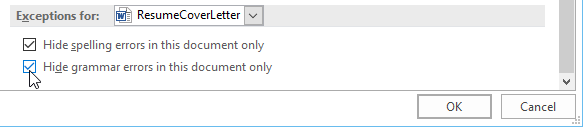

# Bài 25: Kiểm tra chính tả và ngữ pháp

#### Bài 25: Kiểm tra chính tả và ngữ pháp

/en/word/charts/content/

### Giới thiệu

Bạn lo lắng về việc mắc lỗi khi gõ phím? Đừng như vậy. Word cung cấp cho bạn một số ** tính năng soát lỗi **—bao gồm công cụ ** Chính tả và Ngữ pháp **—có thể Help giúp bạn tạo ra các tài liệu chuyên nghiệp, không có lỗi.

Xem video bên dưới để tìm hiểu thêm về cách sử dụng công cụ Chính tả và Ngữ pháp.

#### Để chạy kiểm tra Chính tả và Ngữ pháp:

1. Từ tab ** Review **, hãy nhấp vào lệnh ** Spelling & Grammar **.

   
2. Ngăn ** Chính tả và Ngữ pháp ** sẽ xuất hiện ở bên phải. Đối với mỗi lỗi trong tài liệu của bạn, Word sẽ đưa ra một hoặc nhiều ** gợi ý **. Bấm vào một gợi ý để sửa lỗi.

   
3. Word sẽ chuyển qua từng lỗi cho đến khi bạn xem lại hết chúng. Sau khi lỗi cuối cùng được xem xét, một hộp thoại sẽ xuất hiện xác nhận rằng việc kiểm tra chính tả và ngữ pháp đã hoàn tất. Nhấp vào ** OK **.

   

Nếu không có gợi ý nào được đưa ra, bạn có thể nhập thủ công chính tả vào tài liệu của mình.

### Bỏ qua “lỗi”

Việc kiểm tra chính tả và ngữ pháp ** không phải lúc nào cũng đúng **. Riêng với ngữ pháp, có rất nhiều lỗi Word sẽ không để ý. Cũng có những lúc việc kiểm tra chính tả và ngữ pháp sẽ cho biết có lỗi trong khi thực tế không phải vậy. Điều này thường xảy ra với tên và danh từ riêng khác, có thể không có trong từ điển.

Nếu Word thông báo có lỗi, bạn có thể chọn không thay đổi lỗi đó. Tùy thuộc vào đó là lỗi chính tả hay lỗi ngữ pháp, bạn có thể chọn từ một số Options.

#### Đối với "lỗi" chính tả:

* ** Bỏ qua một lần **: Thao tác này sẽ bỏ qua từ mà không thay đổi từ đó.
* ** Bỏ qua tất cả **: Thao tác này sẽ bỏ qua từ mà không thay đổi từ đó và cũng sẽ bỏ qua tất cả các trường hợp khác của từ trong tài liệu.
* ** Thêm vào từ điển **: Thao tác này sẽ thêm từ vào từ điển để nó không bao giờ bị lỗi. Đảm bảo từ đó được viết đúng chính tả trước khi chọn tùy chọn này.

  

#### Đối với "lỗi" ngữ pháp:

* ** Bỏ qua một lần **: Thao tác này sẽ bỏ qua từ hoặc cụm từ mà không thay đổi nó.

### Tự động kiểm tra chính tả và ngữ pháp

Theo mặc định, Word tự động kiểm tra tài liệu của bạn để tìm lỗi ** chính tả và ngữ pháp **, do đó, bạn thậm chí có thể không cần thực hiện kiểm tra riêng. Những lỗi này được biểu thị bằng ** dòng màu ** bên dưới văn bản.

* ** Dòng màu đỏ ** biểu thị từ sai chính tả.
* ** Dòng màu xanh ** biểu thị lỗi ngữ pháp, có thể bao gồm các từ dùng sai.

  

** Từ bị sử dụng sai **—còn được gọi là lỗi chính tả theo ngữ cảnh—xảy ra khi một từ được viết đúng chính tả nhưng được sử dụng không chính xác. Ví dụ: nếu bạn sử dụng cụm từ ** Deer Mr. Theodore ** ở đầu một chữ cái, ** deer ** sẽ là lỗi chính tả theo ngữ cảnh. ** Deer ** viết đúng chính tả nhưng lại dùng sai trong chữ cái. Từ đúng là ** Kính gửi **.

#### Để sửa lỗi chính tả:

1. Nhấp chuột phải vào ** từ được gạch chân **, sau đó chọn ** đúng chính tả ** từ danh sách gợi ý.

   
2. Từ được sửa sẽ xuất hiện trong tài liệu.

Bạn cũng có thể chọn ** Bỏ qua tất cả ** trường hợp của từ được gạch chân hoặc thêm từ đó vào ** từ điển **.

#### Để sửa lỗi ngữ pháp:

1. Nhấp chuột phải vào ** từ hoặc cụm từ được gạch chân **, sau đó chọn ** đúng chính tả hoặc cụm từ ** từ danh sách đề xuất.

   
2. Cụm từ đã sửa sẽ xuất hiện trong tài liệu.

#### Để thay đổi cài đặt kiểm tra chính tả và ngữ pháp tự động:

1. Nhấp vào tab ** File ** để truy cập ** Backstage view **, sau đó nhấp vào ** Options **.

   
2. Một hộp thoại sẽ xuất hiện. Ở bên trái hộp thoại, chọn ** Proofing **. Từ đây, bạn có một số Options để lựa chọn. Ví dụ: nếu bạn không muốn Word tự động đánh dấu ** lỗi chính tả **, ** lỗi ngữ pháp ** hoặc ** các từ thường bị nhầm lẫn **, bạn chỉ cần bỏ chọn tùy chọn mong muốn.

   

Nếu đã tắt tính năng kiểm tra chính tả và/hoặc ngữ pháp tự động, bạn vẫn có thể chuyển tới tab ** Review ** và nhấp vào lệnh ** Spelling & Grammar ** để chạy kiểm tra New.

#### Để ẩn lỗi chính tả và ngữ pháp trong tài liệu:

Nếu bạn đang chia sẻ một tài liệu như sơ yếu lý lịch với ai đó, bạn có thể không muốn người đó nhìn thấy các đường màu đỏ và xanh lam. Việc tắt tính năng tự động kiểm tra chính tả và ngữ pháp chỉ áp dụng cho máy tính của bạn nên các dòng vẫn có thể hiển thị khi người khác xem tài liệu của bạn. May mắn thay, Word cho phép bạn ẩn các lỗi chính tả và ngữ pháp để các dòng không hiển thị trên bất kỳ máy tính nào.

1. Nhấp vào tab ** File ** để đi tới ** Backstage view **, sau đó nhấp vào ** Options **.
2. Một hộp thoại sẽ xuất hiện. Chọn ** Đang kiểm tra **, sau đó chọn hộp bên cạnh ** Chỉ ẩn lỗi chính tả trong tài liệu này ** và ** Chỉ ẩn lỗi ngữ pháp trong tài liệu này **, sau đó nhấp vào ** OK **.

   
3. Các dòng trong tài liệu sẽ bị ẩn.

### Thử thách!

1. Open [tài liệu thực hành](practice_files/word_spellinggrammar_practice.docx) của chúng tôi. Nếu bạn đã tải xuống tài liệu thực hành của chúng tôi để theo dõi bài học, hãy nhớ tải xuống bản sao mới bằng cách nhấp vào liên kết trong bước này.
2. Chạy kiểm tra ** Spelling & Grammar **.
3. ** Bỏ qua ** cách viết những cái tên như ** Marcom **.
4. Sửa ** tất cả ** các lỗi chính tả và ngữ pháp khác.
5. Khi bạn hoàn tất, tài liệu của bạn sẽ trông như thế này:

   

/en/word/track-changes-and-comments/content/