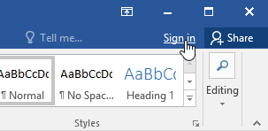
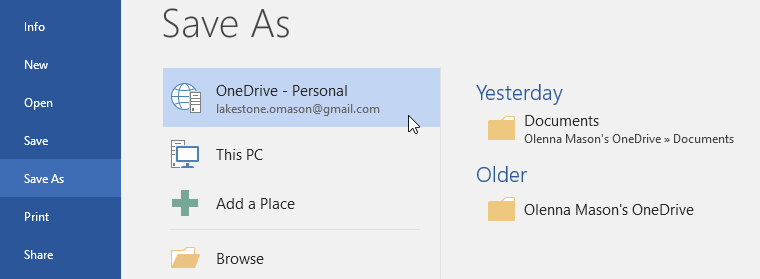

# Bài 2: hiểu-OneDrive

#### Bài 2: Tìm hiểu OneDrive

/en/word/getting-started-with-word/content/

### Giới thiệu

Nhiều tính năng trong Office hướng tới việc lưu và chia sẻ tệp trực tuyến. ** OneDrive ** là không gian lưu trữ trực tuyến của Microsoft mà bạn có thể sử dụng để Save, chỉnh sửa và Share tài liệu của mình cũng như các tệp khác. Bạn có thể truy cập OneDrive từ máy tính, điện thoại thông minh hoặc bất kỳ thiết bị nào bạn sử dụng.

Để bắt đầu với OneDrive, tất cả những gì bạn cần làm là thiết lập ** Microsoft Account ** miễn phí nếu bạn chưa có.

Nếu chưa có Microsoft Account, bạn có thể đi tới bài học [Tạo Microsoft Account](../../../microsoftaccount/creating-a-microsoft-Account/2/index.html) trong hướng dẫn Microsoft Account của chúng tôi.

Sau khi có Microsoft Account, bạn sẽ có thể đăng nhập vào Office. Chỉ cần nhấp vào ** Đăng nhập ** ở góc trên bên phải của cửa sổ Word.

#### Lợi ích của việc sử dụng OneDrive

Khi bạn đã đăng nhập vào Microsoft Account của mình, có một số điều bạn có thể thực hiện với OneDrive:

* ** Truy cập tệp của bạn ở mọi nơi **: Khi bạn Save tệp của mình vào OneDrive, bạn sẽ có thể truy cập chúng từ bất kỳ máy tính, máy tính bảng hoặc điện thoại thông minh nào có kết nối Internet. Bạn cũng sẽ có thể tạo tài liệu New từ OneDrive.
* ** Sao lưu tệp của bạn **: Việc lưu tệp vào OneDrive sẽ mang lại cho chúng thêm một lớp bảo vệ. Ngay cả khi có điều gì đó xảy ra với máy tính của bạn, OneDrive sẽ giữ cho các tệp của bạn an toàn và có thể truy cập được.
* ** Share tệp **: Thật dễ dàng để Share tệp OneDrive của bạn với bạn bè và đồng nghiệp. Bạn có thể chọn xem họ có thể chỉnh sửa hay chỉ đọc tệp. Tùy chọn này rất phù hợp cho việc cộng tác vì nhiều người có thể chỉnh sửa tài liệu cùng lúc (còn được gọi là đồng tác giả).

#### Lưu và mở tập tin

Khi bạn đăng nhập vào Microsoft Account của mình, OneDrive sẽ xuất hiện dưới dạng tùy chọn bất cứ khi nào bạn Save hoặc Open và File. Bạn vẫn có tùy chọn lưu tập tin vào máy tính của mình. Tuy nhiên, việc lưu tệp vào OneDrive cho phép bạn truy cập chúng từ bất kỳ máy tính nào khác và nó cũng cho phép bạn truy cập tệp Share với bạn bè và đồng nghiệp.

Ví dụ: khi nhấp vào ** Save As **, bạn có thể chọn OneDrive hoặc PC này làm vị trí Save.

/en/word/tạo-và-mở-tài liệu/nội dung/