# Bài 3: Tạo và mở tài liệu

#### Bài 3: Tạo và mở tài liệu

/en/word/hiểu-OneDrive/content/

### Giới thiệu

Tệp Word được gọi là ** tài liệu **. Bất cứ khi nào bạn bắt đầu dự án New trong Word, bạn sẽ cần ** tạo một tài liệu New **, có thể để trống hoặc từ một Template. Bạn cũng cần biết cách ** Open một tài liệu hiện có **.

Hãy xem video bên dưới để tìm hiểu thêm về cách tạo và mở tài liệu trong Word.

#### Để tạo New Blank document:

Khi bắt đầu dự án New trong Word, bạn thường muốn bắt đầu bằng New Blank document.

1. Chọn tab ** File ** để truy cập ** Backstage view **.

   
2. Chọn ** New **, sau đó nhấp vào ** Blank document **.

   
3. Một New Blank document sẽ xuất hiện.

#### Để tạo tài liệu New từ Template:

** Template ** là ** tài liệu được thiết kế trước ** mà bạn có thể sử dụng để tạo tài liệu New một cách nhanh chóng. Các mẫu thường bao gồm ** định dạng tùy chỉnh ** và ** thiết kế **, vì vậy chúng có thể giúp bạn Save mất rất nhiều thời gian và công sức khi bắt đầu một dự án New.

1. Nhấp vào tab ** File ** để truy cập ** Backstage view **, sau đó chọn ** New **.
2. Một số mẫu sẽ xuất hiện bên dưới tùy chọn ** Blank document **. Bạn cũng có thể sử dụng thanh tìm kiếm để tìm nội dung cụ thể hơn. Trong ví dụ của chúng tôi, chúng tôi sẽ tìm kiếm ** tờ rơi ** Template.

   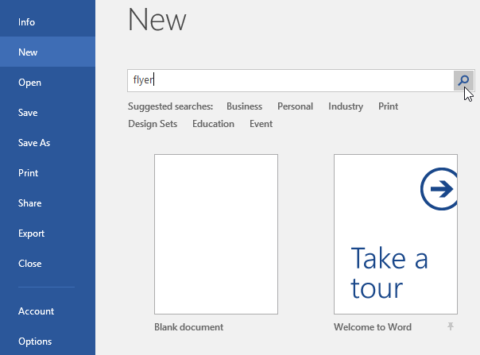
3. Khi bạn tìm thấy nội dung nào đó mình thích, hãy chọn Template để xem trước nội dung đó.

   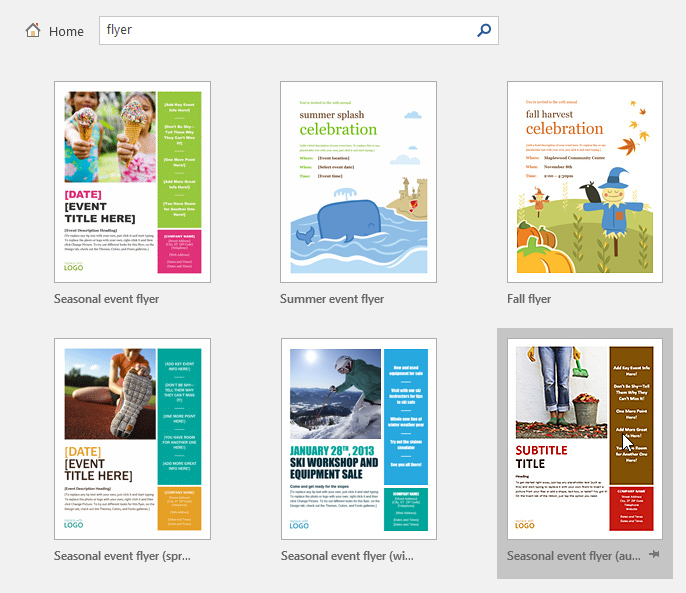
4. ** bản xem trước ** của Template sẽ xuất hiện. Nhấp vào ** Tạo ** để sử dụng Template đã chọn.

   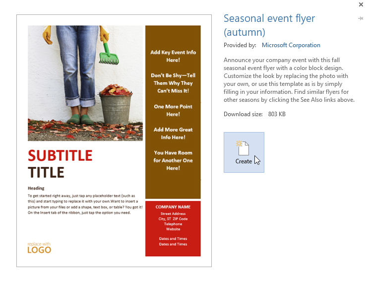
5. Tài liệu New sẽ xuất hiện cùng với ** Template ** đã chọn.

None

#### Đến Open một tài liệu hiện có:

Ngoài việc tạo tài liệu New, bạn thường sẽ cần Open tài liệu đã được lưu trước đó. Để tìm hiểu thêm về cách lưu tài liệu, hãy truy cập bài học của chúng tôi về [Lưu và chia sẻ tài liệu](../../../word2016/ Saving-and-sharing-documents/1/index.html).

1. Điều hướng đến ** Backstage view **, sau đó nhấp vào ** Open **.

   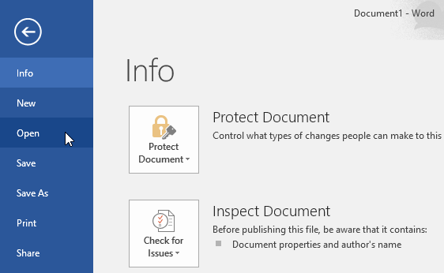
2. Chọn ** PC này **, sau đó nhấp vào ** Duyệt **. Bạn cũng có thể chọn ** OneDrive ** cho các tệp Open được lưu trữ trên OneDrive của mình.

   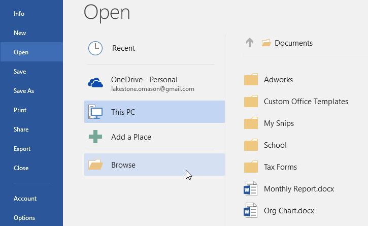
3. Hộp thoại ** Open ** sẽ xuất hiện. Xác định vị trí và chọn ** tài liệu ** của bạn, sau đó nhấp vào ** Open **.

   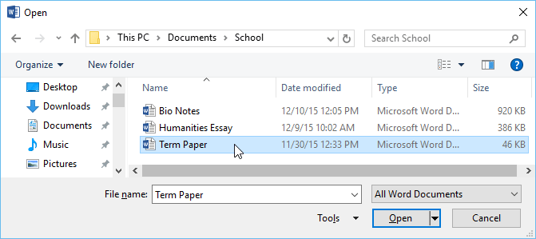
4. Tài liệu đã chọn sẽ xuất hiện.

Hầu hết các tính năng trong Microsoft Office, bao gồm Word, đều hướng đến việc lưu và chia sẻ tài liệu ** trực tuyến **. Việc này được thực hiện với ** OneDrive **, đây là không gian lưu trữ trực tuyến cho tài liệu và tệp của bạn. Nếu bạn muốn sử dụng OneDrive, hãy đảm bảo bạn đã đăng nhập vào Word bằng Microsoft Account của mình. Review bài học của chúng tôi về [Hiểu OneDrive](../../hiểu-OneDrive/1/index.html) để tìm hiểu thêm.

#### Để ghim một tài liệu:

Nếu thường xuyên làm việc với ** cùng một tài liệu **, bạn có thể ** ghim nó ** vào Backstage view để truy cập nhanh.

1. Điều hướng đến ** Backstage view **, nhấp vào ** Open **, sau đó chọn ** Gần đây **.
2. Một danh sách các tài liệu được chỉnh sửa gần đây sẽ xuất hiện. Di chuột qua ** tài liệu ** bạn muốn ghim, sau đó nhấp vào biểu tượng ** ghim.

   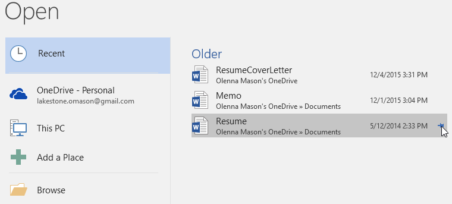**
3. Tài liệu sẽ ở trong danh sách Tài liệu gần đây cho đến khi được bỏ ghim. Để ** bỏ ghim ** tài liệu, hãy nhấp lại vào biểu tượng đinh ghim.

   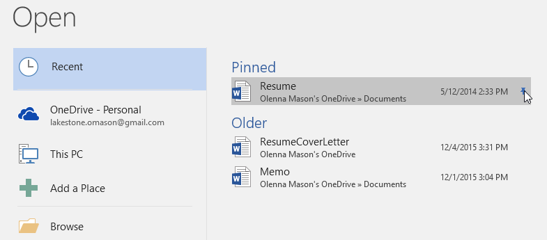

### Chế độ tương thích

Đôi khi, bạn có thể cần phải làm việc với các tài liệu được tạo trong các phiên bản Microsoft Word cũ hơn, như Word 2010 hoặc Word 2007. Khi bạn Open những loại tài liệu này, chúng sẽ xuất hiện trong ** Chế độ tương thích **.

Chế độ tương thích ** tắt ** một số tính năng nhất định, do đó bạn sẽ chỉ có thể truy cập các lệnh có trong chương trình được sử dụng để tạo tài liệu. Ví dụ: nếu bạn Open một tài liệu được tạo trong Word 2007, bạn chỉ có thể sử dụng các tab và lệnh có trong Word 2007.

Trong hình ảnh bên dưới, bạn có thể thấy Chế độ tương thích có thể ảnh hưởng như thế nào đến các lệnh khả dụng. Vì tài liệu bên trái ở Chế độ tương thích nên nó chỉ hiển thị các lệnh có sẵn trong Word 2007.

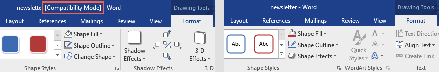

## Các lệnh trong Word 2007

Để thoát khỏi Chế độ tương thích, bạn cần ** chuyển đổi ** tài liệu sang loại phiên bản hiện tại. Tuy nhiên, nếu bạn đang cộng tác với những người khác chỉ có quyền truy cập vào phiên bản Word cũ hơn, tốt nhất bạn nên để tài liệu ở Chế độ tương thích để định dạng không thay đổi.

Bạn có thể Review [hỗ trợ này page](../../../not-offline.html?url=https:/support.microsoft.com/en-us/office/Open-a-document-in-an-earlier-version-of-word-45c4dd2f-bf7b-4a0d-9ff2-7b2ff6b733f0?redirec tSourcePath=%252fen-US%252farticle%252fUse-Word-2016-to-Open-documents-created-in-earlier-versions-of-Word-5b38a00a-840b-4719-a8a3-ce155df82554&ui=en-US&rs=en-001&ad=US) từ Microsoft để tìm hiểu thêm về những tính năng bị tắt trong Chế độ tương thích.

#### Để chuyển đổi một tài liệu:

Nếu muốn truy cập vào các tính năng mới hơn, bạn có thể ** chuyển đổi ** tài liệu sang định dạng File hiện tại.

1. Nhấp vào tab ** File ** để truy cập Backstage view, sau đó tìm và chọn lệnh ** Convert **.

   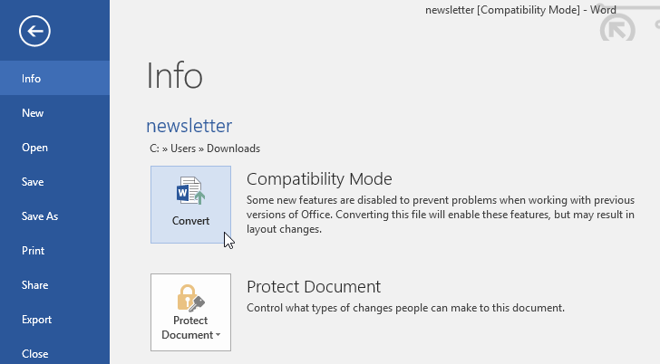
2. Một hộp thoại sẽ xuất hiện. Nhấp vào ** OK ** để xác nhận nâng cấp File.

   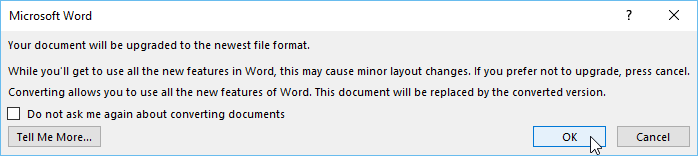
3. Tài liệu sẽ được chuyển đổi sang loại File mới nhất.

Việc chuyển đổi File có thể gây ra một số thay đổi đối với ** Layout ** gốc của tài liệu.

### Thử thách!

1. Open [tài liệu thực hành](practice_files/word_createopen_practice.doc) của chúng tôi.
2. Lưu ý rằng tài liệu sẽ mở ở ** Chế độ tương thích **. ** Chuyển đổi ** nó sang định dạng File hiện tại. Nếu một hộp thoại xuất hiện hỏi bạn có muốn Close và mở lại File để xem các tính năng của New hay không, hãy chọn ** Có **.
3. Trong Backstage view, ** ghim ** một File hoặc thư mục.

/en/word/save-and-sharing-documents/content/