# Bài 4: Lưu và chia sẻ tài liệu

#### Bài 4: Lưu và chia sẻ tài liệu

/en/word/tạo-và-mở-tài liệu/nội dung/

### Giới thiệu

Khi tạo tài liệu New trong Word, bạn cần biết cách ** Save ** tài liệu đó để có thể truy cập và chỉnh sửa sau này. Giống như các phiên bản Word trước, bạn có thể Save tệp vào ** máy tính ** của mình. Nếu muốn, bạn cũng có thể Save tệp lên ** đám mây ** bằng cách sử dụng ** OneDrive **. Bạn thậm chí có thể ** Export ** và ** Share ** tài liệu trực tiếp từ Word.

Xem video bên dưới để tìm hiểu cách Save và Share tài liệu Word.

#### Save và Save As

Word cung cấp hai cách để Save a File: ** Save ** và ** Save As **. Các Options này hoạt động theo cách tương tự nhau, có một số điểm khác biệt quan trọng.

* ** Save **: Khi tạo hoặc chỉnh sửa tài liệu, bạn sẽ sử dụng lệnh ** Save ** cho Save các thay đổi của mình. Bạn sẽ sử dụng lệnh này hầu hết thời gian. Khi bạn Save một File, bạn sẽ chỉ cần chọn tên và vị trí File lần đầu tiên. Sau đó, bạn có thể nhấp vào lệnh Save để Save nó có cùng tên và vị trí.
* ** Save As **: Bạn sẽ sử dụng lệnh này để tạo ** bản sao ** của tài liệu trong khi vẫn giữ bản gốc. Khi bạn sử dụng Save As, bạn sẽ cần chọn tên và/hoặc vị trí khác cho phiên bản đã sao chép.

#### Giới thiệu về OneDrive

Hầu hết các tính năng trong Microsoft Office, bao gồm Word, đều hướng đến việc lưu và chia sẻ tài liệu ** trực tuyến **. Việc này được thực hiện với ** OneDrive **, đây là không gian lưu trữ trực tuyến cho tài liệu và tệp của bạn. Nếu bạn muốn sử dụng OneDrive, hãy đảm bảo bạn đã đăng nhập vào Word bằng Microsoft Account của mình. Review bài học của chúng tôi về [Hiểu OneDrive](../../hiểu-OneDrive/1/index.html) để tìm hiểu thêm.

#### Tới Save một tài liệu:

Điều quan trọng là ** Save tài liệu của bạn ** bất cứ khi nào bạn bắt đầu dự án New hoặc thực hiện thay đổi đối với dự án hiện có. Lưu sớm và thường xuyên có thể giúp công việc của bạn không bị thất lạc. Bạn cũng cần phải chú ý Close đến ** nơi bạn Save ** tài liệu để có thể dễ dàng tìm thấy sau này.

1. Xác định vị trí và chọn lệnh ** Save ** trên ** Quick ** ** Access Toolbar **.

   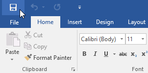
2. Nếu bạn đang lưu File lần đầu tiên thì ngăn ** Save As ** sẽ xuất hiện trong ** Backstage ** ** View **.
3. Sau đó, bạn sẽ cần chọn ** nơi đặt Save ** File và đặt tên ** File **. Nhấp vào ** Duyệt ** để chọn vị trí trên máy tính của bạn. Bạn cũng có thể nhấp vào ** OneDrive ** để Save File cho OneDrive của bạn.

   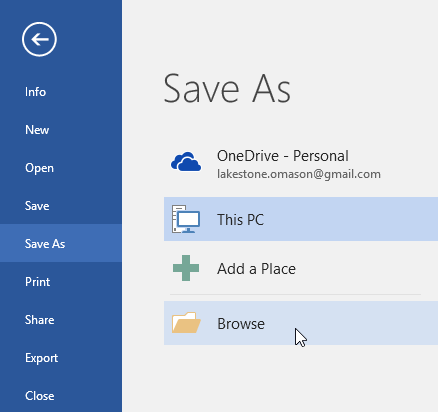
4. Hộp thoại ** Save As ** sẽ xuất hiện. Chọn ** vị trí ** nơi bạn muốn Save tài liệu.
5. Nhập tên ** File ** cho tài liệu, sau đó nhấp vào ** Save **.

   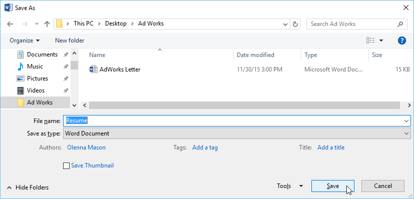
6. Tài liệu sẽ được ** lưu **. Bạn có thể nhấp lại vào lệnh ** Save ** để Save những thay đổi của bạn khi sửa đổi tài liệu.

#### Sử dụng Save As để tạo bản sao

Nếu bạn muốn Save một ** phiên bản khác ** của tài liệu trong khi vẫn giữ bản gốc, bạn có thể tạo ** bản sao **. Ví dụ: nếu bạn có File có tên ** Báo cáo bán hàng **, bạn có thể Save dưới dạng ** Báo cáo bán hàng 2 ** để bạn có thể chỉnh sửa New File và vẫn tham khảo lại phiên bản gốc.

Để thực hiện việc này, bạn sẽ nhấp vào lệnh ** Save As ** trong Backstage view. Giống như khi lưu File lần đầu tiên, bạn sẽ cần chọn ** vị trí Save ** File và đặt cho nó một tên New ** File **.

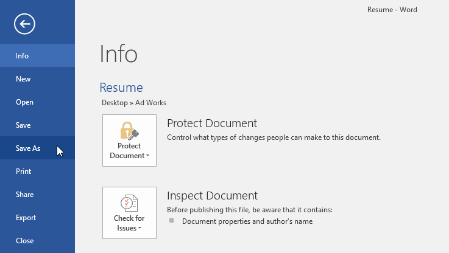

#### Để thay đổi vị trí Save mặc định:

Nếu bạn không muốn sử dụng ** OneDrive **, bạn có thể cảm thấy khó chịu vì OneDrive được chọn làm vị trí mặc định khi lưu. Nếu thấy điều này bất tiện, bạn có thể thay đổi ** vị trí Save mặc định ** để ** PC này ** được chọn theo mặc định.

1. Nhấp vào tab ** File ** để truy cập ** Hậu trường ** ** View **.

   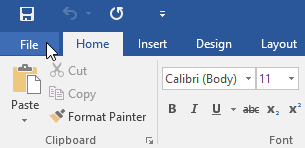
2. Nhấp vào ** Options **.

   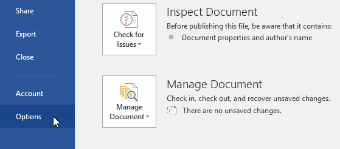
3. Hộp thoại ** Word Options ** sẽ xuất hiện. Chọn ** Save ** ở bên trái, ** đánh dấu vào hộp ** bên cạnh ** Save vào Máy tính theo mặc định **, sau đó nhấp vào ** OK **. Vị trí Save mặc định sẽ được thay đổi.

   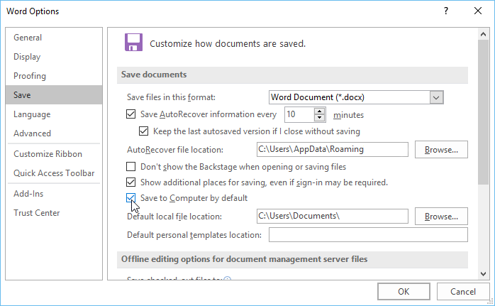

### Tự động Phục hồi

Word sẽ tự động lưu tài liệu của bạn vào một thư mục tạm thời trong khi bạn đang làm việc với chúng. Nếu bạn quên Save các thay đổi của mình hoặc nếu Word gặp sự cố, bạn có thể khôi phục File bằng ** Tự động phục hồi **.

#### Để sử dụng Tự động Phục hồi:

1. Open Từ. Nếu tìm thấy ** phiên bản được lưu tự động ** của File thì ngăn ** Tài liệu ** ** Phục hồi ** sẽ xuất hiện ở bên trái.
2. Nhấp vào ** Open ** một File có sẵn. Tài liệu sẽ được ** phục hồi **.

   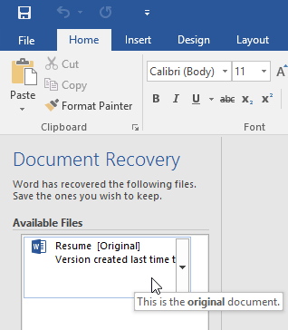

Theo mặc định, Word sẽ tự động lưu sau mỗi 10 phút. Nếu bạn đang chỉnh sửa tài liệu có thời lượng dưới 10 phút, Word có thể không tạo phiên bản lưu tự động.

Nếu không thấy File mình cần, bạn có thể duyệt tất cả các tệp được lưu tự động từ ** Backstage ** ** View **. Chọn tab ** File **, nhấp vào ** Quản lý phiên bản **, sau đó chọn ** Khôi phục tài liệu chưa lưu **.

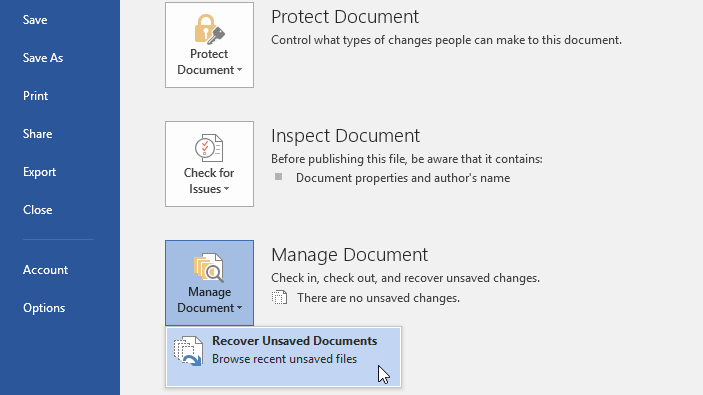

### Xuất tài liệu

Theo mặc định, tài liệu Word được lưu ở loại **.docx ** File. Tuy nhiên, có thể đôi khi bạn cần sử dụng ** loại File khác **, chẳng hạn như ** PDF ** hoặc ** Tài liệu Word 97-2003 **. Thật dễ dàng để ** Export ** tài liệu của bạn từ Word đến nhiều loại File khác nhau.

#### Tới Export tài liệu dưới dạng PDF File:

Xuất tài liệu của bạn dưới dạng ** tài liệu Adobe Acrobat **, thường được gọi là ** PDF File **, có thể đặc biệt hữu ích nếu bạn đang chia sẻ tài liệu với người không có Word. PDF File sẽ giúp người nhận có thể View—nhưng không thể chỉnh sửa—nội dung tài liệu của bạn.

1. Nhấp vào tab ** File ** để truy cập ** Hậu trường ** ** View **, chọn ** Export **, sau đó chọn ** Tạo PDF/XPS **.

   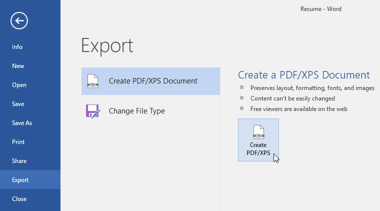
2. Hộp thoại ** Save As ** sẽ xuất hiện. Chọn ** vị trí ** nơi bạn muốn Export tài liệu, nhập tên ** File **, sau đó nhấp vào ** Xuất bản.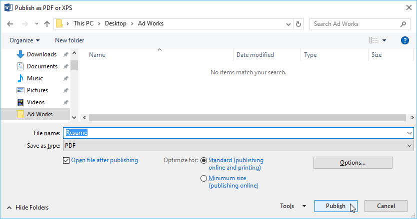**

Nếu bạn cần chỉnh sửa tệp PDF File, Word cho phép bạn chuyển đổi tệp PDF File thành tài liệu có thể chỉnh sửa. Đọc hướng dẫn của chúng tôi về [Chỉnh sửa tệp PDF](../../../word2013/editing-pdf-files/1/index.html) để biết thêm thông tin.

#### Để Export một tài liệu sang các loại File khác:

Bạn cũng có thể thấy tài liệu này hữu ích Export đối với các loại File khác, chẳng hạn như ** Tài liệu Word 97-2003 ** nếu bạn cần Share với những người sử dụng phiên bản Word cũ hơn hoặc **.txt File ** nếu bạn cần phiên bản ** văn bản thuần ** của tài liệu.

1. Nhấp vào tab ** File ** để truy cập ** Hậu trường ** ** View **, chọn ** Export **, sau đó chọn ** Thay đổi File Loại **.

   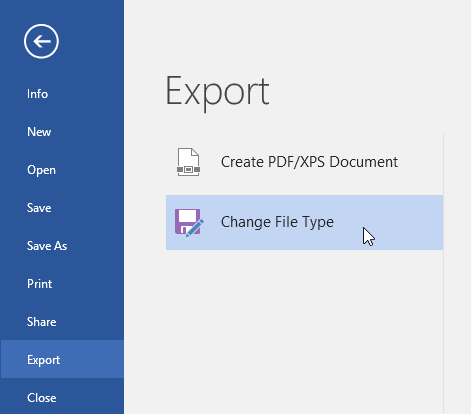
2. Chọn một ** File ** ** loại **, sau đó nhấp vào ** Save ** ** Như **.

   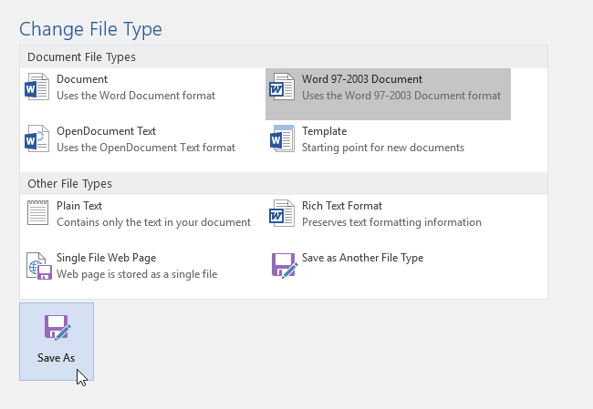
3. Hộp thoại ** Save As ** sẽ xuất hiện. Chọn ** vị trí ** nơi bạn muốn Export tài liệu, nhập ** File tên **, sau đó nhấp vào ** Save **.

Bạn cũng có thể sử dụng trình đơn thả xuống ** Save As loại ** trong hộp thoại ** Save As ** cho các tài liệu Save thuộc nhiều loại File khác nhau.

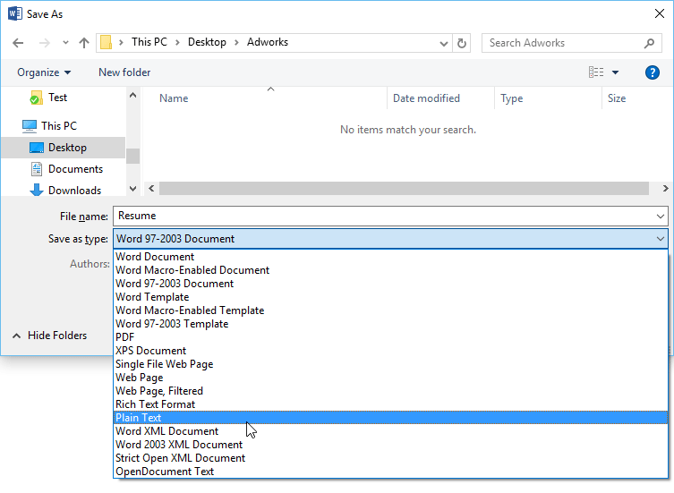

### Chia sẻ tài liệu

Word giúp bạn dễ dàng ** Share ** ** và cộng tác ** trên các tài liệu bằng cách sử dụng ** OneDrive **. Trước đây, nếu bạn muốn Share một File với ai đó, bạn có thể gửi nó dưới dạng tệp đính kèm email. Mặc dù thuận tiện nhưng hệ thống này cũng tạo ** nhiều phiên bản ** của cùng một File, điều này có thể gây khó khăn cho việc sắp xếp.

Khi bạn Share một tài liệu từ Word, thực tế là bạn đang cấp cho người khác quyền truy cập vào ** chính xác File **. Điều này cho phép bạn và những người Share cùng ** chỉnh sửa cùng một tài liệu ** mà không cần phải theo dõi nhiều phiên bản.

Để Share một tài liệu, trước tiên tài liệu đó phải được ** lưu ** ** vào ** ** của bạn ** ** OneDrive **.

#### Tới Share một tài liệu:

1. Nhấp vào tab ** File ** để truy cập ** Hậu trường ** ** View **, sau đó nhấp vào ** Share **.

   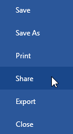
2. Cửa sổ ** Gửi liên kết ** sẽ xuất hiện.

Nhấp vào các nút trong phần tương tác bên dưới để tìm hiểu thêm về các cách khác nhau để Share tài liệu.

chỉnh sửa điểm phát sóng

## Cài đặt liên kết

Tại đây, bạn có thể chọn ** ai được phép truy cập File ** của bạn, liệu bạn có muốn ** cho phép chỉnh sửa ** hay không và tùy chọn bao gồm ** ngày hết hạn ** cho File.

## Nhập tên hoặc địa chỉ email

Nhập ** tên ** hoặc ** địa chỉ email ** của người mà bạn muốn Share File của bạn ở đây.

## Thêm tin nhắn

Nếu bạn muốn đưa ** tin nhắn ** vào File của mình, bạn có thể nhập tin nhắn đó vào đây.

## Gửi

Nhấp vào ** Gửi ** để gửi File của bạn tới (những) người nhận.

## Sao chép liên kết

Nhấp vào ** Sao chép liên kết ** để sao chép ** URL ** mà bạn có thể gửi cho người khác qua email, tin nhắn hoặc bất kỳ phương thức nào khác.

## Triển vọng

Nếu bạn muốn sử dụng ** Outlook **, hãy nhấp vào đây để gửi File của bạn qua email.

## Gửi một bản sao

Bạn có thể sử dụng tùy chọn này nếu bạn muốn ** gửi một bản sao ** để người nhận không chỉnh sửa File giống như bạn.

### Thử thách!

1. Open [tài liệu thực hành](practice_files/word_saveshare_practice.docx) của chúng tôi.
2. Sử dụng ** Save As ** để tạo bản sao của tài liệu. Đặt tên cho bản sao New ** Thực hành thử thách tiết kiệm **. Bạn có thể Save nó vào một thư mục trên máy tính hoặc vào ** OneDrive ** của bạn.
3. Export tài liệu của bạn dưới dạng ** PDF **.

/en/word/text-basics/content/