# Bài 5: văn bản cơ bản

#### Bài học 5: Kiến thức cơ bản về văn bản

/en/word/save-and-sharing-documents/content/

### Giới thiệu

Nếu bạn New sử dụng Microsoft Word, bạn sẽ cần tìm hiểu những kiến ​​thức cơ bản về nhập, chỉnh sửa và sắp xếp văn bản. Các tác vụ cơ bản bao gồm khả năng ** thêm **, ** xóa ** và ** di chuyển ** văn bản trong tài liệu của bạn cũng như cách ** cắt **, ** sao chép ** và ** dán **.

Hãy xem video bên dưới để tìm hiểu những kiến ​​thức cơ bản về cách làm việc với văn bản trong Word.

#### Sử dụng điểm chèn để thêm văn bản

** điểm chèn ** là đường thẳng đứng nhấp nháy trong tài liệu của bạn. Nó cho biết nơi bạn có thể nhập ** văn bản ** trên trang. Bạn có thể sử dụng điểm chèn theo nhiều cách khác nhau.

* ** Blank document **: Khi New Blank document mở ra, điểm chèn sẽ xuất hiện ở góc trên cùng bên trái của trang. Nếu muốn, bạn có thể bắt đầu nhập từ vị trí này.

  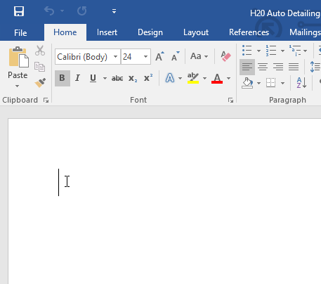
* ** Thêm dấu cách **: Nhấn ** phím cách ** để thêm ** dấu cách ** sau một từ hoặc ở giữa văn bản.

  
* ** New dòng đoạn **: Nhấn ** Enter ** trên bàn phím để di chuyển điểm chèn sang dòng đoạn tiếp theo.

  
* ** Vị trí thủ công **: Sau khi bắt đầu nhập, bạn có thể sử dụng chuột để di chuyển điểm chèn đến vị trí cụ thể trong tài liệu của mình. Chỉ cần nhấp vào ** vị trí ** trong văn bản nơi bạn muốn đặt nó.

* ** Phím mũi tên **: Bạn cũng có thể sử dụng các phím mũi tên trên bàn phím để di chuyển điểm chèn. Các phím mũi tên ** trái ** và ** phải ** sẽ di chuyển giữa ** các ký tự liền kề ** trên cùng một dòng, trong khi các mũi tên ** lên ** và ** xuống ** sẽ di chuyển giữa ** các dòng đoạn **. Bạn cũng có thể nhấn ** Ctrl+Left ** hoặc ** Ctrl+Right ** để di chuyển nhanh giữa toàn bộ các từ.

Trong New Blank document, bạn có thể nhấp đúp chuột để di chuyển điểm chèn đến nơi khác trên trang.

#### Chọn văn bản

Trước khi có thể di chuyển hoặc định dạng văn bản, bạn cần ** chọn nó **. Để thực hiện việc này, hãy nhấp và kéo chuột qua văn bản, sau đó thả chuột. ** hộp được đánh dấu ** sẽ xuất hiện trên văn bản đã chọn.

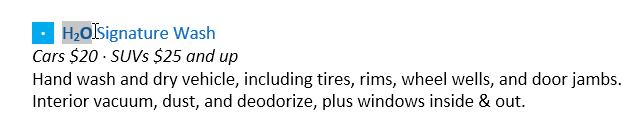

Khi bạn chọn văn bản hoặc hình ảnh trong Word, ** thanh công cụ di chuột ** với các phím tắt lệnh sẽ xuất hiện. Nếu lúc đầu thanh công cụ không xuất hiện, hãy thử di chuột qua vùng chọn.

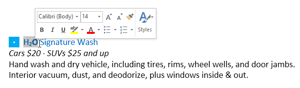

#### Để chọn nhiều dòng văn bản:

1. Di chuyển con trỏ chuột sang bên trái của bất kỳ dòng nào để nó trở thành ** mũi tên nghiêng phải **.

   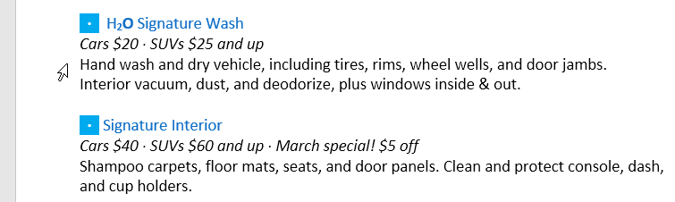
2. Bấm chuột. Dòng sẽ được chọn.

   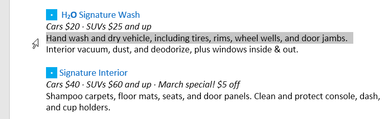
3. Để chọn ** nhiều dòng **, hãy nhấp và kéo chuột lên hoặc xuống.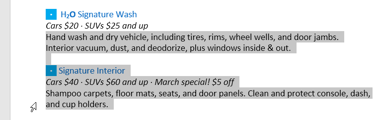
4. Để ** chọn tất cả ** văn bản trong tài liệu của bạn, hãy chọn lệnh ** Chọn ** trên tab Home, sau đó nhấp vào ** Chọn tất cả **. Bạn cũng có thể nhấn ** Ctrl+A ** trên bàn phím.

   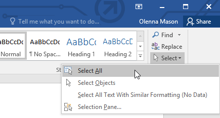

Các phím tắt khác bao gồm ** nhấp đúp ** để chọn một từ và ** nhấp ba lần ** để chọn toàn bộ câu hoặc đoạn văn.

#### Để xóa văn bản:

Có một số cách để ** xóa ** hoặc xóa văn bản:

* Để xóa văn bản ở ** trái ** của điểm chèn, hãy nhấn phím ** Backspace ** trên bàn phím của bạn.
* Để xóa văn bản ở ** bên phải ** điểm chèn, hãy nhấn phím ** Delete ** trên bàn phím của bạn.
* Chọn ** văn bản ** bạn muốn xóa, sau đó nhấn phím ** Xóa **.

Nếu bạn chọn văn bản và bắt đầu nhập, văn bản đã chọn sẽ tự động bị xóa và thay thế bằng văn bản New.

### Sao chép và di chuyển văn bản

Word cho phép bạn ** sao chép ** văn bản đã có trong tài liệu của bạn và ** dán ** văn bản đó vào những nơi khác, điều này có thể Save bạn tốn rất nhiều thời gian và công sức. Nếu bạn muốn di chuyển văn bản trong tài liệu của mình, bạn có thể ** cắt và dán ** hoặc ** kéo và thả **.

#### Để sao chép và dán văn bản:

1. Chọn ** văn bản ** bạn muốn sao chép.

   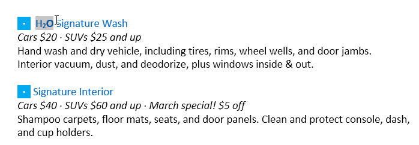
2. Nhấp vào lệnh ** Sao chép ** trên tab ** Home **. Bạn cũng có thể nhấn ** Ctrl+C ** trên bàn phím.

   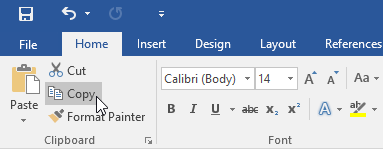
3. Đặt điểm chèn vào nơi bạn muốn văn bản xuất hiện.

   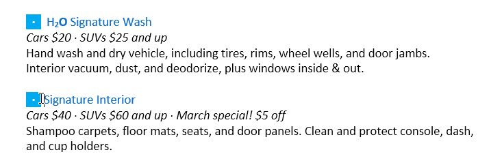
4. Nhấp vào lệnh ** Dán ** trên tab Home. Bạn cũng có thể nhấn ** Ctrl+V ** trên bàn phím.

   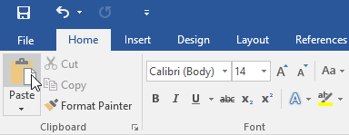
5. Văn bản sẽ xuất hiện.

   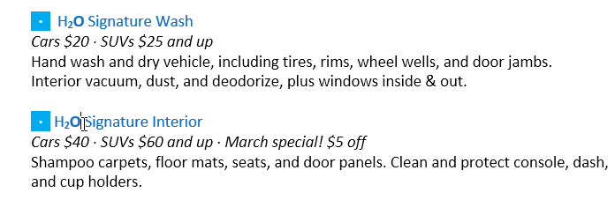

#### Để cắt và dán văn bản:

1. Chọn ** văn bản ** bạn muốn cắt.

   
2. Nhấp vào lệnh ** Cut ** trên tab ** Home **. Bạn cũng có thể nhấn ** Ctrl+X ** trên bàn phím.

   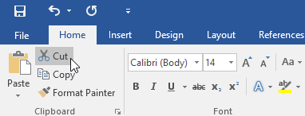
3. Đặt điểm chèn vào nơi bạn muốn văn bản xuất hiện.

   
4. Nhấp vào lệnh ** Dán ** trên tab ** Home **. Bạn cũng có thể nhấn ** Ctrl+V ** trên bàn phím.

   
5. Văn bản sẽ xuất hiện.

   

Bạn cũng có thể cắt, sao chép và dán bằng cách nhấp chuột phải vào tài liệu của mình và chọn hành động mong muốn từ menu thả xuống. Khi sử dụng phương pháp này để dán, bạn có thể chọn từ ba Options xác định cách định dạng văn bản: ** Giữ định dạng nguồn **, ** Hợp nhất định dạng ** và ** Chỉ giữ văn bản **. Bạn có thể di chuột qua từng biểu tượng để xem nó trông như thế nào trước khi chọn.

#### Để kéo và thả văn bản:

1. Chọn ** văn bản ** bạn muốn di chuyển.

   
2. Nhấp và kéo ** văn bản ** đến vị trí bạn muốn nó xuất hiện. Một hình chữ nhật nhỏ sẽ xuất hiện bên dưới mũi tên để cho biết bạn đang di chuyển văn bản.
3. Nhả chuột và văn bản sẽ xuất hiện.

   

Nếu văn bản ** không xuất hiện ** ở vị trí chính xác mà bạn muốn, bạn có thể nhấn phím ** Enter ** trên bàn phím để di chuyển văn bản đến dòng New.

### Hoàn tác và làm lại

Giả sử bạn đang làm việc trên một tài liệu và vô tình xóa một số văn bản. May mắn thay, bạn sẽ không phải gõ lại mọi thứ bạn vừa xóa! Word cho phép bạn ** hoàn tác ** hành động gần đây nhất của bạn khi bạn mắc lỗi như thế này.

Để thực hiện việc này, hãy tìm và chọn lệnh ** Hoàn tác ** trên Quick Access Toolbar. Bạn cũng có thể nhấn ** Ctrl+Z ** trên bàn phím. Bạn có thể tiếp tục sử dụng lệnh này để hoàn tác nhiều thay đổi liên tiếp.

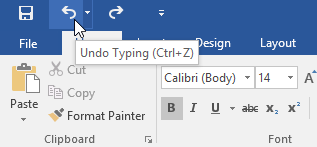

Ngược lại, lệnh ** Redo ** cho phép bạn đảo ngược thao tác hoàn tác cuối cùng. Bạn cũng có thể truy cập lệnh này bằng cách nhấn ** Ctrl+Y ** trên bàn phím.

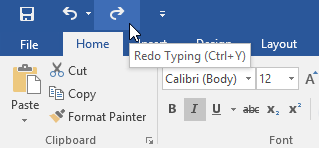

### Biểu tượng

Nếu bạn cần Insert một ký tự bất thường không có trên bàn phím, chẳng hạn như biểu tượng bản quyền (©) hoặc nhãn hiệu (™), bạn thường có thể tìm thấy ký tự đó bằng lệnh ** Symbol **.

#### Gửi tới Insert một biểu tượng:

1. Đặt điểm chèn vào nơi bạn muốn biểu tượng xuất hiện.

   
2. Nhấp vào tab ** Insert **.

   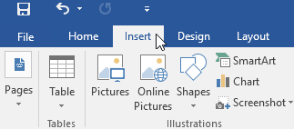
3. Xác định vị trí và chọn lệnh ** Symbol **, sau đó chọn biểu tượng mong muốn từ menu thả xuống. Nếu bạn không thấy biểu tượng mình muốn, hãy chọn ** Biểu tượng khác **...

   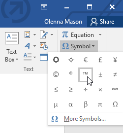
4. Biểu tượng sẽ xuất hiện trong tài liệu.

   

### Thử thách!

1. Open [tài liệu thực hành](practice_files/word_textbasics_practice.docx) của chúng tôi.
2. Cuộn đến ** trang 2 **.
3. Đặt điểm chèn ở trên cùng của tài liệu và gõ ** Bây giờ giới thiệu...**
4. Sử dụng các phím mũi tên để di chuyển điểm chèn đến giá ** Gói chi tiết chữ ký ** và thay đổi thành **$99,99 ****/tháng **.
5. Ở cuối tài liệu, sử dụng ** kéo và thả ** để di chuyển ** Chỉ cần để lại thông tin chi tiết cho chúng tôi ** đến cuối dòng cuối cùng.
6. Ở cuối dòng bạn vừa di chuyển, Insert ** biểu tượng nhãn hiệu **. Nếu bạn không thể tìm thấy biểu tượng nhãn hiệu, Insert một biểu tượng khác mà bạn chọn.
7. Khi bạn hoàn tất, tài liệu của bạn sẽ trông giống như thế này:

   

/en/word/formatting-text/content/