# Bài 6: định dạng văn bản

#### Bài 6: Định dạng văn bản

/en/word/text-basics/content/

### Giới thiệu

** Văn bản được định dạng ** có thể Draw thu hút sự chú ý của người đọc đến các phần cụ thể của tài liệu và nhấn mạnh thông tin quan trọng. Trong Word, bạn có một số Options để điều chỉnh văn bản, bao gồm ** font **, ** size ** và ** color **. Bạn cũng có thể điều chỉnh ** căn chỉnh ** văn bản để thay đổi cách hiển thị trên trang.

Xem video bên dưới để tìm hiểu thêm về định dạng văn bản trong Word.

#### Để thay đổi kích thước phông chữ:

1. Chọn văn bản bạn muốn sửa đổi.

   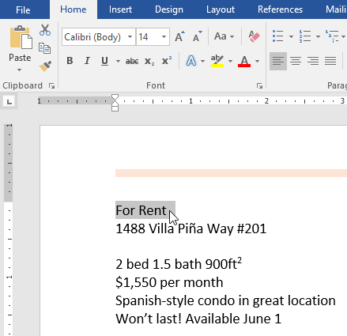
2. Trên tab ** Home **, nhấp vào mũi tên thả xuống Cỡ chữ. Chọn cỡ chữ từ menu. Nếu cỡ chữ bạn cần không có sẵn trong menu, bạn có thể nhấp vào hộp Cỡ chữ và ** gõ ** cỡ chữ mong muốn, sau đó nhấn ** Enter **.

   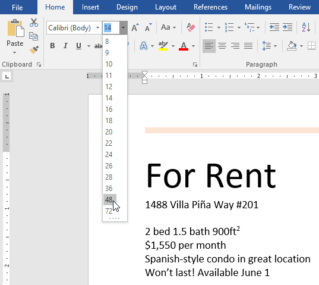
3. Kích thước phông chữ sẽ thay đổi trong tài liệu.

   

Bạn cũng có thể sử dụng lệnh ** Grow Font ** và ** Shrink Font ** để thay đổi kích thước phông chữ.

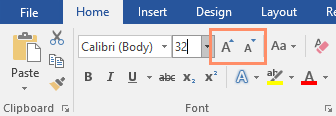

#### Để thay đổi phông chữ:

Theo mặc định, phông chữ của mỗi tài liệu New được đặt thành Calibri. Tuy nhiên, Word cung cấp nhiều phông chữ khác mà bạn có thể sử dụng để tùy chỉnh văn bản.

1. Chọn văn bản bạn muốn sửa đổi.

   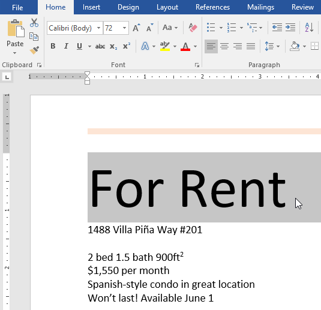
2. Trên tab ** Home **, hãy nhấp vào ** mũi tên thả xuống ** bên cạnh hộp ** Phông chữ **. Một menu các kiểu phông chữ sẽ xuất hiện.
3. Chọn kiểu phông chữ bạn muốn sử dụng.

   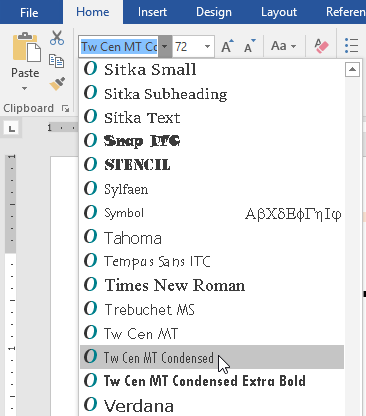
4. Phông chữ sẽ thay đổi trong tài liệu.

   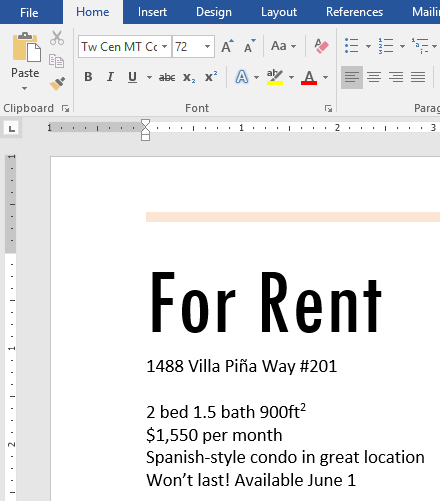

Khi tạo một tài liệu chuyên nghiệp hoặc một tài liệu có nhiều đoạn văn, bạn sẽ muốn chọn phông chữ dễ đọc. Cùng với Calibri, các phông chữ đọc tiêu chuẩn bao gồm Cambria, Times New Roman và Arial.

#### Để thay đổi màu phông chữ:

1. Chọn văn bản bạn muốn sửa đổi.

   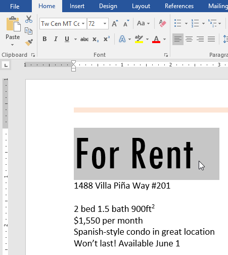
2. Trên tab ** Home **, hãy nhấp vào mũi tên thả xuống ** Màu phông chữ **. Trình đơn ** Màu phông chữ ** xuất hiện.

   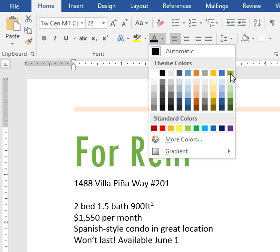
3. Chọn màu phông chữ bạn muốn sử dụng. Màu phông chữ sẽ thay đổi trong tài liệu.

   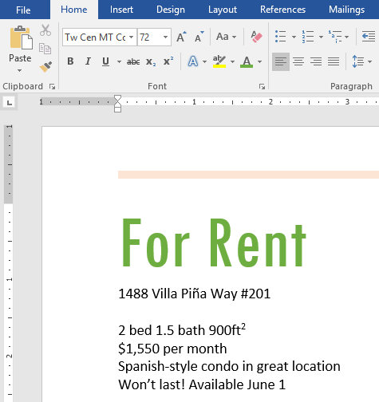

Lựa chọn màu sắc của bạn không bị giới hạn ở menu thả xuống xuất hiện. Chọn ** Màu khác ** ở cuối menu để truy cập hộp thoại ** Màu **. Chọn màu bạn muốn, sau đó nhấp vào ** OK **.

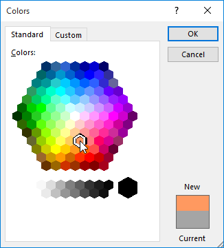

#### Để sử dụng các lệnh In đậm, Nghiêng và Gạch chân:

Các lệnh In đậm, Nghiêng và Gạch chân có thể được sử dụng để Help Draw chú ý đến các từ hoặc cụm từ quan trọng.

1. Chọn văn bản bạn muốn sửa đổi.

   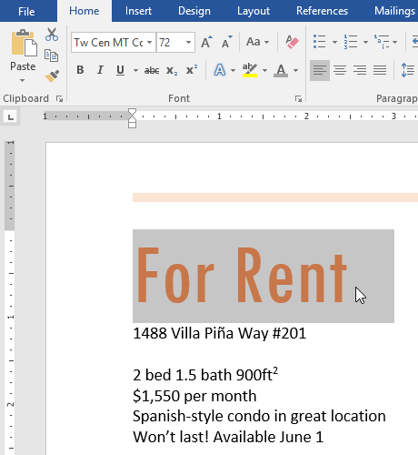
2. Trên tab Home, hãy nhấp vào lệnh In đậm (** B **), In nghiêng (* I *) hoặc Gạch dưới (U) trong nhóm ** F **** ont **. Trong ví dụ của chúng tôi, chúng tôi sẽ nhấp vào In đậm.

   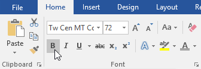
3. Văn bản đã chọn sẽ được sửa đổi trong tài liệu.

   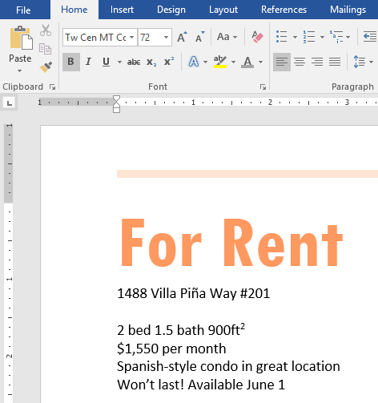

#### Để thay đổi kiểu chữ:

Khi cần thay đổi nhanh kiểu chữ, bạn có thể sử dụng lệnh ** Change Case ** thay vì xóa và gõ lại văn bản.

1. Chọn văn bản bạn muốn sửa đổi.

   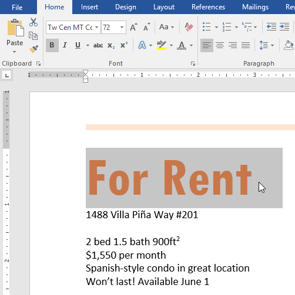
2. Trên tab Home, hãy nhấp vào lệnh ** Thay đổi chữ hoa ** trong nhóm ** Phông chữ **.
3. Một menu thả xuống sẽ xuất hiện. Chọn tùy chọn trường hợp mong muốn từ menu.

   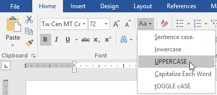
4. Trường hợp văn bản sẽ được thay đổi trong tài liệu.

   

#### Để đánh dấu văn bản:

Đánh dấu có thể là một công cụ hữu ích để đánh dấu văn bản quan trọng trong tài liệu của bạn.

1. Chọn văn bản bạn muốn đánh dấu.

   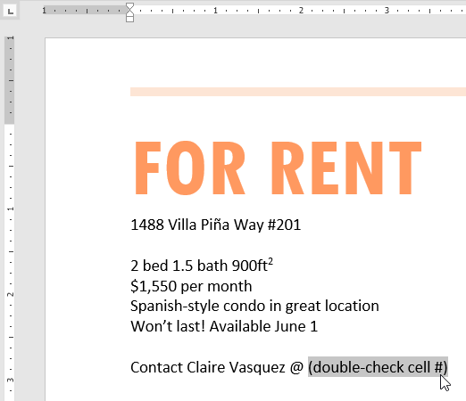
2. Từ tab ** Home **, hãy nhấp vào mũi tên thả xuống ** Màu đánh dấu văn bản **. Trình đơn ** Màu tô sáng ** xuất hiện.

   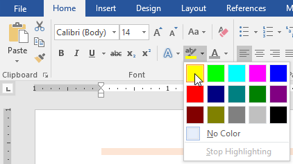
3. Chọn vùng sáng mong muốn ** màu **. Văn bản đã chọn sau đó sẽ được đánh dấu trong tài liệu.

   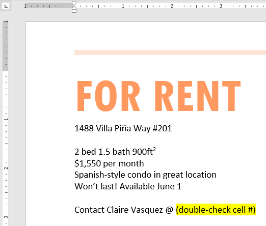

Để xóa đánh dấu, hãy chọn văn bản được đánh dấu, sau đó nhấp vào mũi tên thả xuống ** Màu đánh dấu văn bản **. Chọn ** Không màu ** từ trình đơn thả xuống.

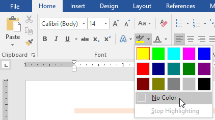

Nếu bạn cần đánh dấu một số dòng văn bản, việc thay đổi chuột thành ** công cụ tô sáng ** có thể là một giải pháp thay thế hữu ích cho việc chọn và đánh dấu từng dòng riêng lẻ. Nhấp vào lệnh ** Màu đánh dấu văn bản ** và con trỏ thay đổi thành bút đánh dấu. Sau đó, bạn có thể nhấp và kéo bút đánh dấu qua các dòng bạn muốn đánh dấu.

#### Để thay đổi căn chỉnh văn bản:

Theo mặc định, Word căn chỉnh văn bản theo ** lề trái ** trong tài liệu New. Tuy nhiên, có thể đôi khi bạn muốn điều chỉnh căn chỉnh văn bản về giữa hoặc sang phải.

1. Chọn văn bản bạn muốn sửa đổi.

   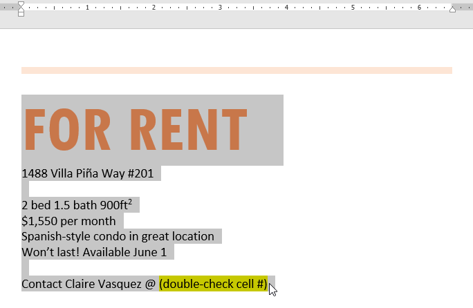
2. Trên tab ** Home **, chọn một trong bốn căn chỉnh Options từ nhóm ** Đoạn **. Trong ví dụ của chúng tôi, chúng tôi đã chọn ** Căn chỉnh giữa **.

   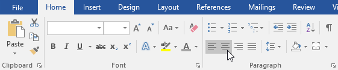
3. Văn bản sẽ được căn chỉnh lại trong tài liệu.

   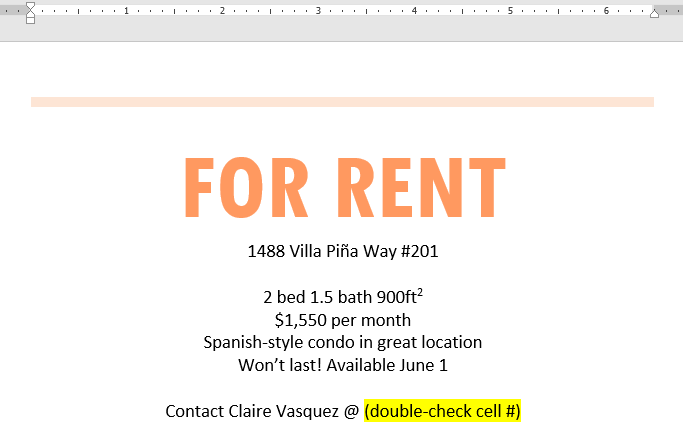

Nhấp vào mũi tên trong trình chiếu bên dưới để tìm hiểu thêm về cách căn chỉnh bốn văn bản Options.

* 

  ** Căn chỉnh văn bản sang trái ****:** Thao tác này căn chỉnh tất cả văn bản đã chọn sang lề trái. Lệnh Căn chỉnh văn bản còn lại là cách căn chỉnh phổ biến nhất và được chọn theo mặc định khi tài liệu New được tạo.
* 

  ** Giữa *****:** Tùy chọn này căn chỉnh văn bản ở khoảng cách bằng nhau tính từ lề trái và lề phải.
* 

  ** Căn chỉnh văn bản đúng ****:** Điều này căn chỉnh tất cả văn bản đã chọn sang lề phải.
* 

  ** Căn đều ****:** Văn bản được căn đều bằng nhau ở cả hai bên. Nó xếp hàng ngang nhau ở lề phải và trái. Nhiều tờ báo và tạp chí sử dụng đầy đủ lời biện minh.

Bạn có thể sử dụng tính năng ** Đặt làm mặc định ** tiện lợi của Word để ** Save ** tất cả các thay đổi ** định dạng ** mà bạn đã thực hiện và tự động áp dụng chúng cho tài liệu New. Để tìm hiểu cách thực hiện việc này, hãy đọc bài viết của chúng tôi về [Thay đổi cài đặt mặc định của bạn trong Word](../../../word-tips/changed-your-default-settings-in-word/1/index.html "Cách thay đổi cài đặt mặc định của bạn trong Word").

### Thử thách!

1. Open [tài liệu thực hành](practice_files/word_formattext_practice.docx) của chúng tôi.
2. Cuộn đến ** trang 2 **.
3. Chọn dòng chữ ** Cho thuê ** và thay đổi ** cỡ chữ ** thành ** 48 pt **.
4. Với văn bản vẫn được chọn, hãy thay đổi ** font ** thành ** Franklin Gothic Demi **. ** Lưu ý **: Nếu bạn không thấy phông chữ này trong menu, bạn có thể chọn phông chữ khác.
5. Sử dụng lệnh ** Thay đổi trường hợp ** để thay đổi Cho thuê thành ** CHỮ HOA **.
6. Thay đổi màu của dòng chữ ** For Rent ** thành ** Gold, Accent 4 **.
7. ** Xóa phần đánh dấu ** khỏi số điện thoại (919-555-7237).
8. Chọn tất cả văn bản từ ** For Rent ** đến **(919-555-7237)** và ** Center Align **.
9. ** Chữ nghiêng ** văn bản trong đoạn bên dưới ** Giới thiệu về Villa Piña **.
10. Khi bạn hoàn tất, trang của bạn sẽ trông như thế này:

    

/en/word/using-find-and-replace/content/