# Bài 7: Sử dụng-tìm-và-thay thế

#### Bài 7: Sử dụng Find and Replace

/en/word/formatting-text/content/

### Giới thiệu

Khi bạn làm việc với các tài liệu dài hơn, việc tìm một từ hoặc cụm từ cụ thể có thể khó khăn và tốn thời gian. Word có thể tự động tìm kiếm tài liệu của bạn bằng tính năng ** Tìm ** và cho phép bạn nhanh chóng thay đổi các từ hoặc cụm từ bằng cách sử dụng ** Thay thế **.

Xem video bên dưới để tìm hiểu thêm về cách sử dụng Find and Replace.

#### Để tìm văn bản:

Trong ví dụ của chúng tôi, chúng tôi đã viết một bài báo học thuật và sẽ sử dụng lệnh Tìm để định vị tất cả các trường hợp của một từ cụ thể.

1. Từ tab ** Home **, hãy nhấp vào lệnh ** Tìm **. Bạn cũng có thể nhấn ** Ctrl+F ** trên bàn phím.

   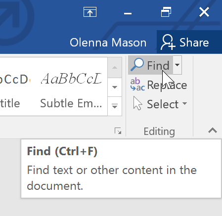
2. ** Khung điều hướng ** sẽ xuất hiện ở bên trái màn hình.
3. Nhập văn bản bạn muốn tìm vào trường ở đầu ngăn điều hướng. Trong ví dụ của chúng tôi, chúng tôi sẽ nhập từ mà chúng tôi đang tìm kiếm.

   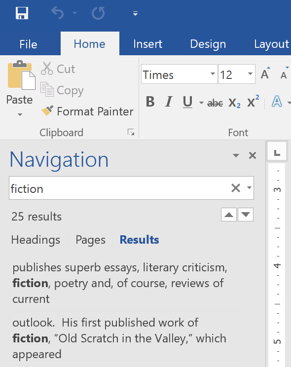
4. Nếu tìm thấy văn bản trong tài liệu, văn bản đó sẽ được đánh dấu màu vàng và ** bản xem trước kết quả ** sẽ xuất hiện trong ** ngăn điều hướng **. Bạn cũng có thể nhấp vào một trong các kết quả bên dưới mũi tên để chuyển đến kết quả đó.

   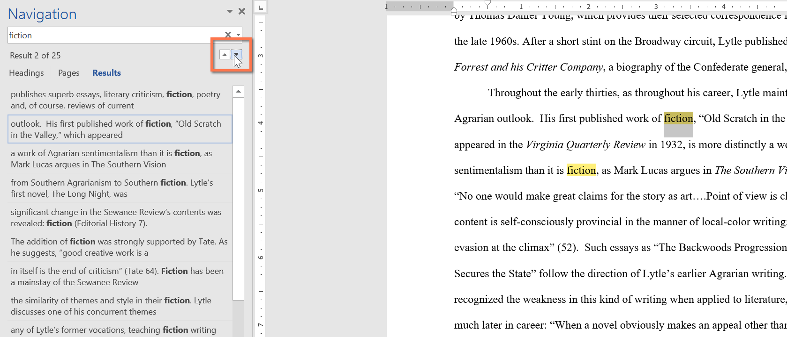
5. Khi bạn hoàn tất, hãy nhấp vào ** X ** để Close khung điều hướng. Điểm nổi bật sẽ biến mất.

   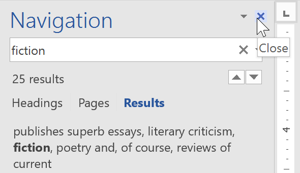

Để tìm kiếm thêm Options, hãy nhấp vào mũi tên thả xuống bên cạnh trường tìm kiếm.

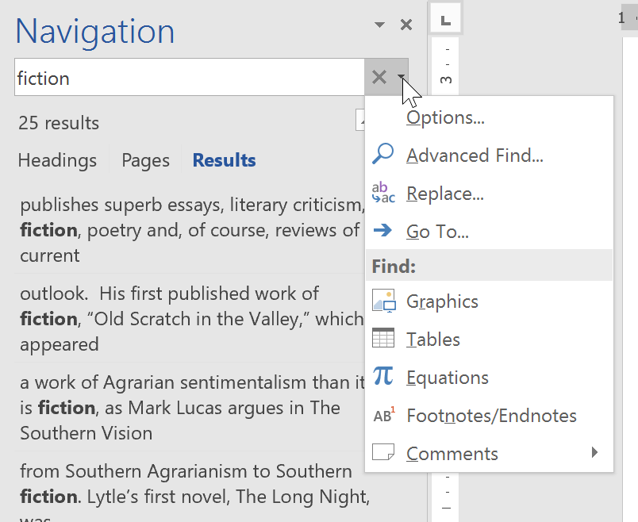

#### Để thay thế văn bản:

Bạn có thể phát hiện ra rằng mình đã mắc lỗi nhiều lần trong toàn bộ tài liệu của mình, chẳng hạn như viết sai chính tả tên của ai đó hoặc bạn cần đổi một từ hoặc cụm từ cụ thể sang một từ hoặc cụm từ khác. Bạn có thể sử dụng tính năng ** Find and Replace ** của Word để nhanh chóng sửa đổi. Trong ví dụ của chúng tôi, chúng tôi sẽ sử dụng Find and Replace để thay đổi tiêu đề của một tạp chí để nó được viết tắt.

1. Từ tab ** Home **, hãy nhấp vào lệnh ** Thay thế **. Bạn cũng có thể nhấn ** Ctrl+H ** trên bàn phím.

   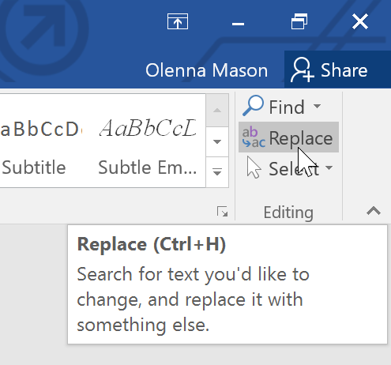
2. Hộp thoại ** Find and Replace ** sẽ xuất hiện.
3. Nhập văn bản bạn muốn tìm vào trường ** Find what:**.
4. Nhập văn bản bạn muốn thay thế vào trường ** Thay thế bằng:**, sau đó nhấp vào ** Tìm tiếp **.

   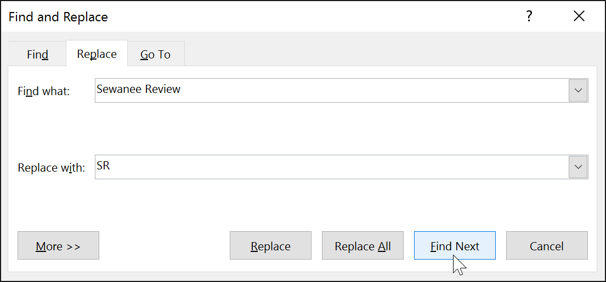
5. Word sẽ tìm phiên bản đầu tiên của văn bản và ** đánh dấu ** nó bằng màu xám.
6. ** Review ** văn bản để đảm bảo bạn muốn thay thế nó. Trong ví dụ của chúng tôi, văn bản là một phần của tiêu đề bài báo và không cần phải thay thế. Chúng ta sẽ nhấp lại vào ** Tìm tiếp ** để chuyển sang phiên bản tiếp theo.

   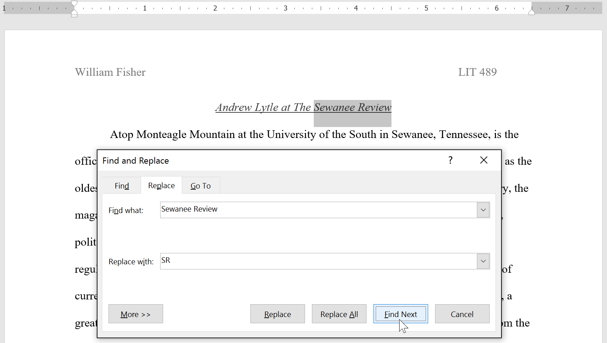
7. Nếu bạn muốn thay thế nó, bạn có thể nhấp vào ** Thay thế ** để thay đổi từng trường hợp văn bản. Bạn cũng có thể nhấp vào ** Thay thế tất cả ** để thay thế mọi phiên bản của văn bản trong toàn bộ tài liệu.

   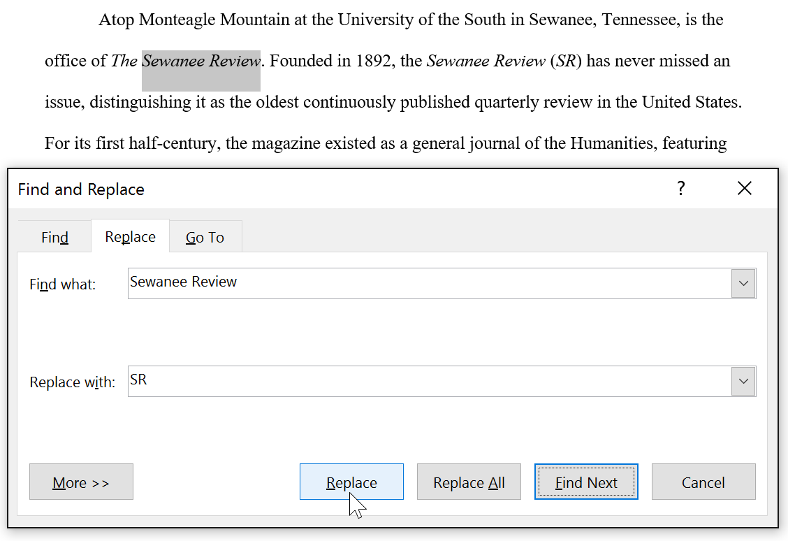
8. Văn bản sẽ được thay thế.

   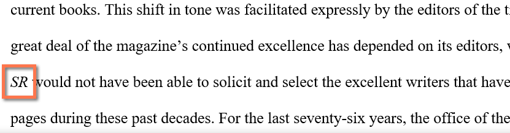
9. Khi bạn hoàn tất, hãy nhấp vào ** Close ** hoặc ** Hủy ** để Close hộp thoại.

Để tìm kiếm bổ sung Options, hãy nhấp vào ** Thêm ** trong hộp thoại Find and Replace. Từ đây, bạn có thể chọn Options bổ sung, chẳng hạn như khớp chữ hoa chữ thường và bỏ qua dấu câu.

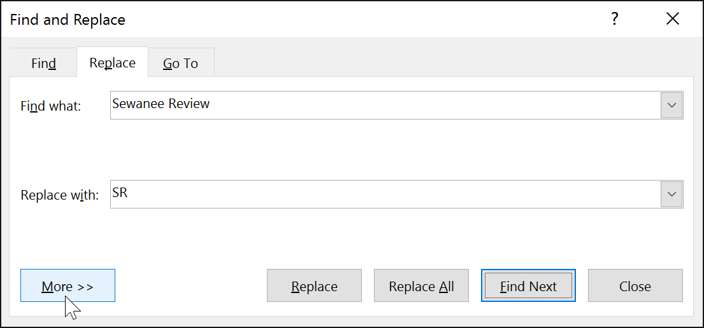

Khi sử dụng Thay thế tất cả, điều quan trọng cần nhớ là nó có thể tìm thấy những kết quả phù hợp mà bạn không lường trước được và có thể bạn không thực sự muốn thay đổi. Bạn chỉ nên sử dụng tùy chọn này nếu bạn hoàn toàn chắc chắn rằng nó sẽ không thay thế bất cứ thứ gì bạn không mong muốn.

### Thử thách!

1. Open [tài liệu thực hành](practice_files/word_findreplace_practice.docx) của chúng tôi.
2. Sử dụng tính năng ** Tìm **, xác định trang nào đề cập đến ** Caroline Gordon **.
3. Cái tên T.S. Eliot viết sai chính tả. Thay thế tất cả các phiên bản của ** Elliot ** bằng ** Eliot **. Khi hoàn tất, đáng lẽ bạn phải thực hiện ba lần thay thế.
4. Tên của Allen Tate cũng sai chính tả. ** Find and Replace ** Alan và Allen. ** Gợi ý **: Không sử dụng ** Thay thế tất cả **. Nếu không, bạn có thể vô tình thay thế từ ** cân bằng **.

/en/word/indents-and-tabs/content/