# Bài 8: thụt lề và tab

#### Bài 8: Thụt lề và Tab

/en/word/using-find-and-replace/content/

### Giới thiệu

Văn bản thụt lề sẽ thêm cấu trúc vào tài liệu của bạn bằng cách cho phép bạn phân tách thông tin. Cho dù bạn muốn di chuyển một dòng hay toàn bộ đoạn văn, bạn có thể sử dụng ** bộ chọn tab ** và ** ngang Ruler ** để đặt ** tab ** và ** thụt lề **.

Hãy xem video bên dưới để tìm hiểu thêm về cách sử dụng thụt lề và tab trong Word.

#### Thụt lề văn bản

Trong nhiều loại tài liệu, bạn có thể chỉ muốn thụt lề dòng đầu tiên của mỗi đoạn văn. Điều này giúp ** tách biệt ** các đoạn văn một cách trực quan **** tách biệt ** với nhau.

Bạn cũng có thể thụt lề mọi dòng ** ngoại trừ dòng đầu tiên **, được gọi là ** thụt lề treo **.

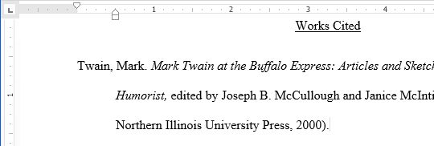

#### Để thụt lề bằng phím Tab:

Cách thụt lề nhanh chóng là sử dụng phím ** Tab **. Điều này sẽ tạo ra mức thụt lề dòng đầu tiên là ** 1/2 inch **.

1. Đặt điểm chèn ** ở đầu ** đoạn bạn muốn thụt lề.

   
2. Nhấn phím ** Tab **. Trên Ruler, bạn sẽ thấy ** điểm đánh dấu thụt lề dòng đầu tiên ** di chuyển sang bên phải ** 1/2 inch **.
3. Dòng đầu tiên của đoạn văn sẽ được thụt lề.

   

Nếu bạn không thể thấy Ruler, hãy chọn tab ** View **, sau đó nhấp vào hộp kiểm bên cạnh ** Ruler **.

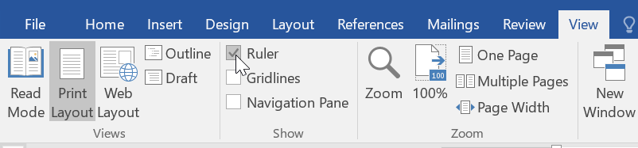

#### Dấu thụt lề

Trong một số trường hợp, bạn có thể muốn có nhiều quyền kiểm soát hơn đối với việc thụt lề. Word cung cấp ** điểm đánh dấu thụt lề ** cho phép bạn thụt lề đoạn văn đến vị trí bạn muốn.

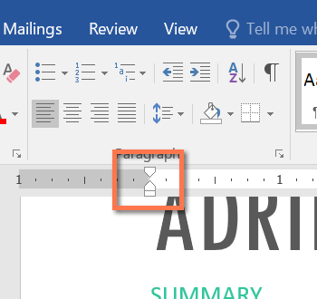

Các điểm đánh dấu thụt lề nằm ở bên trái của Ruler ngang và chúng cung cấp một số Options thụt lề:

* ** Điểm đánh dấu thụt lề dòng đầu tiên **  điều chỉnh thụt lề dòng đầu tiên
* ** Điểm đánh dấu thụt lề treo **  điều chỉnh thụt lề treo
* ** Điểm đánh dấu thụt lề trái **  di chuyển ** cả hai ** dấu thụt lề dòng đầu tiên và dấu thụt lề treo cùng lúc (thụt lề tất cả các dòng trong một đoạn văn)

#### Để thụt lề bằng cách sử dụng dấu thụt lề:

1. Đặt ** điểm chèn ** vào bất kỳ vị trí nào trong đoạn văn bạn muốn thụt lề hoặc chọn một hoặc nhiều đoạn văn.

   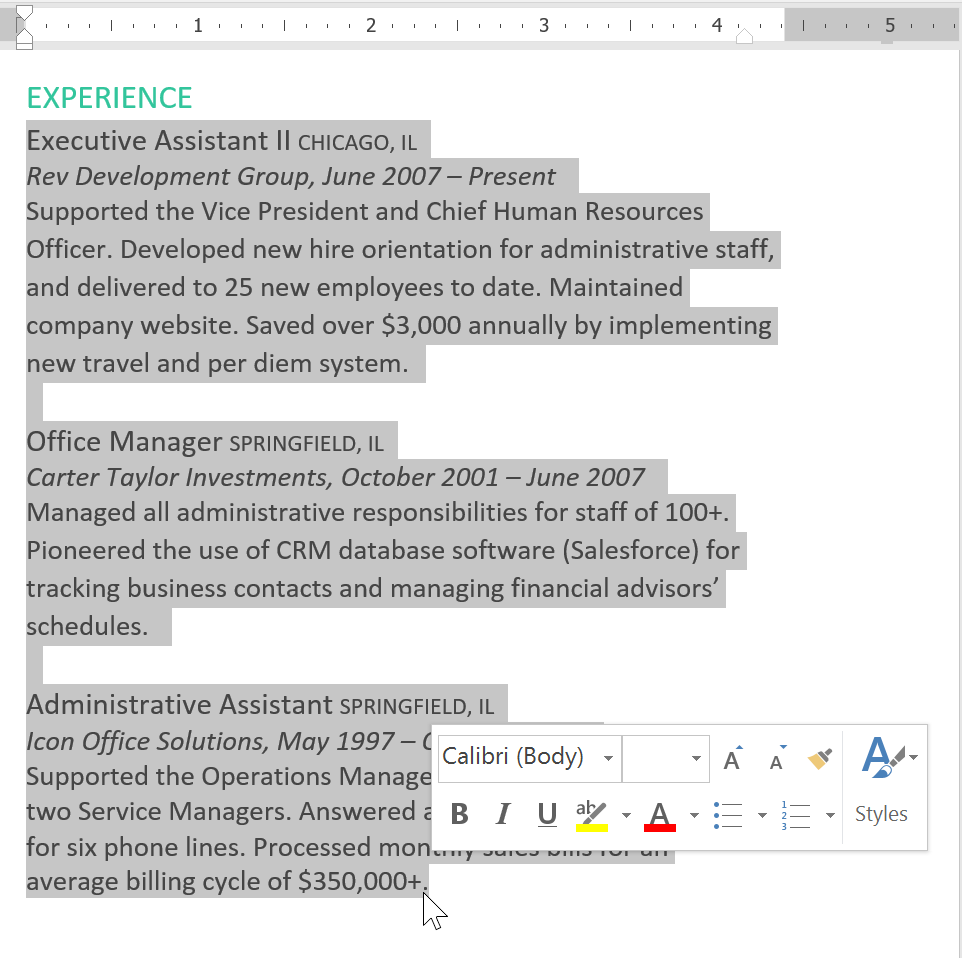
2. Nhấp và kéo ** điểm đánh dấu thụt lề ** mong muốn. Trong ví dụ của chúng tôi, chúng tôi sẽ nhấp và kéo điểm đánh dấu thụt lề trái.

   
3. Thả chuột. Các đoạn văn sẽ được thụt lề.

   

#### Để thụt lề bằng lệnh thụt lề:

Nếu bạn muốn thụt lề nhiều dòng văn bản hoặc tất cả các dòng của một đoạn văn, bạn có thể sử dụng ** Lệnh thụt lề **. Các lệnh thụt lề sẽ điều chỉnh mức thụt lề theo ** gia số 1/2 inch **.

1. Chọn văn bản bạn muốn thụt lề.

   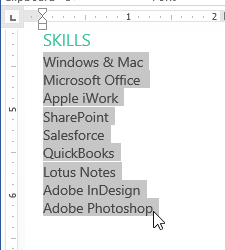
2. Trên tab ** Home **, hãy nhấp vào lệnh ** Tăng thụt lề ** hoặc ** Giảm thụt lề **.

   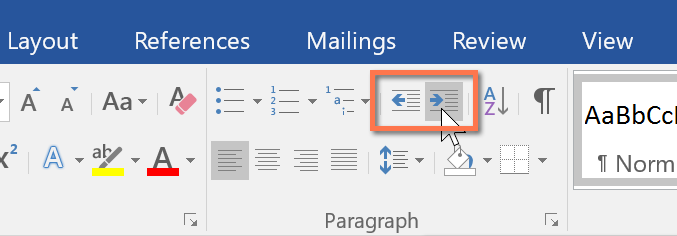
3. Văn bản sẽ thụt lề.

   

Để tùy chỉnh mức thụt lề, hãy chọn tab ** Layout ** gần các giá trị mong muốn trong các hộp bên dưới ** Thụt lề **.

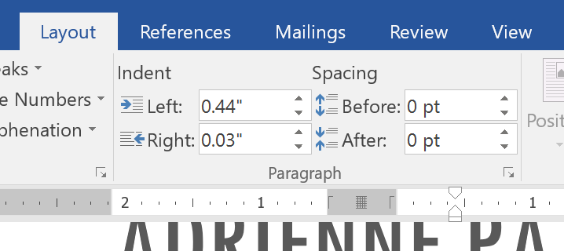

#### Tab

Việc sử dụng ** tab ** giúp bạn kiểm soát nhiều hơn vị trí của văn bản. Theo mặc định, mỗi lần bạn nhấn phím Tab, điểm chèn sẽ di chuyển ** 1/2 inch ** sang phải. Việc thêm ** điểm dừng tab ** vào ** Ruler ** cho phép bạn thay đổi kích thước của các tab và Word thậm chí còn cho phép bạn áp dụng nhiều điểm dừng tab cho một dòng. Ví dụ: trên sơ yếu lý lịch, bạn có thể ** căn lề trái ** phần đầu dòng và ** căn phải ** phần cuối dòng bằng cách thêm ** Tab phải **, như minh họa trong hình ảnh bên dưới.

Nhấn phím Tab có thể thêm ** tab ** hoặc tạo ** thụt lề dòng đầu tiên **, tùy thuộc vào vị trí của điểm chèn. Nói chung, nếu điểm chèn ở đầu đoạn văn hiện có, nó sẽ tạo ra thụt lề dòng đầu tiên; nếu không, nó sẽ tạo một tab.

#### Bộ chọn tab

** Bộ chọn tab ** nằm phía trên ** dọc Ruler ** ở bên trái. Di chuột qua bộ chọn tab để xem tên của ** điểm dừng tab ** đang hoạt động.

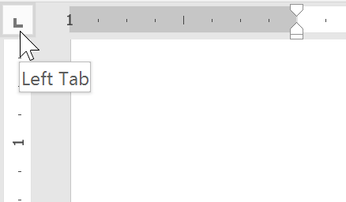

#### Các loại điểm dừng tab:

* ** Tab bên trái ** căn trái văn bản tại điểm dừng tab
* ** Tab giữa **  căn giữa văn bản xung quanh điểm dừng tab
* ** Tab bên phải **  căn chỉnh văn bản tại điểm dừng tab
* ** Tab thập phân **  căn chỉnh các số thập phân bằng dấu thập phân
* ** Bar Tab **  vẽ một đường thẳng đứng trên tài liệu
* ** Thụt lề dòng đầu tiên **  chèn dấu thụt lề vào Ruler và thụt dòng văn bản đầu tiên trong một đoạn văn
* ** Thụt lề treo **  chèn dấu thụt lề treo và thụt lề tất cả các dòng ngoài dòng đầu tiên

Mặc dù ** Bar Tab **, ** Thụt lề dòng đầu tiên ** và ** Thụt lề treo ** xuất hiện trên ** bộ chọn tab ** nhưng chúng không phải là tab về mặt kỹ thuật.

#### Để thêm điểm dừng tab:

1. Chọn đoạn văn hoặc các đoạn văn bạn muốn thêm điểm dừng tab vào. Nếu bạn không chọn bất kỳ đoạn văn nào, các điểm dừng tab sẽ áp dụng cho ** đoạn hiện tại ** và bất kỳ đoạn ** New nào ** mà bạn nhập bên dưới đoạn văn đó.

   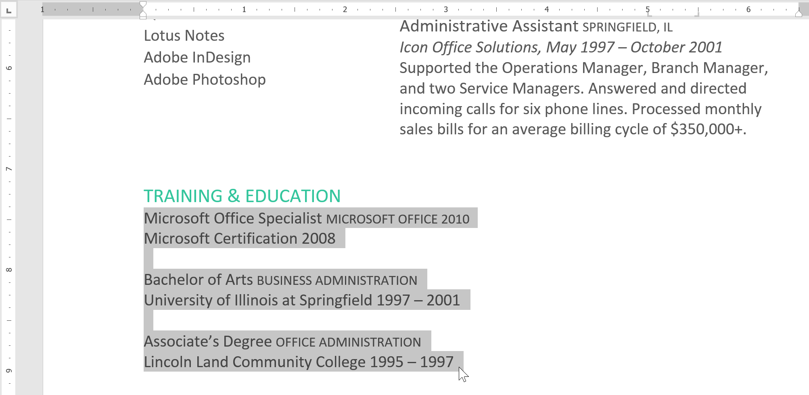
2. Nhấp vào ** bộ chọn tab ** cho đến khi điểm dừng tab bạn muốn sử dụng xuất hiện. Trong ví dụ của chúng tôi, chúng tôi sẽ chọn ** Tab bên phải **.

   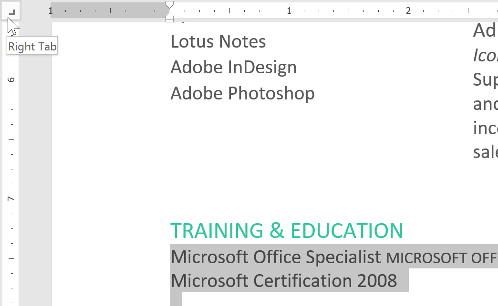
3. Nhấp vào ** vị trí trên Ruler ** nằm ngang nơi bạn muốn văn bản của mình xuất hiện (việc nhấp vào ** cạnh dưới ** của Ruler sẽ giúp ích. Bạn có thể thêm bao nhiêu điểm dừng tab tùy thích.

   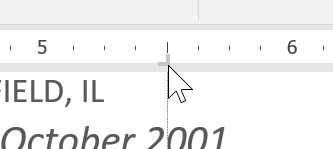
4. Đặt ** điểm chèn ** trước ** văn bản ** bạn muốn đặt tab, sau đó nhấn phím ** Tab **. Văn bản sẽ chuyển sang điểm dừng tab tiếp theo. Trong ví dụ của chúng tôi, chúng tôi sẽ di chuyển từng phạm vi ngày tới điểm dừng tab mà chúng tôi đã tạo.

   

#### Xóa điểm dừng tab

Bạn nên xóa bất kỳ điểm dừng tab nào mà bạn không sử dụng để chúng không gây cản trở. Để xóa điểm dừng tab, trước tiên hãy chọn tất cả văn bản sử dụng điểm dừng tab. Sau đó nhấp và kéo nó ra khỏi Ruler.

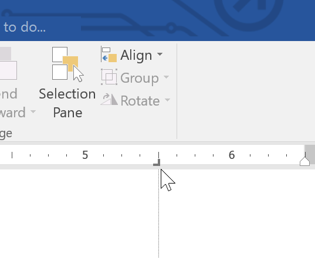

Word cũng có thể hiển thị các ký hiệu định dạng ẩn như dấu cách (), dấu đoạn văn () và tab () cho đến Help bạn sẽ thấy định dạng trong tài liệu của mình. Để hiển thị các ký hiệu định dạng ẩn, hãy chọn tab ** Home **, sau đó nhấp vào lệnh ** Hiển thị/Ẩn **.

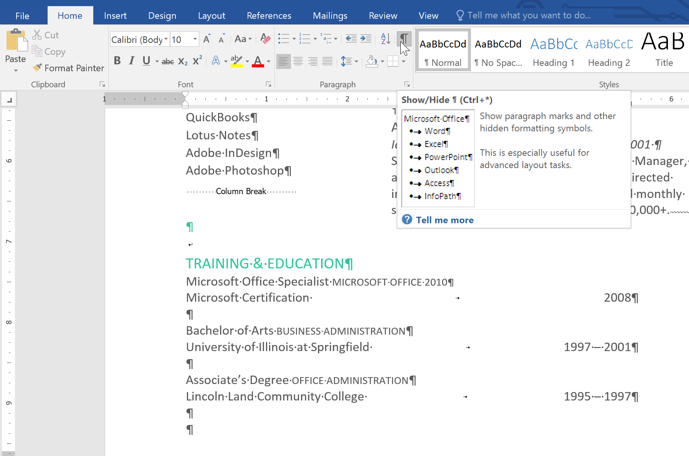

### Thử thách!

1. Open [tài liệu thực hành](practice_files/word_indentstabs_practice.docx) của chúng tôi.
2. Sử dụng ** phím Tab ** để thụt lề đầu mỗi đoạn trong nội dung thư xin việc. Chúng bắt đầu bằng ** Tôi cực kỳ quan tâm **, ** Đang làm việc ** và ** Đính kèm là một bản sao **.
3. Khi bạn hoàn tất, trang đầu tiên sẽ trông như thế này:

   
4. Cuộn đến ** trang 2 **.
5. Chọn tất cả nội dung bên dưới ** Đào tạo & Giáo dục ** ở trang 2.
6. Đặt ** tab bên phải ** ở dấu 6" (15,25 cm).
7. Insert con trỏ của bạn trước mỗi phạm vi ngày, sau đó nhấn ** T ****** phím ab **. Những ngày này bao gồm ** 2008 **,** 1997-2001 ** và ** 1995-1997 **.
8. Chọn từng mô tả công việc trong phần ** Kinh nghiệm ** và di chuyển ** thụt lề trái ** đến dấu 0,25" (50 mm).
9. Khi bạn hoàn tất, trang 2 sẽ trông giống như thế này:

   

/en/word/line-and-paragraph-spacing/content/