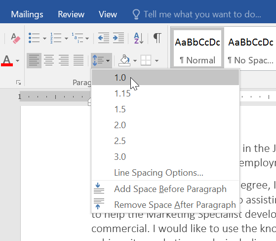
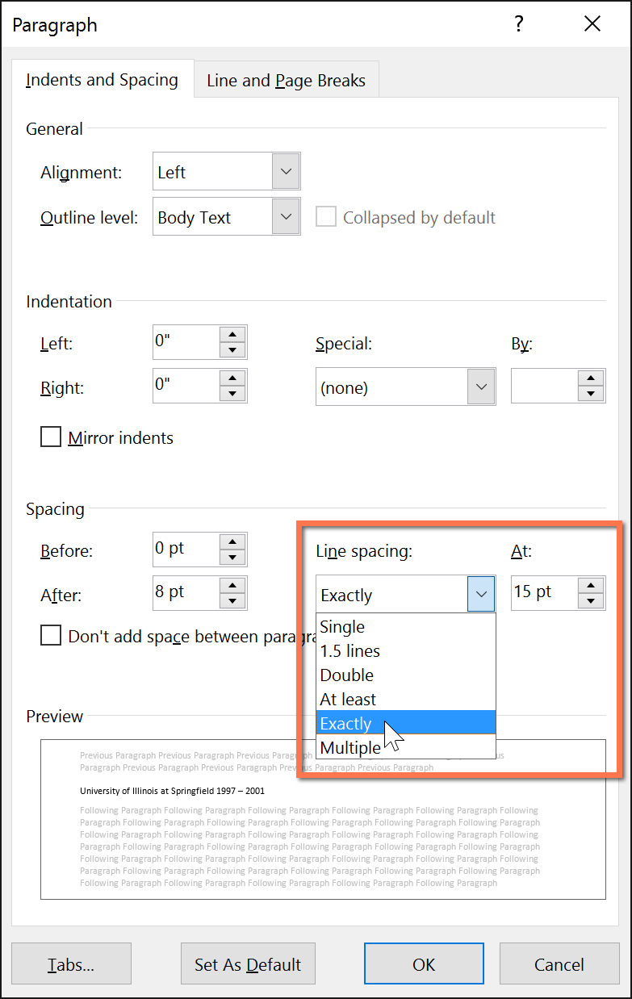
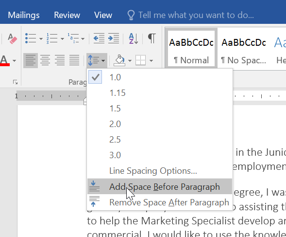
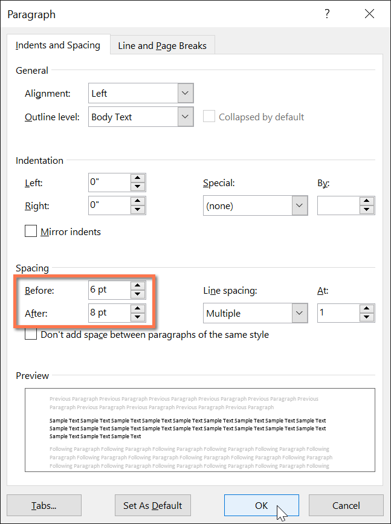

# Bài 9: Giãn cách dòng và đoạn

#### Bài 9: Giãn cách dòng và đoạn

/en/word/indents-and-tabs/content/

### Giới thiệu

Khi bạn Design tài liệu của mình và đưa ra quyết định định dạng, bạn sẽ cần xem xét ** dòng ** và ** khoảng cách đoạn **. Bạn có thể ** tăng ** khoảng cách để cải thiện khả năng đọc và ** giảm ** khoảng cách để vừa với nhiều văn bản hơn trên trang.

Xem video bên dưới để tìm hiểu cách điều chỉnh khoảng cách dòng và đoạn trong tài liệu của bạn.

#### Khoảng cách dòng

Giãn cách dòng là ** khoảng cách giữa mỗi dòng ** trong một đoạn văn. Word cho phép bạn tùy chỉnh khoảng cách dòng thành ** cách nhau một dòng ** (cao một dòng), ** cách đôi ** (cao hai dòng) hoặc bất kỳ khoảng cách nào khác mà bạn muốn. Khoảng cách mặc định trong Word là ** 1,08 dòng **, lớn hơn một chút so với khoảng cách đơn.

Trong các hình ảnh bên dưới, bạn có thể so sánh các loại khoảng cách dòng khác nhau. Từ trái sang phải, những hình ảnh này hiển thị khoảng cách dòng mặc định, khoảng cách đơn và khoảng cách đôi.

Khoảng cách dòng còn được gọi là khoảng cách dòng (phát âm là vần với ** đám cưới **).

#### Để định dạng khoảng cách dòng:

1. Chọn văn bản bạn muốn định dạng.

   
2. Trên tab ** Home **, hãy nhấp vào lệnh ** Dãn cách dòng và đoạn **, sau đó chọn khoảng cách dòng mong muốn.

   
3. Khoảng cách dòng sẽ thay đổi trong tài liệu.

   

#### Điều chỉnh khoảng cách dòng

Khoảng cách dòng Options của bạn không bị giới hạn ở các khoảng cách trong trình đơn ** Khoảng cách dòng và đoạn **. Để điều chỉnh khoảng cách chính xác hơn, hãy chọn ** Dãn cách dòng Options ** từ trình đơn để truy cập hộp thoại ** Đoạn **. Sau đó, bạn sẽ có thêm một số Options mà bạn có thể sử dụng để tùy chỉnh khoảng cách.

* ** Chính xác **:Khi bạn chọn tùy chọn này, khoảng cách dòng được ** đo bằng điểm **, giống như kích thước phông chữ. Ví dụ: nếu bạn đang sử dụng văn bản ** 12 điểm **, bạn có thể sử dụng khoảng cách ** 15 điểm **.

* **Ít nhất **: Giống như tùy chọn ** Chính xác **, tùy chọn này cho phép bạn chọn số điểm giãn cách mà bạn muốn. Tuy nhiên, nếu bạn có các kích cỡ văn bản khác nhau trên cùng một dòng, khoảng cách sẽ mở rộng để vừa với văn bản lớn hơn.
* ** Nhiều **: Tùy chọn này cho phép bạn nhập số dòng giãn cách bạn muốn. Ví dụ: chọn ** Nhiều ** và thay đổi khoảng cách thành ** 1,2 ** sẽ làm cho văn bản trải rộng hơn một chút so với văn bản có khoảng cách đơn. Nếu muốn các đường gần nhau hơn, bạn có thể chọn giá trị nhỏ hơn, chẳng hạn như ** 0,9 **.

  

#### Giãn cách đoạn

Giống như bạn có thể định dạng khoảng cách giữa các dòng trong tài liệu của mình, bạn có thể điều chỉnh khoảng cách trước và sau các đoạn văn. Điều này rất hữu ích để tách các đoạn văn, tiêu đề và tiêu đề phụ.

#### Để định dạng giãn cách đoạn văn:

Trong ví dụ của chúng tôi, chúng tôi sẽ tăng khoảng cách trước mỗi đoạn để tách chúng ra một chút. Điều này sẽ làm cho nó dễ đọc hơn một chút.

1. Chọn đoạn văn hoặc các đoạn văn bạn muốn định dạng.

   
2. Trên tab ** Home **, hãy nhấp vào lệnh ** Dãn cách dòng và đoạn **. Nhấp vào ** Thêm khoảng trắng trước đoạn ** hoặc ** Xóa khoảng trắng sau đoạn ** từ trình đơn thả xuống. Trong ví dụ của chúng tôi, chúng tôi sẽ chọn ** Thêm dấu cách trước đoạn **.

   
3. Khoảng cách đoạn văn sẽ thay đổi trong tài liệu.

   

Từ menu thả xuống, bạn cũng có thể chọn ** Dãn cách dòng Options ** đến Open hộp thoại Đoạn. Từ đây, bạn có thể kiểm soát khoảng trống ** trước ** và ** sau ** đoạn văn.

Bạn có thể sử dụng tính năng ** Đặt làm mặc định ** tiện lợi của Word để ** Save ** tất cả các thay đổi ** định dạng ** mà bạn đã thực hiện và tự động áp dụng chúng cho tài liệu New. Để tìm hiểu cách thực hiện việc này, hãy đọc bài viết của chúng tôi về [Thay đổi cài đặt mặc định của bạn trong Word](../../../word-tips/changed-your-default-settings-in-word/1/index.html).

### Thử thách!

1. Open [tài liệu thực hành](practice_files/word_lineparagraphspacing_practice.docx) của chúng tôi.
2. Chọn ngày và khối địa chỉ. Việc này bắt đầu bằng ** ngày 13 tháng 4 năm 2016 ** và kết thúc bằng ** Trenton, NJ 08601 **.
3. Thay đổi khoảng cách ** trước ** đoạn văn thành ** 12 pt ** và khoảng cách ** sau ** đoạn văn thành ** 30 pt **.
4. Chọn nội dung của bức thư. Điều này bắt đầu bằng ** Tôi vô cùng ** và kết thúc bằng ** sự cân nhắc của bạn **.
5. Thay đổi ** khoảng cách dòng ** thành 1,15.
6. Khi bạn hoàn tất, trang của bạn sẽ trông như thế này:

   

/en/word/lists/content/